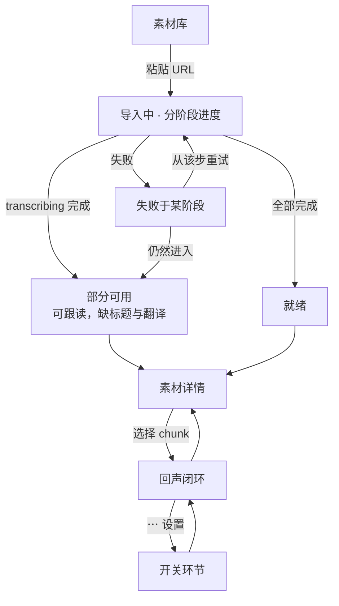
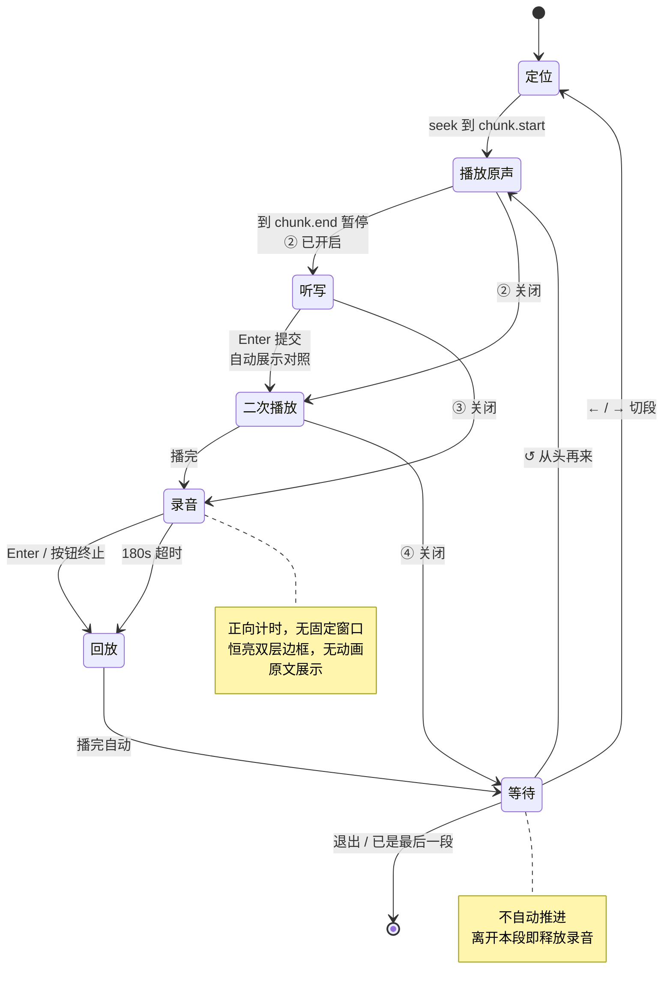
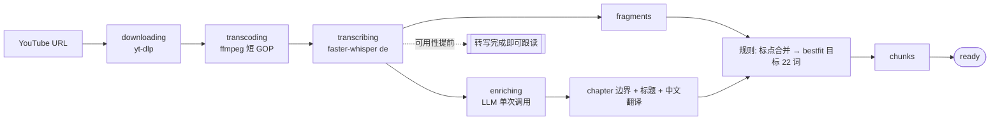
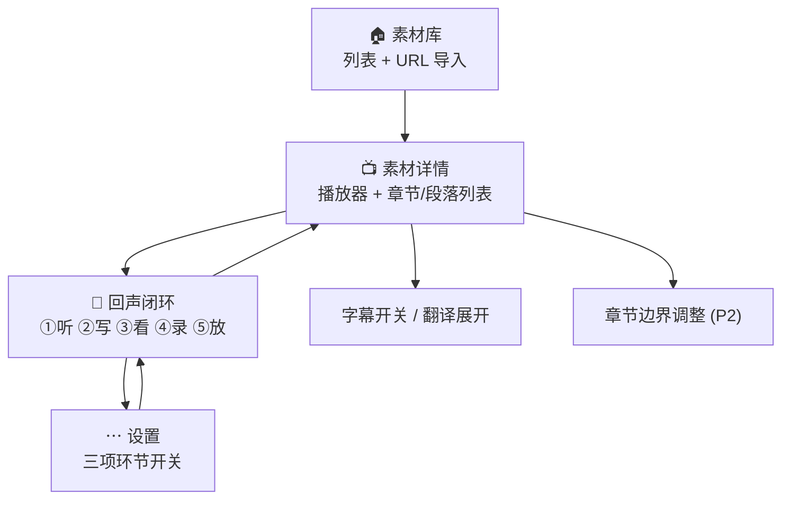

# DE_Nachhall PRD

> 版本 1.0 · 2026-08-22
> 输入：`docs/REQUIREMENTS-NOTES.md`（三轮引导式拷问）+ PRD 阶段四轮澄清
> 下游：`ui-designer` · `spec-designer` · `task-planner`

---

## 1. 产品概述

### 1.1 产品愿景

一个**订阅驱动的德语听说训练工具**：把德语新闻视频自动切成「一口气能跟读完」的段落，逐段完成可自由开关的五步回声闭环。素材分**官方源**（我们维护抓取与转写）与**用户导入**两类，订阅决定每天打开时看到什么。

MVP 是作者的自用工具，但按产品级工具的结构建造。

### 1.2 目标用户

| 项 | 值 |
|---|---|
| 用户 | 作者本人；**MVP 单用户，数据模型预留多用户** |
| 德语水平 | **B2–C1** |
| 训练目标 | 听力语速适应 + 口语输出流利度 |
| 主素材 | **logo! 官方站 `logo.de`（ZDF）**，约 8–11 分钟/期 |
| 自行导入 | **不限 YouTube**——ZDF Mediathek、ARD 等 yt-dlp 覆盖的站点均可 |
| 使用设备 | 桌面浏览器为主 |
| 产品定位 | 自用工具起步，**按产品级工具的结构设计**，不做阻断未来的选择 |

**B2–C1 推导出的默认界面**：字幕默认**关**（按键临时显示）· 中文翻译默认**折叠** · 听写前听 1 遍 · 跟读窗口 = 段落时长 × 1.2

### 1.3 核心价值

1. **切分粒度对**——不是按字幕行切的半句，也不是整条新闻，而是 ~22 词的呼吸单元
2. **画面在场**——回声全程视频跟随，不是纯音频跟读
3. **零判罚**——不打分、不判对错，消除"系统说我错了但其实我对了"的挫败源
4. **素材新鲜**——粘一个 YouTube 链接就能把最新一期变成训练材料

---

## 2. 用户故事

### 2.1 学习者（唯一角色）

- 作为学习者，我想**粘贴一个 logo! 的 YouTube 链接**，以便把最新一期变成可训练的素材
- 作为学习者，我想在导入等待期间**看到进度条和当前阶段**，以便知道它在跑而不是死了
- 作为学习者，我想**按新闻条目浏览一期内容**，以便决定今天练哪一条
- 作为学习者，我想**逐段跟读并立即回放对比**，以便听出自己和原声的差距
- 作为学习者，我想**自己决定何时进入下一段**，以便难的段落可以反复练
- 作为学习者，我想**从任意段落起播**，以便接着上次的地方继续
- 作为学习者，我想**默认关掉字幕**，以便先靠耳朵听，实在听不懂再看
- 作为学习者，我想**在听写后看到上下对照**，以便自己发现漏听了什么
- 作为学习者，我想**自由开关训练环节**，以便按今天的状态决定练得多深
- 作为学习者，我想**这套开关一次设定长期生效**，以便下一期不用重设
- 作为学习者，我想**在需要时展开中文翻译**，以便确认理解无误

---

## 3. 功能需求

### 3.0 核心数据分层（贯穿所有模块）

| 层级 | 是什么 | 谁产生 | 典型数量/期 | 用户可见 |
|---|---|---|---|---|
| `fragment` | 平台字幕 cue 或 Whisper 碎片 | 字幕 / Whisper | ~175 | 否 |
| `sentence` | 完整句（`. ? !` 为界） | 标点规则 | ~118 | 否（中间层） |
| **`chunk`** | **~22 词的段落** | **bestfit 就近取优** | **~50** | **是（训练单元）** |
| `chapter` | 一条新闻 | LLM | 4–6 | 是（导航单元） |

**chunk 生成算法**（纯规则，无 LLM）：

```
for each chapter:                       # chapter 边界是硬边界，不可跨越
    sentences = merge_fragments_by_punctuation(fragments)
    cur = None
    for s in sentences:
        if cur is None: cur = s; continue
        if |wc(cur)+wc(s) - TARGET| <= |wc(cur) - TARGET|:
            cur = merge(cur, s)         # 加上更接近目标 → 加
        else:
            emit(cur); cur = s          # 加上反而更远 → 断开
    if cur: emit(cur)
```

**bestfit「就近取优」，`CHUNK_TARGET_WORDS` 默认 22，不设硬上限。**

> **长句不拆**：单句词数已超阈值时独立成段。这是有意为之——德语长句本就该整句跟读。

---

### 3.1 M1 素材导入

#### 3.1.1 单 URL 导入
- **优先级**: P0
- **描述**: 输入框粘贴单个 YouTube 视频 URL，提交后立即返回，后台异步执行 ingest 管线
- **验收标准**:
  - [ ] 提交后 1 秒内返回，素材库立刻出现一条占位记录
  - [ ] 提交时同步 probe（1–3 秒）：不能抓、纯音频、地域限制等**在提交时即报错**，不进队列
  - [ ] **不维护站点白名单**——能不能抓由 yt-dlp 决定，支持 YouTube / ZDF / ARD 等所有其覆盖的站点
  - [ ] 同一 URL 重复导入时提示已存在，不重复处理

#### 3.1.2 分阶段处理管线
- **优先级**: P0
- **描述**: `queued → downloading → transcoding → transcribing → enriching → ready`，任一阶段失败则停在该阶段并记录原因
- **验收标准**:
  - [ ] 各阶段状态持久化，刷新页面不丢失
  - [ ] `transcribing` 完成后 chunk 已可用（不依赖 `enriching`）
  - [ ] `enriching` 失败时素材仍可进入回声模式，仅缺章节标题与翻译

#### 3.1.3 处理进度可视化
- **优先级**: P0
- **描述**: 素材库列表项展示当前阶段名 + 转圈动画 + 进度条
- **验收标准**:
  - [ ] `downloading` 显示字节百分比
  - [ ] `transcoding` 显示 ffmpeg 真实进度百分比
  - [ ] `transcribing` 显示已处理时长 / 总时长百分比
  - [ ] `enriching` 为黑盒，只显示转圈 + 阶段名，**不显示伪造百分比**
  - [ ] 失败态显示阶段名 + 错误摘要

#### 3.1.4 失败分步重试
- **优先级**: P1
- **描述**: 失败的素材可从失败阶段重试，不必从头下载
- **验收标准**:
  - [ ] 重试按钮从失败阶段续跑
  - [ ] 已完成阶段的产物被复用

#### 3.1.5 Playlist 批量导入
- **优先级**: P3（v2）
- **描述**: 粘贴 playlist URL 一次导入多期

#### 3.1.6 定时自动抓取
- **优先级**: P3（v2）
- **描述**: cron 轮询频道，发现新一期自动导入。**复用 `ingest(url)` 同一函数**

---

### 3.2 M2 首页（素材流）

首页的唯一任务：**让「今天练什么」快到不构成决定**。它是一条**统一时间线**——订阅源的内容和自己导入的素材混排，来源只用小标签标注。九成情况答案是最新一期，所以最新一期展开为主卡片，历史收成紧凑列表。

> **为什么不分「官方 / 我的」Tab**：分 Tab 会逼你每天点两次去看有没有新东西。订阅本身已经决定了什么该进这条流，再分类是重复劳动。

#### 3.2.1 顶栏
- **优先级**: P0
- **描述**: 左侧产品名，右侧 **`+` 导入按钮**；右端**预留头像位置但本期不渲染**
- **验收标准**:
  - [ ] `+` 位于顶栏右侧，点击打开导入浮层
  - [ ] 头像位置在布局上预留（右端留出 40px），本期不放任何元素
  - [ ] **MVP 无「发现」入口**（只有一个源，订阅 UI 价值为零）
  - [ ] 顶栏**不得出现第二排控件**

#### 3.2.2 最新一期主卡片
- **优先级**: P0
- **描述**: 时间线最新一条展开为大卡片，**直接列出章节标题并可直达该章节**
- **验收标准**:
  - [ ] 元信息行为**日期 → 来源标签**两项，**不显示段数**
  - [ ] 日期用等宽 14px 次级色；**不得与主标题争夺视线**——两者须在字族、字号、颜色三个通道上同时区分，主标题始终是视线第一落点
  - [ ] 整期时长叠在缩略图右下角
  - [ ] 列出全部 chapter 及其标题、**时长**
  - [ ] 每个 chapter 可点击**直接进入回声闭环**，跳过详情页
  - [ ] 提供「▶ 从头开始跟读」入口
  - [ ] `enriching` 未完成时章节区显示「章节生成中」，跟读入口照常可用

> **为什么列章节标题**：因为不记学习进度，列表上只能显示客观元信息，而 `09:38` 对每一期都长一样。章节标题（`① Waldbrände ② Ahrtal-Flut ③ Wiederaufbau`）是天然的内容摘要，是这个列表唯一有区分度的信息。它同时省掉一次纯粹路过的点击——一期 10 分钟你未必想一次练完。

> **为什么首页只谈时长不谈段数**：决定「今天练哪条」靠的是「这条要花几分钟」。段数是内部结构，用户不该关心——它只在回声闭环里作为进度指示（`#11 / 27`）出现，以及在详情页作为章节规模出现。

#### 3.2.3 历史时间线
- **优先级**: P0
- **描述**: 除最新一条外，按日期倒序的紧凑单行列表，官方与自导入混排
- **验收标准**:
  - [ ] 每行以**日期起首**（等宽 12.5px 次级色），其后为来源标签、标题、**时长**
  - [ ] 来源标签区分订阅源名（如 `logo!`）与 `我导入`
  - [ ] 点击进入素材详情页
  - [ ] 素材量小（约 250 条/年），**不做搜索、标签、分页、分类**

#### 3.2.4 导入浮层
- **优先级**: P0
- **描述**: `+` 打开浮层，粘贴 URL 后异步触发 `ingest`，产出归为 `origin: user`
- **验收标准**:
  - [ ] 抓不了的链接在提交时即报错，错误文案**说明怎么改**且区分原因（站点不支持 / 已下架 / 地域限制 / 需登录）
  - [ ] URL 已存在于库中时提示并直接跳转，**不重复转写**
  - [ ] **检测到纯音频素材时明确提示「暂不支持音频素材」**并拒绝导入
  - [ ] 提交后浮层关闭，时间线立即出现占位行

#### 3.2.5 处理中与失败状态
- **优先级**: P0
- **描述**: 处理中的素材插在主卡片与历史列表之间，带阶段名 + 转圈 + 进度条
- **验收标准**:
  - [ ] 状态每 2s 自动刷新，无需手动刷新页面
  - [ ] 失败态显示阶段名 + 错误摘要 + 「从该步重试」
  - [ ] `enriching` 失败时提供「仍然进入」入口

#### 3.2.6 媒体类型标识
- **优先级**: P3（v2，随音频支持一并出现）
- **描述**: 列表项显示视频 / 音频标识
- **理由**: MVP 只有视频，图标在每一行都一样，是纯噪音。`media_type` 字段仍然现在就建，界面等到真有两种类型再加

#### 3.2.7 删除素材
- **优先级**: P1
- **描述**: 从我的时间线移除
- **验收标准**:
  - [ ] 删除前二次确认，列出将被删除的内容
  - [ ] 自导入素材：删除 `user_media` 关联；素材本体按引用计数回收
  - [ ] **订阅源素材不可删除**，取消订阅才是正确操作（v2）

---

### 3.2b M2b 素材源与订阅（结构先行，UI 推 v2）

- **优先级**: P0（数据结构）/ P3（界面）
- **描述**: `sources` 与 `subscriptions` 两张表在 MVP 就建好；预置一条 logo! 官方源并默认订阅。**发现页与订阅开关的界面推 v2，届时只添 UI 不改表。**
- **验收标准**:
  - [ ] `sources` 含 `kind: official | user`，官方源由我们维护抓取与转写
  - [ ] MVP 预置 `logo!` 官方源（**`logo.de` / ZDF**）并对唯一用户默认订阅
  - [ ] `media.source_id` 可空——自行导入的素材不属于任何源
  - [ ] **订阅源的素材直接可练，不需要「添加到我的」**
  - [ ] MVP 不渲染发现页、不提供订阅/取消订阅入口

---

### 3.3 M3 素材详情页

#### 3.3.1 视频播放器
- **优先级**: P0
- **描述**: 本地 mp4 播放器，支持任意位置 seek
- **验收标准**:
  - [ ] seek 到 chunk 起点的误差 < 200ms
  - [ ] 支持 Range 请求，大文件可拖动

#### 3.3.2 章节 / 段落列表
- **优先级**: P0
- **描述**: 按 chapter 分组、chunk 为条目的可折叠列表，每个 chunk 有「回声」「听写」两个入口
- **验收标准**:
  - [ ] chapter 显示 LLM 生成的德语标题
  - [ ] chunk 显示德语原文首行 + 时长
  - [ ] 点击 chunk 即从该段起播

#### 3.3.3 字幕显示开关
- **优先级**: P0
- **描述**: 德语原文默认**隐藏**，按键或点击临时/持久显示
- **验收标准**:
  - [ ] 默认关闭
  - [ ] 开关状态在会话内保持

#### 3.3.4 中文翻译展开
- **优先级**: P0
- **描述**: 每个 chunk 的中文翻译默认**折叠**，点击展开
- **验收标准**:
  - [ ] 默认折叠
  - [ ] `enriching` 未完成时显示"生成中"而非空白

#### 3.3.5 手动调整章节边界
- **优先级**: P2
- **描述**: LLM 分章分错时可手动合并/拆分 chapter，chunk 随之重算

---

### 3.4 M4 回声闭环（核心）

一段 chunk 的完整训练由**五个步骤**顺序组成。可开关的只有 **② 听写**与 **④ 录音**两项，**① 播放原声不可关**（是闭环的地基）：**③ 与 ⑤ 都跟随 ④**——③ 是录音前的准备（自动重听并展示原文），⑤ 是录音后的对比，关掉录音时三步一起消失。

> 2026-08-23 调整：③ 原本是独立开关，已并入 ④。理由是单独开着 ③ 等于「重听一遍然后什么也不做」。

| 步骤 | 名称 | 可关 | 默认 | 德语原文 | 主按钮（`Space`） |
|---|---|---|---|---|---|
| ① | 播放原声 | 否 | 开 | 隐藏 | ↺ 再听原声 |
| ② | 听写 | 是 | **关** | 隐藏 | ▶ 再听一遍 |
| ③ | 二次播放 + 展示原文 | 是 | 开 | **展示** | ↺ 再听原声 |
| ④ | 录音 | 是 | 开 | **展示** | ↺ 重录 |
| ⑤ | 回放 | 随 ④ | 开 | 展示 | ↺ 回放录音 |

**默认预设 = `① ③ ④ ⑤`**（听写默认关闭）。

> **设置 3 项 ↔ 运行时 6 步**：这是有意的非一一对应。设置里「③ 录音与回放」是一个开关，运行时是 ③④⑤ 三个界面不同的步骤。数据模型必须显式注释这一点。

#### 3.4.1 步骤引擎
- **优先级**: P0
- **描述**: 按设置计算本段的启用步骤序列，依次执行；每步结束进入下一个**启用**的步骤，全部走完进入「等待确认」
- **验收标准**:
  - [ ] 关闭的步骤被完全跳过，不产生任何界面闪现
  - [ ] `record` 关闭时 ⑤ 回放一并跳过
  - [ ] 全部关闭时闭环退化为「① 播放原声 → 等待确认」
  - [ ] 步骤切换有 180ms 过渡，**视频位置与尺寸始终不变**

#### 3.4.2 ① 播放原声
- **优先级**: P0
- **描述**: 视频定位到 `chunk.start` 播放，到 `chunk.end` 自动暂停，画面停在该帧；德语原文隐藏
- **验收标准**:
  - [ ] seek 与自动暂停误差 < 200ms
  - [ ] 暂停时画面保持该 chunk 最后一帧，不黑屏不跳回
  - [ ] 原文默认隐藏，`S` 可临时显示

#### 3.4.3 ② 听写
- **优先级**: P0
- **描述**: 多行输入框写下听到的内容，`Enter` 提交，**提交即自动展示答案**并就地对照
- **验收标准**:
  - [ ] 写作过程中德语原文与中文翻译**均不可见**
  - [ ] 本步骤**不提供 `S` 字幕开关**——看到原文等于直接看答案
  - [ ] 提交后自动展示对照，不需要再点一次
  - [ ] 对照采用**上下叠**布局：我写的在上（灰底），原文在下（白底），同宽同字号同行高
  - [ ] **不做 diff、不判对错、不打分**，无高亮无颜色无删除线
  - [ ] 可「✎ 重写」回到输入态，已输入内容保留
  - [ ] 对照超出视口时靠**页面滚动**查看，视频不缩小

#### 3.4.4 ③ 二次播放 + 展示原文
- **优先级**: P0
- **描述**: 重播同一 chunk，**同时展示德语原文**，耳朵与眼睛同步校对
- **验收标准**:
  - [ ] 原文在本步骤默认可见
  - [ ] `S` 在此语义反转为「隐藏字幕」
  - [ ] 播完自动进入下一启用步骤

#### 3.4.5 ④ 录音
- **优先级**: P0
- **描述**: **正向计时、无固定窗口**；`Enter` 或「■ 结束录音」终止；德语原文在本步骤**展示**
- **验收标准**:
  - [ ] 录音态显示**正向计时**（已录时长），不显示倒计时、不显示原声参照值
  - [ ] 视频四周为**恒亮双层边框**：内层主色 + 外层半透明深色描边；**无呼吸/闪烁动画**
  - [ ] `Enter` 与按钮都能终止
  - [ ] **180 秒**无操作自动终止并 Toast 提示
  - [ ] 原文展示是**本步骤自身的属性**，不依赖 ③ 是否开启

#### 3.4.6 ⑤ 回放
- **优先级**: P0
- **描述**: 进入后**停顿一秒自动回放**我的录音一次；可与原声反复对比
- **验收标准**:
  - [x] 进入后 1 秒自动回放一次（2026-08-23 补实现——此前只做了手动回放，
        本条验收标准被漏掉了）
  - [ ] 停顿而不是立刻：刚说完就听到自己会像被打断
  - [ ] 等录音 blob 就绪再计时（`MediaRecorder.onstop` 之后才有 URL）
  - [ ] 切段 / 跳步骤 / 离开页面时取消，不能在人走开后才响
  - [ ] 手动回放时取消待触发的自动回放，不能响两遍
  - [ ] `Space` = 再放一遍我的（「↺ 回放录音」）
  - [ ] 另有「▶ 原声」用于对比；**不提供单独的「▶ 我的」按钮**——那就是 `Space`
  - [ ] 播放原声时画面同步跟随

#### 3.4.7 等待确认与推进控制
- **优先级**: P0
- **描述**: 走完所有启用步骤后停住，**不自动推进**
- **验收标准**:
  - [ ] 无超时自动跳转
  - [ ] 提供「↺ 从头再来」「← 上一段」「→ 下一段」
  - [ ] `Space` 在等待态 = 回放录音（延续 ⑤ 的语义）；「从头再来整段」只走按钮
  - [ ] **离开本 chunk 时录音立即释放，不落盘、不上传**

#### 3.4.8 任意段落起播
- **优先级**: P0
- **描述**: 可从任意 chunk 进入，之后按顺序线性推进
- **验收标准**:
  - [ ] 详情页任一 chunk 点「跟读」直接进入该段的步骤 ①
  - [ ] 到达最后一段提示已完成，不循环回开头

#### 3.4.9 键盘快捷键
- **优先级**: P1
- **描述**: 手不离键盘完成整轮：`Space` → 说 → `Enter` → 听 → `→`
- **验收标准**:
  - [ ] `Space` = **重复当前这一步**
  - [ ] `Enter` = 结束录音（④）/ 提交听写（②）
  - [ ] `→` `←` 切段 · `S` 字幕 · `T` 翻译 · `Tab` 侧栏 · `Esc` 返回
  - [ ] 听写 textarea 聚焦时仅 `Enter` 与 `Esc` 生效，其余键正常输入字符
  - [ ] `Space` 绑定后需 `preventDefault` 拦截浏览器翻页；页面滚动靠滚轮或 `PgDn`

#### 3.4.10 长句回退到句级
- **优先级**: P2
- **描述**: 超长 chunk（> 35 词）可临时按 `sentence` 逐句跟读，默认关闭

#### 3.4.11 变速播放
- **优先级**: P2
- **描述**: 0.75× / 1.0× 切换

---

### 3.5 M5 设置

#### 3.5.1 设置入口
- **优先级**: P0
- **描述**: 回声模式顶栏右侧 **`⋯`** 图标打开浮层设置面板
- **验收标准**:
  - [ ] 图标为 `⋯`（三点），不是齿轮——保留以后加「删除本期」「导出字幕」等非设置操作的位置
  - [ ] **顶栏不得增加第二排控件**
  - [ ] 点击图标外区域关闭面板

#### 3.5.2 环节开关
- **优先级**: P0
- **描述**: **两组全平铺，无嵌套**。「回声环节」四项：00 全文播放（默认关，开启后 ① 播完进下一段一路连到底，不进听写与录音）；① 标「始终」不给假开关；③ 合并显示为「录音与回放」，盖住二次播放、录音、回放三步。「显示」一项：段落进度条（默认开，不影响任何步骤）
- **验收标准**:
  - [ ] 环节四行：00 全文播放 · ① 播放原声（始终）· ② 听写 · ③ 录音与回放；显示一行：段落进度条
  - [ ] ① 无可点击控件，显示静态标签「始终」
  - [ ] **不出现任何派生的只读开关**（回放不单列一行）
  - [ ] 每行带一行说明文字
  - [ ] 切换即时生效，无需保存按钮

#### 3.5.3 持久化
- **优先级**: P0
- **描述**: **全局唯一**设置，存 `localStorage`，无后端、无数据表、无每期覆盖
- **验收标准**:
  - [ ] 改一次以后每期都是这样
  - [ ] **不提供「仅本次」临时覆盖**
  - [ ] 读取失败或首次使用时回落到默认预设 `① ③ ④ ⑤`

---

### 3.6 用户流程图

#### 主流程



#### 回声闭环状态机



#### ingest 管线



---

## 4. 不做什么（Out of Scope）

| 功能 / 场景 | 排除原因 |
|---|---|
| 发音评分 / ASR 打分 | 明确推 v2；MVP 只做回放自评，`ScoreProvider` 留接口 |
| 听写 diff 判对错 | 有意排除——Whisper 转写会错，判对错会产生假判罚，是最劝退的失败模式 |
| 独立的听写模式页面 | 听写已折叠为回声闭环的步骤 ②；「只开 ②」的设置组合即等价于纯听写，第二套实现纯属冗余 |
| 每期独立的环节配置 | 设置全局唯一；每期配置会把持久化状态重新引进来，与「不记学习进度」冲突 |
| 「仅本次」临时覆盖设置 | 用户明确不要；顶栏也不允许增加第二排控件 |
| 学习进度记录 | 用户明确不要；chunk 粒度使一次坐下来可练完，断点续练需求弱 |
| SRS 间隔重复 | 依赖进度数据，随进度记录一并推 v2 |
| AI 语法 / 词汇讲解 | 推 v2 |
| 生词本 | 推 v2 |
| Playlist 批量导入 | 推 v2，先验证单素材闭环 |
| cron 定时抓取 | 推 v2，复用 `ingest(url)` |
| 多用户 / 账号体系 | 单用户自用 |
| 移动端适配 | 桌面优先；录音 + 键盘快捷键是桌面场景 |
| 音频素材 | 推 v2。音频没有画面，与 D4「画面必须跟着走」和「余光可读」原则直接冲突，需要单独设计。`media_type` 字段现在就建好 |
| 发现页与订阅界面 | 推 v2。MVP 只有一个源，订阅 UI 价值为零；`sources` / `subscriptions` 表现在就建，届时只添 UI |
| 官方源的多源抓取 | 推 v2。每个官方源都要单独维护抓取器与解析逻辑，MVP 只做 logo! |
| 账号登录 | 推 v2。数据模型现在就带 `user_id`，MVP 全填同一个值 |
| 用户管理界面 | 推 v2。顶栏头像位置本期不渲染，仅在布局上预留 |
| 素材搜索 / 标签 / 分页 | 约 250 条/年的量级，任何「管理」功能都是无中生有 |
| 媒体类型图标 | 推 v2，随音频支持一并出现。MVP 只有视频，每行都一样的图标是纯噪音 |
| 录音持久化 | 用户明确要求切段即丢 |
| 站点白名单 | 有意不做。`yt-dlp` 覆盖上千站点，白名单既不完备又要持续跟进；能不能抓交给它探测 |
| YouTube 作为官方源 | **实测排除**：logo! 的 YouTube 频道 0/4 有字幕，ZDF 官方站 4/4 有。官方源改为 `logo.de` |
| 词级时间戳 / 逐词高亮 | B2–C1 不需要；`TranscriptProvider` 留接口，v2 可接 WhisperX |

---

## 5. 非功能需求

### 5.1 性能

| 指标 | 目标 |
|---|---|
| chunk seek 定位误差 | < 200ms |
| chunk 自动暂停误差 | < 200ms |
| 10 分钟视频端到端 ingest | < 8 分钟 |
| 转写完成到可跟读 | 不等待 `enriching` |
| 素材库首屏 | < 2s |
| 录音启动延迟 | < 300ms |
| 录音自动终止兜底 | 180s |

### 5.2 安全与隐私

- 单用户自用，MVP **不做鉴权**（部署形态与是否加鉴权留 Spec 决策）
- **录音不落盘、不上传、不经过任何网络请求**，仅存在于浏览器内存
- 麦克风权限需用户显式授权
- LLM 调用只发送转写文本，不发送音视频

### 5.3 兼容性

- 桌面 **Chrome / Edge 最新版**
- `MediaRecorder` + `getUserMedia` 要求**安全上下文**：必须 `https://` 或 `localhost`
- 视频服务必须支持 **HTTP Range 请求**（逐段 seek 依赖）

---

## 6. 信息架构



> 只有**三个页面级视图**。听写不是独立页面，而是回声闭环里的一个步骤；设置是回声页上的浮层，不是页面。

---

## 7. 约束与假设

### 7.1 约束条件

| # | 约束 | 影响 |
|---|---|---|
| C1 | 播放的是**本地 mp4**（后端下载），非 HLS 流 | 规避 CORS / Geoblocking / m3u8 seek 三坑；要求静态服务支持 Range |
| C2 | seek 精度受 **GOP（关键帧间隔）** 限制 | 源片 GOP 常 2–4s，需转码缩短 GOP，否则定位漂移超标 |
| C3 | ~~Whisper 德语转写会错~~ **多数情况已消除**：ZDF 提供官方德语字幕（实测 4/4），平台字幕优先，仅无字幕素材才回落 Whisper | Sprint 0 实测；Whisper 词准确率 98.2%，主要缺陷是复合词拆分 |
| C4 | `enriching` 是**黑盒**，无真实进度 | 进度条为分段式，该阶段只转圈，不伪造百分比 |
| C5 | 本机**未安装 `yt-dlp` 与 `ffmpeg`** | 环境准备须作为首批任务 |
| C6 | `MediaRecorder` 需要安全上下文 | 本地开发必须走 `localhost`，公网部署必须 HTTPS |
| C7 | LLM 单次调用同时承担分章 + 标题 + 翻译 | prompt 与输出 schema 须一次设计到位，失败要能降级 |

### 7.2 假设前提

| # | 假设 | 说明 |
|---|---|---|
| A1 | **chunk 阈值 = 22 词** | 由用户两个真实例句反推（24 词 / 22 词），做成可配置 |
| A2 | **自评控件不实现** | 无进度持久化则自评无处可去；`ScoreProvider` 只在布局上预留位置，v2 接入时填 |
| A6 | **等待确认态的 `Space` 延续 ⑤ 的语义**（回放录音） | 「从头整段再来」只走按钮。同一个键在相邻两态做不同的事、中间无视觉边界，是实打实的困惑源 |
| A7 | **素材按 `source_url` 全局唯一，转写只跑一次** | 官方源天然共享；两个用户导入同一 URL 也复用同一份转写。见 §9.2 |
| A8 | **`+` 导入入口在顶栏右侧，不是常驻输入框** | 导入是低频动作，官方源上线后趋近于零。常驻输入框会让每次打开都先撞上一个多数时候不用的控件 |
| A9 | **首页是统一时间线，不分官方 / 我的 Tab** | 订阅已经决定了什么进流；分 Tab 会逼用户每天点两次找新内容 |
| A3 | logo! 官方 YouTube 频道稳定可访问，无 Geoblocking | 若失效，`ingest` 已抽象为 `source → 本地 mp4`，可退回本地文件投递 |
| A4 | ~~108 fragment → 35–45 sentence → 25–30 chunk~~ **已被实测推翻**。真实数据（491 s）：**175 fragment → 118 sentence → 53 chunk**，4–6 chapter | Sprint 0 实测，见 SPEC §11.2 |
| A5 | MVP 转写走 Whisper；YouTube 自带德语字幕作为 P1 优化 | 同一 `TranscriptProvider` 接口，可切换 |

---

## 8. 附录

### 8.1 竞品参考：Miraa

**核心功能**：AI 转写生成词级双语字幕 · Echo Method（Listen → Understand → Imitate → Compare）· 实时翻译 · AI 语法解释 · 支持 8 种语言

**我们的差异化**：

| 维度 | Miraa | DE_Nachhall |
|---|---|---|
| 切分粒度 | 字幕行 / 句 | **~22 词的呼吸段落**（长句不拆，短句合并） |
| 语种 | 通用 8 语种 | 只做德语，默认界面按 B2–C1 调 |
| 素材 | 用户任意导入 | 围绕 logo! 新闻，章节即新闻条目 |
| 判罚 | 有评分 | **零判罚**，只对照不判对错 |
| 推进 | 自动 | **手动确认**，难段可反复 |
| 训练环节 | 固定四步 | **五步可自由开关**，一套设置长期生效 |

**可借鉴**：Echo Method 的四步闭环骨架 · 录音即时 A/B 回放 · 翻译默认折叠不打扰

### 8.2 术语表

| 术语 | 定义 |
|---|---|
| `fragment` | Whisper 按停顿切出的碎片，内部数据 |
| `sentence` | 由 fragment 按 `. ? !` 合并成的完整句 |
| `chunk` | 由 sentence 经 bestfit 就近取优合并至 ~22 词的**训练单元**，用户口中的"段落" |
| `chapter` | 一条独立新闻，由 LLM 划定，是 chunk 合并的硬边界 |
| Echo Method | Miraa 提出的 Listen → Understand → Imitate → Compare 四步法 |
| 回声闭环 | 本产品的单段循环：① 播原声 → ② 听写 → ③ 二次播放+原文 → ④ 录音 → ⑤ 回放 → 等待确认 |
| 步骤 / 环节 | 回声闭环里的一环，②③④ 可在设置中开关，⑤ 跟随 ④ |
| GOP | Group of Pictures，关键帧间隔，决定视频 seek 精度 |
| ingest | 从 URL 到可训练素材的完整后台管线 |

---

## 9. 面向产品化的结构预留

MVP 是单用户自用工具，但按产品级工具的结构建造。关键在于区分**「以后加就行」**和**「现在不留位置以后要动手术」**。

### 9.1 现在必须留（成本近乎为零）

| 项 | 现在做什么 | 不做的代价 |
|---|---|---|
| `sources` + `subscriptions` | 建表，预置 logo! 官方源并默认订阅 | 来源标签无处可取；以后要拆表回填 `source_id` |
| `media.source_url` 唯一键 | 建唯一索引 | 同一素材被重复转写，见 §9.2 |
| `user_id` 外键 | 所有表加一列，MVP 全填同一值 | 以后加列 + 回填 + 改所有查询 |
| `media.media_type` | 枚举 `video \| audio` 现在就进模型 | 音频变成事后补丁，播放器分叉两套 |
| `media.origin` | 枚举 `official \| user` | 首页来源标签与删除策略都依赖它 |
| `SettingsProvider` 抽象 | MVP 实现用 localStorage | 设置要跟账号跨设备时，得重写所有读写点 |
| 顶栏头像位 | 布局上留 40px | 以后加入时顶栏排版要重调 |

### 9.1b 存储清理（本期不实现，TASK-045）

MVP 一直往里灌，从不往外清。实测一期 8 分 11 秒的 logo! 占 **160 MB**：

| 文件 | 大小 | 转写完成后还需要吗 |
|---|---|---|
| `video.mp4` | 148.8 MB | **要**——前端播放与 seek 的对象 |
| `audio.wav` | 15.7 MB | 不要，除非重新转写 |
| `thumb.jpg` | 1.2 MB | 要，但这个尺寸偏大，入库时该压一次 |
| `probe.json` | 64 KB | 要，重试时靠它选路 |

每天一期 ≈ **1.1 GB/周**、**58 GB/年**。这不是「以后优化」，是**几个月内必然发生的故障**。

**现在留的位置**：`media.video_path` / `thumb_path` 可空，回收后置 NULL 即可，
`status` 已有枚举可扩。所以这件事**不需要动手术**，属于「以后加就行」——
但它必须真的被加，所以登记成 TASK-045 而不是写在某个 TODO 注释里。

**一条现在就要守的约束**：回收文件必须**同时更新数据库**。直接删目录会留下指向
不存在文件的记录，界面上点开只会提示「文件不见了」——那是比磁盘满更难查的故障。

### 9.2 素材去重（A7）

产品级工具里同一个视频会被很多人接触。官方源的素材天然只有一份；用户手动导入时若 URL 已存在，**复用已有的 media 与其 chunks，不重复跑 Whisper 与 LLM**。

```
sources
  id, name, kind(official|user), channel_url, ...

media
  id, source_id NULL, source_url UNIQUE, media_type, origin, title, duration, status, ...

chapters / chunks  → media_id

subscriptions(user_id, source_id)     ← 订阅源的素材自动进流，直接可练
user_media(user_id, media_id)         ← 仅记录用户自行导入的素材
```

### 9.3 明确推迟、但不影响结构的

学习进度记录 · SRS · 鉴权中间件 · 用户管理界面 · 音频播放形态 · 发现页 UI · 多源抓取器。这些都可以在不改动现有表结构的前提下新增。

---

## META（供其他 Skill 解析）

```yaml
product:
  name: DE_Nachhall
  version: "1.0"
  description: 德语听说训练 Web 应用，基于 logo! 新闻的分段回声跟读与听写
  stack:
    backend: Python + FastAPI
    frontend: TBD (spec-designer)
    asr: faster-whisper (de)
    fetcher: yt-dlp
    media: ffmpeg

design_decisions:
  theme: light_only
  background: "#F8FAFA"
  accent: "#0D9488"
  accent_text: "#0F766E"
  echo_layout: fullscreen_immersive_with_pullout_sidebar
  recording_meter: steady_glow_border_plus_count_up
  recording_timeout_s: 180
  echo_steps: [play_original, dictation, replay_with_text, record, playback]
  echo_default_preset: [play_original, replay_with_text, record, playback]
  settings_items: 4
  settings_entry: topbar_ellipsis
  settings_storage: localStorage_global_only
  settings_layout: toggle_list
  dictation_compare_layout: stacked_same_width
  primary_shortcut: "Space = repeat current step"
  page_scroll: allowed
  video_never_resizes: true
  homepage_layout: unified_timeline_latest_hero_card
  homepage_import_entry: topbar_plus_button
  homepage_chapter_deeplink: true
  homepage_meta_order: [date, source_badge]
  homepage_shows_chunk_count: false
  homepage_measure: duration
  homepage_date_must_not_compete_with_title: true
  homepage_source_tabs: false
  avatar_slot: reserved_not_rendered
  discover_ui: deferred_v2
  media_types_supported_mvp: [video]
  official_source: "logo.de (ZDF)"
  official_source_changed_from: "youtube @logo-nachrichten"
  official_source_change_reason: "实测 YouTube 0/4 无字幕，ZDF 4/4 有官方德语 VTT"
  transcript_strategy: platform_subs_first_whisper_fallback
  chunk_algorithm: bestfit
  chunk_param: CHUNK_TARGET_WORDS
  chunk_param_default: 22
  chunk_hard_max: none
  source_site_policy: no_whitelist_yt_dlp_probe
  official_media_playable_without_adding: true

domain_model:
  hierarchy: [fragment, sentence, chunk, chapter]
  training_unit: chunk
  navigation_unit: chapter
  chunk_threshold_words: 22
  chunk_rule: greedy_merge_sentences_within_chapter_no_split_long_sentence

modules:
  - name: 素材导入
    key: ingest
    priority: P0
    features:
      - name: 单 URL 导入
        priority: P0
        description: 粘贴单个 YouTube 视频 URL，异步触发 ingest 管线
      - name: 分阶段处理管线
        priority: P0
        description: queued/downloading/transcoding/transcribing/enriching/ready 六态持久化
      - name: 处理进度可视化
        priority: P0
        description: 阶段名 + 转圈 + 进度条；enriching 阶段不伪造百分比
      - name: 失败分步重试
        priority: P1
        description: 从失败阶段续跑，复用已完成阶段产物
      - name: Playlist 批量导入
        priority: P3
        description: v2
      - name: 定时自动抓取
        priority: P3
        description: v2，复用 ingest(url)

  - name: 素材库
    key: library
    priority: P0
    features:
      - name: 期数列表
        priority: P0
        description: 倒序列出素材，处理中项自动刷新进度
      - name: 删除素材
        priority: P1
        description: 连同视频文件与派生数据一并清除

  - name: 素材详情
    key: detail
    priority: P0
    features:
      - name: 视频播放器
        priority: P0
        description: 本地 mp4，Range 请求，seek 误差 < 200ms
      - name: 章节段落列表
        priority: P0
        description: chapter 分组、chunk 条目，各带回声与听写入口
      - name: 字幕显示开关
        priority: P0
        description: 德语原文默认隐藏
      - name: 中文翻译展开
        priority: P0
        description: 默认折叠；enriching 未完成时显示生成中
      - name: 手动调整章节边界
        priority: P2
        description: 合并拆分 chapter 后 chunk 重算

  - name: 回声闭环
    key: echo
    priority: P0
    features:
      - name: 步骤引擎
        priority: P0
        description: 按设置计算启用步骤序列并顺序执行；关闭的步骤完全跳过，record 关则回放一并跳过
      - name: 步骤① 播放原声
        priority: P0
        description: seek 到 chunk.start，到 end 自动暂停保持画面；原文隐藏
      - name: 步骤② 听写
        priority: P0
        description: 输入后 Enter 提交即自动展示上下叠对照；无 diff 无判罚；本步骤不提供 S 字幕
      - name: 步骤③ 二次播放 + 展示原文
        priority: P0
        description: 重播同一 chunk 并展示德语原文，S 在此反转为隐藏
      - name: 步骤④ 录音
        priority: P0
        description: 正向计时无固定窗口，Enter 或按钮终止，180s 兜底；恒亮双层边框无动画；原文展示
      - name: 步骤⑤ 回放
        priority: P0
        description: 进入后 1 秒自动回放一次，Space 再放；另有原声按钮用于对比，不给单独的「我的」按钮
      - name: 等待确认与推进控制
        priority: P0
        description: 不自动推进；离开 chunk 即释放录音不落盘
      - name: 任意段落起播
        priority: P0
        description: 从任一 chunk 进入，之后线性推进
      - name: 键盘快捷键
        priority: P1
        description: Space 重复当前步骤 / Enter 结束录音或提交听写 / 方向键切段 / S 字幕 / T 翻译 / Tab 侧栏
      - name: 长句回退到句级
        priority: P2
        description: 超长 chunk 临时按 sentence 跟读
      - name: 变速播放
        priority: P2
        description: 0.75x / 1.0x

  - name: 设置
    key: settings
    priority: P0
    features:
      - name: 设置入口
        priority: P0
        description: 回声页顶栏右侧三点浮层；顶栏不得增加第二排控件
      - name: 环节开关
        priority: P0
        description: 三项平铺无嵌套；① 标「始终」；③ 合并显示为「录音与回放」，盖住二次播放/录音/回放三步；不出现派生只读开关
      - name: 持久化
        priority: P0
        description: 全局唯一，存 localStorage，无后端无数据表；不提供仅本次临时覆盖

out_of_scope:
  - 发音评分与 ASR 打分
  - 听写 diff 判对错
  - 独立的听写模式页面
  - 每期独立的环节配置
  - 仅本次临时覆盖设置
  - 学习进度记录
  - SRS 间隔重复
  - AI 语法词汇讲解
  - 生词本
  - Playlist 批量导入
  - cron 定时抓取
  - 多用户账号体系
  - 移动端适配
  - 录音持久化
  - ZDF Mediathek 直连
  - 词级时间戳与逐词高亮

non_functional:
  performance:
    - chunk seek 定位误差 < 200ms
    - chunk 自动暂停误差 < 200ms
    - 10 分钟视频端到端 ingest < 8 分钟
    - 转写完成即可跟读，不等待 enriching
    - 素材库首屏 < 2s
    - 录音启动延迟 < 300ms
  security:
    - MVP 不做鉴权，部署形态留 Spec 决策
    - 录音不落盘不上传，仅存在于浏览器内存
    - LLM 调用只发送转写文本
  compatibility:
    - 桌面 Chrome / Edge 最新版
    - MediaRecorder 需安全上下文 https 或 localhost
    - 视频服务需支持 HTTP Range 请求

product_readiness:
  reserved_now:
    - sources 表（kind: official|user），预置 logo! 官方源
    - subscriptions 表，唯一用户默认订阅 logo!
    - media.source_url UNIQUE 唯一键，转写只跑一次
    - media.source_id 可空（自导入素材不属于任何源）
    - media.media_type 枚举 video|audio
    - media.origin 枚举 official|user
    - 所有表带 user_id 外键，MVP 全填同一值
    - SettingsProvider 抽象（MVP 实现为 localStorage）
    - 顶栏头像位布局预留 40px
  deferred_no_structural_impact:
    - 学习进度记录
    - SRS 间隔重复
    - 鉴权中间件
    - 用户管理界面
    - 音频播放形态
    - 发现页 UI 与订阅开关
    - 多官方源抓取器

extension_points:
  - name: TranscriptProvider
    current: faster-whisper
    future: [YouTube 字幕, WhisperX 词级对齐, ZDF 官方 VTT]
  - name: ScoreProvider
    current: NullScorer
    future: [ASR diff 打分, 音素级发音评测]
  - name: SourceFetcher
    current: yt-dlp URL
    future: [playlist 批量, cron 自动抓取, 本地文件投递]

open_for_spec:
  - O2 存储形态与完整 schema（视频放文件系统 vs DB blob）
  - O3 数据库选型 SQLite vs Postgres
  - O4 前端框架选型
  - O5 Whisper 模型规格与部署（CPU/GPU、模型大小、耗时）
  - O6 LLM 供应商与调用方式
  - O7 部署形态 localhost vs VPS，是否加鉴权
  - O8 各阶段失败的降级路径
  - O9 转码 GOP 参数与 seek 精度实测
  - O10 任务队列选型（进程内 vs Celery/RQ）
```
