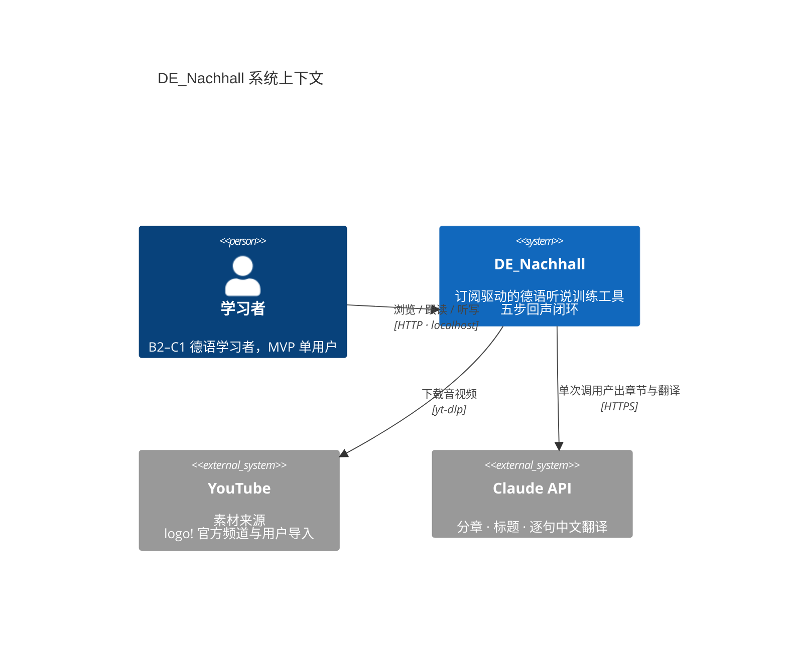
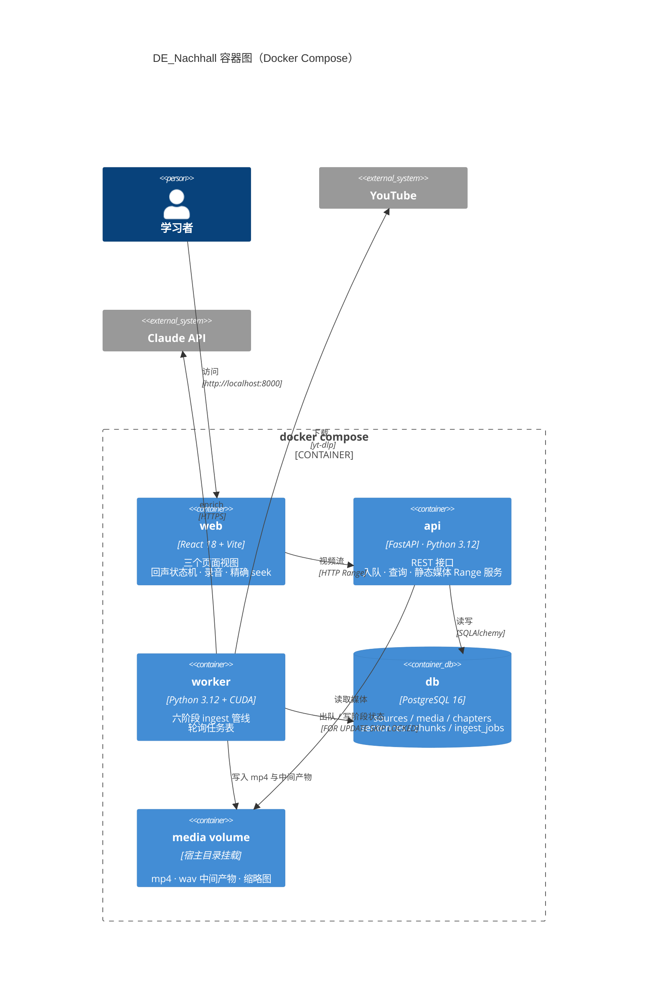
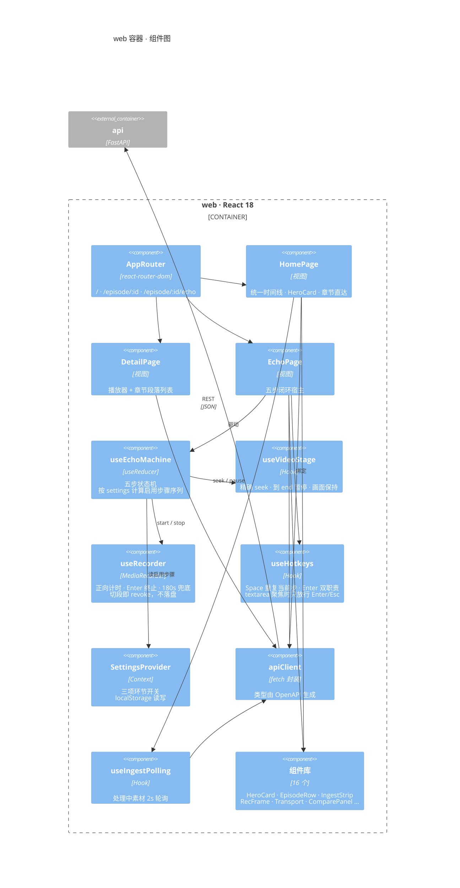
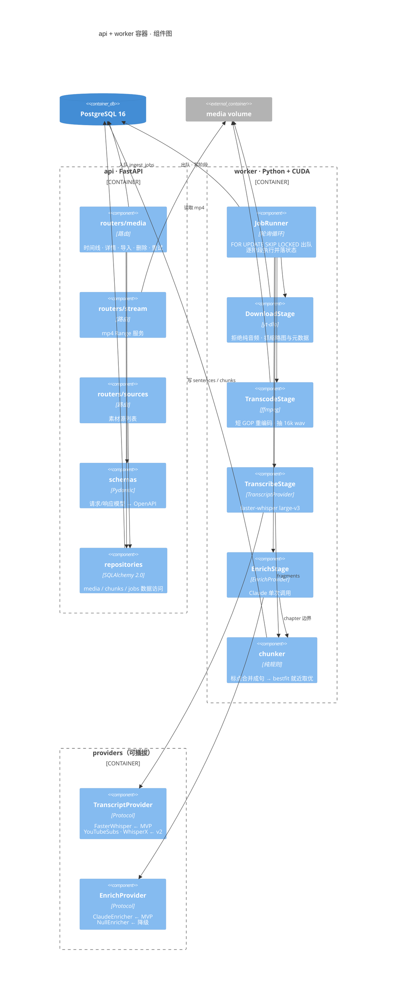
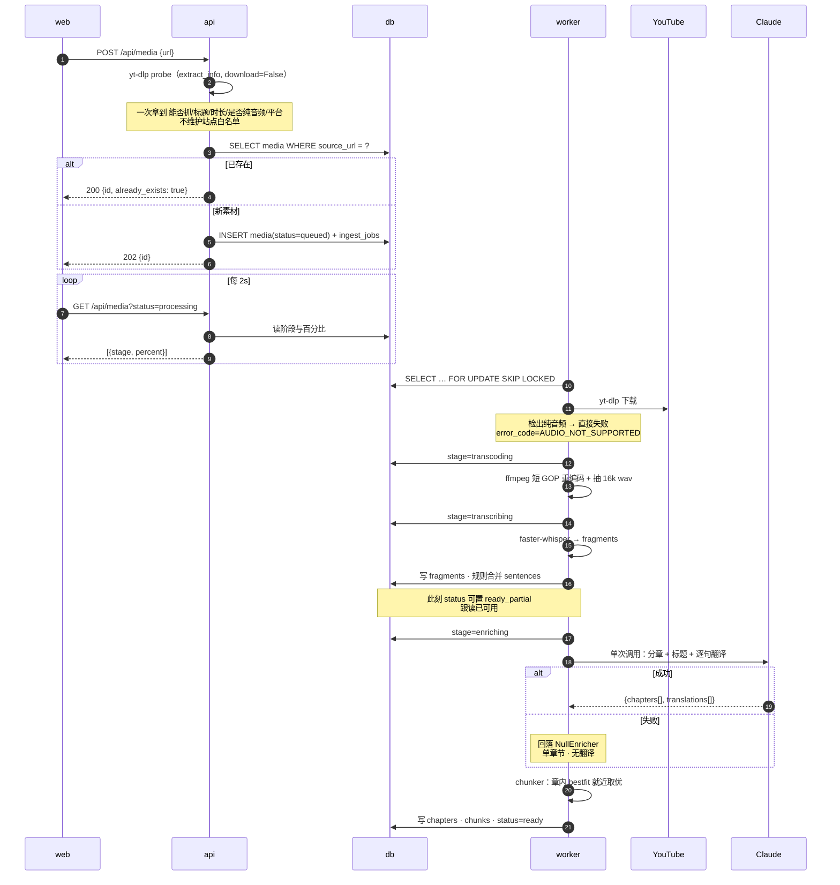
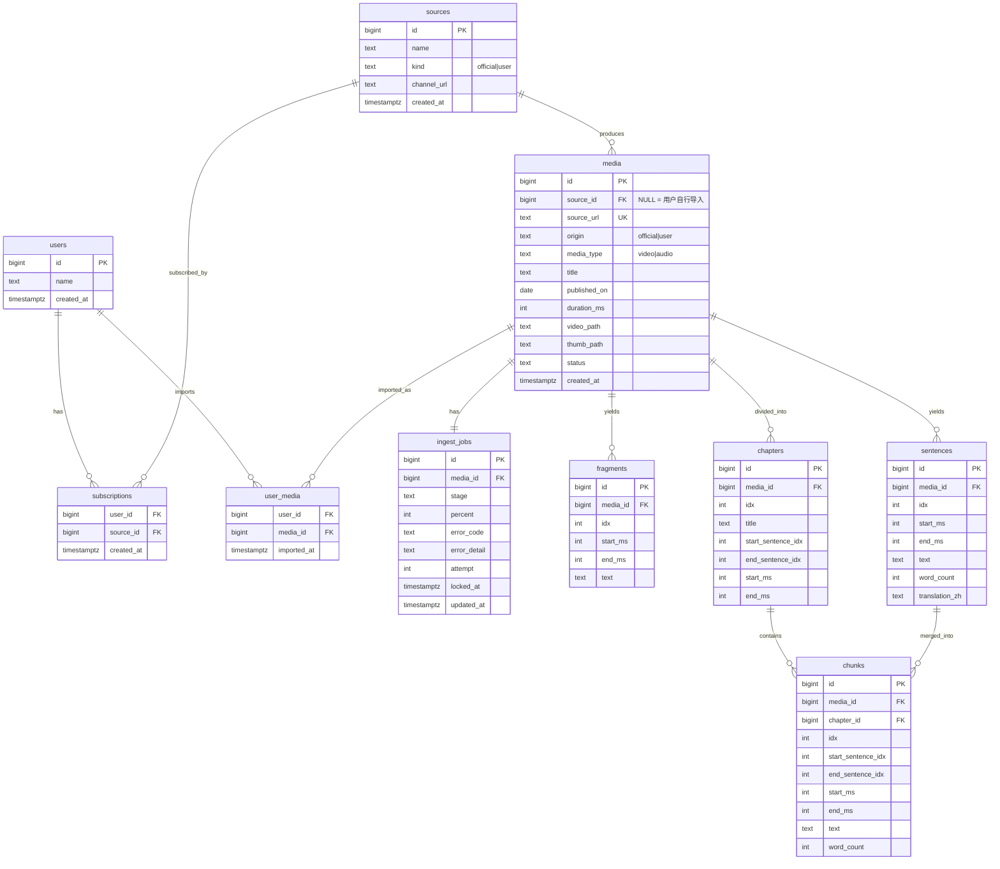

# DE_Nachhall 技术规格文档

> 版本 1.0 · 2026-08-23
> 上游：`docs/PRD.md` · `docs/UI-SPEC.md`
> 下游：`task-planner` · `test-planner`

---

## 1. 技术栈选型

| 层级 | 技术 | 版本 | 选型理由 |
|---|---|---|---|
| 前端框架 | React + TypeScript | 18.3 / 5.6 | 五步状态机 + `MediaRecorder` + 精确 `seek` 控制，这类边角需求的参考实现最多 |
| 前端构建 | Vite | 5.4 | 冷启快，HMR 对调音效/计时这类反复微调友好 |
| 前端路由 | react-router-dom | 6.x | 三个页面 + 章节直达的 query 参数 |
| 前端状态 | `useReducer` + Context | — | **不引 Redux/Zustand**。全局态只有 settings，回声状态机是页面局部的 |
| 前端样式 | `tokens.css` + CSS Modules | — | UI-SPEC 已给出完整变量，不需要 Tailwind 再抽象一层 |
| 后端语言 | Python | **3.12** | 宿主的 3.8 已 EOL 且 `faster-whisper` 要求 ≥ 3.9，容器内锁定 3.12 |
| 后端框架 | FastAPI + Uvicorn | 0.115 / 0.32 | 异步导入接口 + 自动 OpenAPI（前端类型可生成） |
| ORM / 迁移 | SQLAlchemy 2.0 + Alembic | 2.0 / 1.13 | 2.0 的 typed ORM 与 Pydantic 配合好 |
| 数据库 | PostgreSQL | **16** | 需要 `SELECT … FOR UPDATE SKIP LOCKED` 做任务队列；SQLite 做不了并发出队 |
| ASR | faster-whisper | 1.0.x | `large-v3` / `float16` / CUDA |
| 媒体 | ffmpeg · yt-dlp | latest | 转码缩 GOP · 下载 |
| LLM | Claude API | `claude-sonnet-5` | 单次调用同时产出分章、标题、逐句翻译 |
| 编排 | Docker Compose | v2 | 宿主 Python 不动；GPU 经 `nvidia-container-toolkit` 透传 |
| 任务队列 | **Postgres 任务表 + 轮询** | — | 见 §1.1 |

### 1.1 为什么不用 Redis / Celery / RQ

常规选择是 `RQ + Redis`，这里**有意否掉**：

| 事实 | 推论 |
|---|---|
| 每天几个任务、每个跑数分钟、单 worker | 不需要高吞吐调度器 |
| 六阶段状态**必须**存在 Postgres（前端轮询要读） | 用 Redis 会让同一份状态活在两个地方 |
| 需要「从失败阶段续跑」 | 阶段进度本就是业务数据，不是队列的内部状态 |
| Postgres 16 已在 compose 里 | `FOR UPDATE SKIP LOCKED` 就是标准出队原语 |

**结论**：`ingest_jobs` 表 + worker 轮询。少一个容器，少一处不一致。任务量涨到需要多 worker 时，`SKIP LOCKED` 天然支持水平扩展，届时再谈 Redis 也不迟。

### 1.2 Whisper 部署（O5 结案 · 已实测）

```
硬件：RTX 3060 Laptop · 6144 MiB 总显存 · 桌面占用约 1 GB · 实际可用 4748 MiB
模型：large-v3 · compute_type=int8_float16 · device=cuda
```

> **`float16` 实测 OOM。** SPEC v1 写的「3.1 GB 放得下 6 GB」是纸面推算，忽略了桌面占用与 beam search 的 KV cache。实测结果：
>
> | 配置 | 结果 |
> |---|---|
> | `large-v3` · `float16` · beam=5 | ❌ `CUDA failed with error out of memory` |
> | `large-v3` · **`int8_float16`** · beam=5 | ✅ **61.6 s / 491.6 s 音频，8.0× 实时** |

| 项 | 值 | 来源 |
|---|---|---|
| 模型加载 | 4.8 s（模型已缓存） | 实测 |
| 转写 8 分钟视频 | **61.6 s** | 实测 |
| 加速比 | **8.0×** | 实测 |
| 词准确率（对官方字幕） | **98.2%** | 实测，见 §11.2 |
| 语言 | 固定 `de`，不做自动检测 | — |
| `word_timestamps` | `False`，词级留给 v2 | — |
| `vad_filter` | `True` | — |
| 首次运行 | 额外下载模型约 1.5 GB | — |

> **降级**：`WHISPER_DEVICE=cpu` 时自动切 `int8`，耗时升到数分钟但不阻塞。

---

## 2. 系统架构

### 2.1 系统上下文（C4 L1）



> **无鉴权、无外部存储**。MVP 只在 localhost 运行，`user_id` 恒为 1。麦克风要求安全上下文，`localhost` 天然满足，不需要 HTTPS。

### 2.2 容器图（C4 L2）



**api 与 worker 分开的理由**：转写占满 GPU 且是长任务，与 HTTP 请求处理放同一进程会让接口延迟不可控。两者共享同一份代码库（同一镜像不同 entrypoint），只是运行入口不同。

### 2.3 前端组件图（C4 L3）



**`useEchoMachine` 是前端唯一复杂的东西**，它把「四个 settings 布尔」翻译成「最多五个运行时步骤」的序列，并管理步骤间的过渡。`useVideoStage` / `useRecorder` 都只听它调度，不自行推进。

### 2.4 后端组件图（C4 L3）



**三个 Provider 是产品化预留的落点**，全部是 `typing.Protocol`，不用继承：

| Protocol | MVP 实现 | 可插拔候选 | 降级实现 |
|---|---|---|---|
| `TranscriptProvider` | `FasterWhisperProvider` | `PlatformSubsProvider` · `WhisperXProvider` | — |
| `EnrichProvider` | `ClaudeEnricher` | `OpenAICompatEnricher`（GPT · 千问 · DeepSeek · Ollama） | **`NullEnricher`** |
| `SettingsProvider`（前端） | `LocalStorageSettings` | `ApiSettings` | 默认预设 |

`NullEnricher` 不是占位——它就是 PRD O8 的降级路径：LLM 失败时不分章、不翻译，chunk 按整段 bestfit 切，**跟读照常可用**。

### 2.5 ingest 六阶段时序



**「转写完成即可跟读」的实现**：`transcribing` 阶段结束就把 `media.status` 置为 `ready_partial`，前端此时已能进回声闭环；`enriching` 完成后再转 `ready`。详情页在 `ready_partial` 下显示「章节生成中」，跟读入口照常可点。

---

## 3. 数据模型

### 3.1 ER 图



### 3.2 四层文本结构的落库理由

PRD §3.0 定义了 `fragment → sentence → chunk → chapter` 四层。**三层都要落库**，理由各不相同：

| 层 | 落库 | 为什么 |
|---|---|---|
| `fragments` | ✅ | Whisper 原始输出。留着才能**改阈值重切而不重跑 GPU** |
| `sentences` | ✅ | **翻译挂在句上**（LLM 按句翻译），chunk 的翻译是其句子翻译的拼接。也是 chapter 边界的锚 |
| `chunks` | ✅ | 训练单元，前端直接消费。可从 sentences 重算，但缓存下来省一次计算 |
| `chapters` | ✅ | LLM 产出，重跑要花钱 |

> **重切场景**：`CHUNK_TARGET_WORDS` 调整时只需重跑 `chunker`（毫秒级），不碰转写与 LLM。这是把三层都存下来的主要回报——**target 本来就要按实际跟读手感反复调**。

### 3.3 表结构

```sql
-- ============ 用户与素材源 ============
CREATE TABLE users (
    id          BIGSERIAL PRIMARY KEY,
    name        TEXT NOT NULL,
    created_at  TIMESTAMPTZ NOT NULL DEFAULT now()
);
-- MVP 预置：INSERT INTO users(id, name) VALUES (1, 'me');

CREATE TABLE sources (
    id          BIGSERIAL PRIMARY KEY,
    name        TEXT NOT NULL,
    kind        TEXT NOT NULL CHECK (kind IN ('official','user')),
    channel_url TEXT,
    created_at  TIMESTAMPTZ NOT NULL DEFAULT now()
);
-- MVP 预置：logo! 官方源

CREATE TABLE subscriptions (
    user_id    BIGINT NOT NULL REFERENCES users(id) ON DELETE CASCADE,
    source_id  BIGINT NOT NULL REFERENCES sources(id) ON DELETE CASCADE,
    created_at TIMESTAMPTZ NOT NULL DEFAULT now(),
    PRIMARY KEY (user_id, source_id)
);

-- ============ 素材 ============
CREATE TABLE media (
    id           BIGSERIAL PRIMARY KEY,
    source_id    BIGINT REFERENCES sources(id) ON DELETE SET NULL,
    source_url   TEXT NOT NULL UNIQUE,          -- 全局去重的锚点
    platform     TEXT,                          -- yt-dlp extractor_key：Youtube / ZDF / ARDMediathek / generic …
    origin       TEXT NOT NULL CHECK (origin IN ('official','user')),
    media_type   TEXT NOT NULL DEFAULT 'video'
                 CHECK (media_type IN ('video','audio')),
    title        TEXT NOT NULL,
    published_on DATE,
    duration_ms  INT,
    video_path   TEXT,
    thumb_path   TEXT,
    status       TEXT NOT NULL DEFAULT 'queued'
                 CHECK (status IN ('queued','processing','ready_partial','ready','failed')),
    created_at   TIMESTAMPTZ NOT NULL DEFAULT now()
);
CREATE INDEX idx_media_timeline ON media(published_on DESC NULLS LAST, id DESC);
CREATE INDEX idx_media_status   ON media(status) WHERE status IN ('queued','processing','failed');

CREATE TABLE user_media (
    user_id     BIGINT NOT NULL REFERENCES users(id) ON DELETE CASCADE,
    media_id    BIGINT NOT NULL REFERENCES media(id) ON DELETE CASCADE,
    imported_at TIMESTAMPTZ NOT NULL DEFAULT now(),
    PRIMARY KEY (user_id, media_id)
);

-- ============ 任务队列 ============
CREATE TABLE ingest_jobs (
    id           BIGSERIAL PRIMARY KEY,
    media_id     BIGINT NOT NULL UNIQUE REFERENCES media(id) ON DELETE CASCADE,
    stage        TEXT NOT NULL DEFAULT 'queued'
                 CHECK (stage IN ('queued','downloading','transcoding',
                                  'transcribing','enriching','ready','failed')),
    percent      INT  NOT NULL DEFAULT 0,
    error_code   TEXT,
    error_detail TEXT,
    attempt      INT  NOT NULL DEFAULT 0,
    locked_at    TIMESTAMPTZ,
    updated_at   TIMESTAMPTZ NOT NULL DEFAULT now()
);
CREATE INDEX idx_jobs_pending ON ingest_jobs(stage, locked_at)
    WHERE stage NOT IN ('ready','failed');

-- ============ 四层文本 ============
CREATE TABLE fragments (
    id       BIGSERIAL PRIMARY KEY,
    media_id BIGINT NOT NULL REFERENCES media(id) ON DELETE CASCADE,
    idx      INT  NOT NULL,
    start_ms INT  NOT NULL,
    end_ms   INT  NOT NULL,
    text     TEXT NOT NULL,
    UNIQUE (media_id, idx)
);

CREATE TABLE sentences (
    id             BIGSERIAL PRIMARY KEY,
    media_id       BIGINT NOT NULL REFERENCES media(id) ON DELETE CASCADE,
    idx            INT  NOT NULL,
    start_ms       INT  NOT NULL,
    end_ms         INT  NOT NULL,
    text           TEXT NOT NULL,
    word_count     INT  NOT NULL,
    translation_zh TEXT,                        -- NULL = enriching 未完成或已降级
    UNIQUE (media_id, idx)
);

CREATE TABLE chapters (
    id                 BIGSERIAL PRIMARY KEY,
    media_id           BIGINT NOT NULL REFERENCES media(id) ON DELETE CASCADE,
    idx                INT  NOT NULL,
    title              TEXT,                    -- NULL = NullEnricher 降级
    start_sentence_idx INT  NOT NULL,
    end_sentence_idx   INT  NOT NULL,
    start_ms           INT  NOT NULL,
    end_ms             INT  NOT NULL,
    UNIQUE (media_id, idx)
);

CREATE TABLE chunks (
    id                 BIGSERIAL PRIMARY KEY,
    media_id           BIGINT NOT NULL REFERENCES media(id) ON DELETE CASCADE,
    chapter_id         BIGINT NOT NULL REFERENCES chapters(id) ON DELETE CASCADE,
    idx                INT  NOT NULL,           -- 全期连续编号，前端显示 #11 / 27
    start_sentence_idx INT  NOT NULL,
    end_sentence_idx   INT  NOT NULL,
    start_ms           INT  NOT NULL,
    end_ms             INT  NOT NULL,
    text               TEXT NOT NULL,
    word_count         INT  NOT NULL,
    UNIQUE (media_id, idx)
);
CREATE INDEX idx_chunks_chapter ON chunks(chapter_id, idx);
```

### 3.4 评审结论（2026-08-23 · 已签字）

表结构经用户逐表评审通过，**四处工程判断全部维持原方案**。理由在此固化，避免实现阶段被"顺手优化"掉：

| # | 判断 | 结论 | 不可轻易推翻的理由 |
|---|---|---|---|
| ① | 四层文本全部落库 | **维持** | 这三层就是为「target 要按实际跟读手感反复调」付的代价。调参从「重跑转写+LLM，几分钟且花钱」降到「重跑 chunker，毫秒级」。一年约 8.6 万行，Postgres 无压力 |
| ② | `chunks.text` 冗余存一份 | **维持** | 回声页每次切段都读文本，join 拼接在热路径上。代价是改 `sentences.text` 必须同步 `chunks.text`——**这条要写进 chunker 的实现约束** |
| ③ | `ingest_jobs` 与 `media` 分表 | **维持** | `media` 是长期数据，`ingest_jobs` 是过程数据。队列的高频 UPDATE 若落在 `media` 上会持续产生死元组 |
| ④ | `user_media` 与 `subscriptions` 分表 | **维持** | 语义不同：订阅是「源的内容自动进流」，`user_media` 是「我手动导入过」。订阅源素材**不写** `user_media` |

**首页时间线是两者的 UNION**，这是全站最核心的查询：

```sql
SELECT m.* FROM media m
  JOIN subscriptions s ON m.source_id = s.source_id AND s.user_id = :uid
UNION
SELECT m.* FROM media m
  JOIN user_media  um ON m.id = um.media_id        AND um.user_id = :uid
ORDER BY published_on DESC NULLS LAST, id DESC;
```

**三条级联策略：**

- `ON DELETE CASCADE` 沿 `media` 向下贯穿 —— 删一条 media，其 fragments / sentences / chapters / chunks / job 全部自动清除，不留孤儿
- `media.source_id` 用 **`SET NULL` 而非 CASCADE** —— 删掉一个源不应该删掉已下载好的素材
- 所有表带 `user_id` 外键，MVP 全填 `1` —— 以后加账号不用加列、不用回填、不用改查询

---

### 3.5 出队原语

```sql
-- worker 每 2s 执行一次
UPDATE ingest_jobs SET locked_at = now(), attempt = attempt + 1
WHERE id = (
    SELECT id FROM ingest_jobs
    WHERE stage NOT IN ('ready','failed')
      AND (locked_at IS NULL OR locked_at < now() - INTERVAL '15 minutes')
    ORDER BY id
    FOR UPDATE SKIP LOCKED
    LIMIT 1
)
RETURNING *;
```

`locked_at` 超时回收保证 worker 崩溃后任务能被重新捡起。`attempt` 用于给出「重试了几次」的可见信息，不做自动重试上限——**失败一律停在该阶段等用户决定**（PRD F3.2.5）。

---

## 4. Provider 契约

三个 Provider 是产品化预留的落点，全部用 `typing.Protocol`——实现方不需要继承任何基类。

### 4.1 EnrichProvider（多供应商可插拔）

**本期直连 Claude，但接口按「换一家 API 只改环境变量」设计。**

```python
# providers/enrich/base.py
from typing import Protocol, Sequence
from dataclasses import dataclass

@dataclass(frozen=True)
class SentenceIn:
    idx: int
    text: str

@dataclass(frozen=True)
class ChapterOut:
    idx: int
    title: str | None
    start_sentence_idx: int
    end_sentence_idx: int

@dataclass(frozen=True)
class EnrichResult:
    chapters: list[ChapterOut]
    translations: dict[int, str]      # sentence idx → 中文
    degraded: bool = False            # True 表示走了降级路径

class EnrichProvider(Protocol):
    name: str
    def enrich(self, sentences: Sequence[SentenceIn]) -> EnrichResult: ...
```

**统一的输出契约（所有供应商共用同一份 prompt 与 JSON Schema）：**

```json
{
  "chapters": [
    {"title": "Waldbrände in Südeuropa", "start_sentence_idx": 0, "end_sentence_idx": 11}
  ],
  "translations": [
    {"idx": 0, "zh": "南欧的森林已经烧了好几天。"}
  ]
}
```

| 实现 | 适用 | 调用方式 |
|---|---|---|
| `ClaudeEnricher` | **MVP 默认** | Anthropic Messages API，用 tool-use 强制结构化输出 |
| `OpenAICompatEnricher` | GPT · 千问（DashScope 兼容模式）· DeepSeek · 本地 Ollama | OpenAI Chat Completions + `response_format: json_schema` |
| `NullEnricher` | **降级** | 不调用任何 API：单章节、`title=NULL`、无翻译 |

**选择由环境变量驱动，代码零改动：**

```bash
# Claude（本期默认）
LLM_PROVIDER=claude
LLM_MODEL=claude-sonnet-5
ANTHROPIC_API_KEY=sk-ant-...

# 千问
LLM_PROVIDER=openai_compat
LLM_MODEL=qwen-plus
LLM_BASE_URL=https://dashscope.aliyuncs.com/compatible-mode/v1
LLM_API_KEY=sk-...

# GPT
LLM_PROVIDER=openai_compat
LLM_MODEL=gpt-4.1
LLM_BASE_URL=https://api.openai.com/v1
LLM_API_KEY=sk-...

# 本地 Ollama
LLM_PROVIDER=openai_compat
LLM_MODEL=qwen2.5:14b
LLM_BASE_URL=http://host.docker.internal:11434/v1
LLM_API_KEY=ollama
```

> `OpenAICompatEnricher` 一个实现覆盖了 GPT、千问、DeepSeek、Ollama 四家——它们都提供 OpenAI 兼容端点。**真正需要单独实现的只有 Claude**（Messages API 形态不同），所以 Provider 层只有两个真实实现加一个降级。

**三条硬约束：**

1. **prompt 与 JSON Schema 只有一份**，放在 `providers/enrich/contract.py`，两个实现共享。换供应商不得改变输出契约。
2. **`enrich` 必须是幂等的**——重试时用同样的 sentences 应得到可用结果，不依赖上一次的中间状态。
3. **任何供应商失败都回落 `NullEnricher`**，不重试第二家。自动跨供应商回退会让「为什么这期翻译质量不一样」变得无法解释。

### 4.2 TranscriptProvider

```python
class TranscriptProvider(Protocol):
    name: str
    def transcribe(self, media: MediaRef, lang: str) -> list[FragmentOut]: ...
```

> 入参是 `MediaRef`（含 wav 路径**与**原始 URL / probe 信息），不是裸 `wav_path`——字幕类实现需要访问平台元数据。

**已定策略：平台字幕优先，Whisper 兜底。**

| 顺序 | 实现 | 触发条件 | 实测表现 |
|---|---|---|---|
| 1 | **`PlatformSubsProvider`** | `probe.subtitles` 含 `de` 且非 `automatic_captions` | 几秒；拼写 100% 正确 |
| 2 | `FasterWhisperProvider` | 无平台字幕 | 62 s / 8 分钟视频；词准确率 98.2% |
| v2 | `WhisperXProvider` | 需要词级对齐时 | — |

**为什么字幕优先**（实测依据见 §11.2）：Whisper 的主要缺陷是**德语复合词拆分**——`Dopingkontrolle` → `Doping Kontrolle`、`supergut` → `super gut`。这对德语学习者是实害，学的就是错的拼写。官方字幕在这一点上 100% 正确。

**代价要写明**：官方广播字幕按阅读速度**压缩了约 10% 的词**（口吃、重复、语气词）。跟读时个别处会与原声对不上。取舍结论是——被删的多半是口吃重复，本来就不该跟读；而复合词拼错是每次都在害人。

### 4.3 SettingsProvider（前端）

```ts
export interface SettingsProvider {
  load(): EchoSettings;
  save(s: EchoSettings): void;
}

export const DEFAULT_SETTINGS: EchoSettings = {
  dictation: false,   // 默认关
  replay2:   true,
  record:    true,    // 同时驱动 ④ 录音与 ⑤ 回放
};
```

MVP 实现 `LocalStorageSettings`。**所有读写必须走这一层**——v2 接账号时只换实现，不改调用点。读取失败（隐私模式、清缓存）一律回落 `DEFAULT_SETTINGS`，不抛错。

---

### 4.4 chunker 算法（已用真实数据验证）

**两步纯规则，无 LLM、无模型。**

```python
# 第一步：fragment → sentence，按句末标点合并
END = re.compile(r'[.!?]["\u00bb\')\]]?\s*$')

# 第二步：sentence → chunk，bestfit「就近取优」
def chunk(sentences, target):
    out, cur = [], None
    for s in sentences:
        if cur is None:
            cur = s; continue
        now, after = wc(cur), wc(cur) + wc(s)
        if abs(after - target) <= abs(now - target):
            cur = merge(cur, s)          # 加上更接近目标 → 加
        else:
            out.append(cur); cur = s     # 加上反而更远 → 断开
    if cur: out.append(cur)
    return out
```

**为什么不是「先塞后查」的 greedy。** 用真实字幕实测（logo! 2026-08-21 · 491 s · 175 cue → 118 句）：

| 算法 | 块数 | 平均词数 | 平均时长 | 词数范围 | >35 词 |
|---|---|---|---|---|---|
| greedy `thr=22` | 43 | **27.6** ⚠️ | 11.1 s | 22–37 | **4** |
| greedy `thr=18` | 53 | 22.4 | 8.9 s | 5–36 | 1 |
| **bestfit `target=22`** | **53** | **22.4** ✅ | **8.9 s** | **14–32** | **0** |

greedy 系统性超标 25%——它先塞进整句再检查，而平均句长 10.1 词，等于每次平均超出半句。

**bestfit 的三个实测优势：**

1. **参数名等于实际结果**（`target=22` → 平均 22.4）。greedy 要设 18 才得 22.4，调参时会一直别扭——而 target 本来就要按实际跟读手感反复调。
2. **零长块**。完全消除 >35 词的超长 chunk，PRD F3.4.10「长句回退到句级」这条 P2 逃生口可能不再需要。
3. **词数范围更窄**（14–32 vs 5–37），跟读节奏更均匀。

> **不设硬上限。** 单个句子本身超过 target（德语长句常见）时照样独立成块——强行拆句会毁掉语感，而这正是 chunk 设计要避免的。

---

## 5. API 设计

### 5.1 约定

| 项 | 值 |
|---|---|
| 风格 | RESTful，JSON |
| 前缀 | `/api` |
| 认证 | **无**（MVP 单用户，`user_id` 恒为 1） |
| 版本 | 不加版本前缀。单用户自用，破坏性变更直接改 |
| 类型 | FastAPI 自动生成 OpenAPI，前端用 `openapi-typescript` 生成 `.d.ts` |

**错误响应统一形状：**

```json
{ "error": { "code": "AUDIO_NOT_SUPPORTED", "message": "这是纯音频素材，暂不支持。" } }
```

`message` 面向用户，**必须说明怎么修**，不只说错了（UI-SPEC §5.12）。

### 5.2 接口清单

| 方法 | 路径 | 描述 |
|---|---|---|
| `GET` | `/api/media` | 首页时间线。`?status=` 可筛处理中 |
| `POST` | `/api/media` | 粘 URL 导入 |
| `GET` | `/api/media/{id}` | 详情：章节 + chunk + 翻译 |
| `GET` | `/api/media/{id}/chunks` | 只取 chunk 列表（回声页用） |
| `POST` | `/api/media/{id}/retry` | 从失败阶段续跑 |
| `DELETE` | `/api/media/{id}` | 删除（仅 `origin=user`） |
| `GET` | `/api/media/{id}/stream` | mp4，**支持 Range** |
| `GET` | `/api/media/{id}/thumb` | 缩略图 |
| `GET` | `/api/sources` | 素材源列表（v2 订阅 UI 用） |

> **没有 settings 接口**。设置在 localStorage，前端自治。

### 5.3 关键接口细节

#### `POST /api/media` — probe-first

**不维护站点白名单。** 能不能抓由 `yt-dlp` 说了算，不由我们猜。

```python
# 提交时同步执行，1–3 秒
info = ydl.extract_info(url, download=False)   # 不下载，只探
```

这一次调用同时给出 **能否抓取 · 标题 · 时长 · 是否纯音频 · 缩略图 · 平台**——这些本来就要拿，提前到提交阶段等于零额外成本换即时错误反馈。

```jsonc
// 请求
{ "url": "https://www.zdf.de/kinder/logo/logo-vom-14-juli-100.html" }

// 202 新素材（probe 已填好元数据）
{ "id": 42, "status": "queued", "already_exists": false,
  "title": "logo! vom 14. Juli 2026", "platform": "ZDF", "duration_ms": 578000 }

// 200 已存在 —— 不重复转写
{ "id": 17, "status": "ready", "already_exists": true }
```

| 错误码 | HTTP | 触发 |
|---|---|---|
| `INVALID_URL` | 400 | 连 URL 形态都不合法，本地正则即可判 |
| `UNSUPPORTED_SITE` | 400 | `yt-dlp` 找不到 extractor |
| `PROBE_FAILED` | 400 | 找到 extractor 但抓不到元数据（下架、地域限制、需登录） |
| `AUDIO_NOT_SUPPORTED` | 400 | probe 显示无视频流 |

**`PROBE_FAILED` 的文案必须区分原因**——`yt-dlp` 的报错里能区分「地域限制」「已下架」「需要登录」，这三种用户的下一步动作完全不同。笼统说「抓取失败」等于没说。

> **为什么值得多等 1–3 秒**：换来的是不用维护白名单、错误即时且准确、元数据提前入库（列表立刻能显示真实标题而不是 URL）。

#### `GET /api/media`

```jsonc
[
  {
    "id": 42, "title": "Fünf Jahre nach der Flut: …",
    "published_on": "2026-07-14", "duration_ms": 578000,
    "origin": "official", "source": { "id": 1, "name": "logo!" },
    "status": "ready", "thumb_url": "/api/media/42/thumb",
    "chapters": [                      // status ∈ {ready} 时才有
      { "idx": 1, "title": "Waldbrände in Südeuropa", "duration_ms": 128000 }
    ]
  },
  {
    "id": 43, "title": "Warum Bienen so wichtig sind",
    "status": "processing",
    "job": { "stage": "transcribing", "percent": 58 }
  }
]
```

**排序**：`published_on DESC NULLS LAST, id DESC`。首条即 HeroCard，其余进历史时间线。**响应不含 `chunk_count`**——首页只谈时长（PRD）。

#### `GET /api/media/{id}/stream`

必须实现 HTTP Range，否则逐 chunk `seek` 会退化为整片下载。

| 情形 | 响应 |
|---|---|
| 无 `Range` | `200` + `Accept-Ranges: bytes` + `Content-Length` |
| 有 `Range` | `206` + `Content-Range: bytes s-e/total` |
| 越界 | `416` |

#### `POST /api/media/{id}/retry`

从 `ingest_jobs.stage` 记录的失败阶段续跑，**复用已完成阶段的产物**：mp4 已下载则不重下，wav 已抽则不重抽。

### 5.4 错误码表

| 码 | 阶段 | 用户可见文案要点 |
|---|---|---|
| `INVALID_URL` | 提交 | 这不像一个网址，检查是否漏了 `https://` |
| `UNSUPPORTED_SITE` | 提交 | 这个站点抓不了。支持 YouTube、ZDF、ARD 等 yt-dlp 覆盖的站点 |
| `PROBE_FAILED` | 提交 | **按 yt-dlp 报错分流**：地域限制 / 已下架 / 需要登录，三种文案不同 |
| `AUDIO_NOT_SUPPORTED` | 提交 | 音频没有画面，回声闭环的画面跟随无从谈起 |
| `DOWNLOAD_FAILED` | download | 网络或视频不可用，可重试 |
| `TRANSCODE_FAILED` | transcode | ffmpeg 失败，附 stderr 摘要 |
| `TRANSCRIBE_FAILED` | transcribe | 显存不足时提示改 `WHISPER_DEVICE=cpu` |
| `ENRICH_FAILED` | enrich | **不阻塞**：已回落降级，跟读可用，缺章节与翻译 |

---

## 6. 项目结构

```
DE_Nachhall/
├── docker-compose.yml
├── .env.example
├── docs/                          # PRD · UI-SPEC · SPEC · TASKS · TEST-PLAN
│   └── ui/tokens.css
│
├── server/                        # api 与 worker 共用同一份代码与镜像
│   ├── Dockerfile                 # 多阶段：base → api / worker(CUDA)
│   ├── pyproject.toml
│   ├── alembic/
│   │   └── versions/
│   └── src/de_nachhall/
│       ├── main.py                # FastAPI 入口（api entrypoint）
│       ├── worker.py              # 轮询循环入口（worker entrypoint）
│       ├── config.py              # pydantic-settings，读环境变量
│       ├── db/
│       │   ├── models.py          # SQLAlchemy 2.0 ORM
│       │   └── session.py
│       ├── schemas/               # Pydantic 请求/响应
│       ├── routers/
│       │   ├── media.py
│       │   ├── stream.py          # Range 服务
│       │   └── sources.py
│       ├── repositories/
│       ├── ingest/
│       │   ├── runner.py          # JobRunner：出队 + 阶段调度
│       │   └── stages/
│       │       ├── download.py
│       │       ├── transcode.py
│       │       ├── transcribe.py
│       │       └── enrich.py
│       ├── chunking/
│       │   ├── sentences.py       # fragment → sentence（标点合并）
│       │   └── chunker.py         # sentence → chunk（章内 bestfit 就近取优）
│       └── providers/
│           ├── transcript/
│           │   ├── base.py
│           │   └── faster_whisper.py
│           └── enrich/
│               ├── base.py
│               ├── contract.py    # 共享 prompt 与 JSON Schema
│               ├── claude.py
│               ├── openai_compat.py
│               └── null.py
│
└── web/
    ├── Dockerfile
    ├── package.json
    ├── vite.config.ts
    └── src/
        ├── main.tsx
        ├── routes/
        │   ├── HomePage.tsx
        │   ├── DetailPage.tsx
        │   └── EchoPage.tsx
        ├── echo/
        │   ├── useEchoMachine.ts  # 五步状态机（核心）
        │   ├── useVideoStage.ts   # 精确 seek + 到 end 暂停
        │   ├── useRecorder.ts     # MediaRecorder 正向计时
        │   └── useHotkeys.ts
        ├── settings/
        │   ├── SettingsProvider.tsx
        │   └── localStorage.ts
        ├── components/            # UI-SPEC 的 16 个组件
        ├── lib/
        │   ├── api.ts
        │   └── api.types.ts       # openapi-typescript 生成
        └── styles/
            └── tokens.css         # 从 docs/ui/tokens.css 同步
```

**`server/` 一份代码两个 entrypoint**：`main.py` 起 FastAPI，`worker.py` 起轮询循环。共享 models、repositories、config，避免 schema 漂移。

---

## 7. 依赖清单

### 7.1 后端

```toml
# server/pyproject.toml
[project]
requires-python = ">=3.12"
dependencies = [
  "fastapi>=0.115",
  "uvicorn[standard]>=0.32",
  "sqlalchemy>=2.0.36",
  "alembic>=1.13",
  "psycopg[binary]>=3.2",
  "pydantic>=2.9",
  "pydantic-settings>=2.6",
  "faster-whisper>=1.0.3",
  "yt-dlp>=2024.12.13",
  "anthropic>=0.40",
  "openai>=1.57",            # OpenAICompatEnricher：GPT / 千问 / DeepSeek / Ollama
  "httpx>=0.27",
]

[project.optional-dependencies]
dev = ["pytest>=8", "pytest-asyncio", "ruff>=0.8", "black>=24", "mypy>=1.13"]
```

> `ffmpeg` 不是 pip 包，装在镜像里（`apt install ffmpeg`）。

### 7.2 前端

```jsonc
{
  "dependencies": {
    "react": "^18.3.1",
    "react-dom": "^18.3.1",
    "react-router-dom": "^6.28.0"
  },
  "devDependencies": {
    "typescript": "^5.6.3",
    "vite": "^5.4.11",
    "@vitejs/plugin-react": "^4.3.4",
    "openapi-typescript": "^7.4.4",
    "eslint": "^9.16.0",
    "prettier": "^3.4.2",
    "vitest": "^2.1.8",
    "@testing-library/react": "^16.1.0"
  }
}
```

**运行时依赖只有三个**。状态管理、样式框架、组件库全部不引——UI-SPEC 已给出完整 token 与组件规格，再套一层抽象只会让硬规则更难落地。

---

## 8. 环境配置

### 8.1 环境变量

| 变量 | 必需 | 默认 | 说明 |
|---|---|---|---|
| `DATABASE_URL` | ✅ | — | `postgresql+psycopg://…` |
| `MEDIA_ROOT` | ✅ | `/data/media` | 容器内媒体根目录 |
| `LLM_PROVIDER` | ✅ | `claude` | `claude` \| `openai_compat` \| `null` |
| `LLM_MODEL` | ✅ | `claude-sonnet-5` | — |
| `ANTHROPIC_API_KEY` | 条件 | — | `LLM_PROVIDER=claude` 时必需 |
| `LLM_API_KEY` | 条件 | — | `LLM_PROVIDER=openai_compat` 时必需 |
| `LLM_BASE_URL` | 条件 | — | 同上 |
| `WHISPER_MODEL` | | `large-v3` | — |
| `WHISPER_DEVICE` | | `cuda` | `cuda` \| `cpu` |
| `WHISPER_COMPUTE_TYPE` | | `float16` | CPU 时自动降 `int8` |
| `CHUNK_TARGET_WORDS` | | `22` | **目标**词数而非阈值；改它只需重跑 chunker（毫秒级） |
| `RECORD_TIMEOUT_S` | | `180` | 前端读，经 `/api/config` 下发 |
| `GOP_SECONDS` | | `1` | 转码关键帧间隔，见 §9.1 |
| `WORKER_POLL_INTERVAL_S` | | `2` | — |

### 8.2 docker-compose

```yaml
services:
  db:
    image: postgres:16
    environment: [POSTGRES_DB=de_nachhall, POSTGRES_PASSWORD=dev]
    volumes: ["pgdata:/var/lib/postgresql/data"]

  api:
    build: { context: ./server, target: api }
    env_file: .env
    ports: ["8001:8000"]   # 宿主 8001 → 容器 8000
    volumes: ["./media:/data/media", "./server/src:/app/src"]   # 挂卷支持热重载
    depends_on: [db]

  worker:
    build: { context: ./server, target: worker }
    env_file: .env
    volumes: ["./media:/data/media", "./server/src:/app/src"]
    depends_on: [db]
    deploy:
      resources:
        reservations:
          devices: [{ driver: nvidia, count: 1, capabilities: [gpu] }]

  web:
    build: ./web
    ports: ["8000:5173"]   # 宿主 8000 → 容器 5173
    volumes: ["./web/src:/app/src"]
    depends_on: [api]

volumes: { pgdata: }
```

### 8.3 宿主前置条件

| 项 | 状态 | 动作 |
|---|---|---|
| Docker | ✅ 已装 | — |
| Node 20 | ✅ 已装 | 仅用于本机跑 lint / 生成类型 |
| `nvidia-container-toolkit` | ❓ **待验证** | GPU 透传的前提，装完 `docker run --gpus all nvidia/cuda nvidia-smi` 自检 |
| Python 3.8 | ⚠️ EOL | **不动它**，后端全在容器内 |
| `ffmpeg` / `yt-dlp` / `sqlite3` | ✖ 未装 | **不需要装**，都在镜像里 |
| 磁盘 | 75 GB 可用 | 一年约 250 期 × ~200 MB ≈ 50 GB，够但要监控 |

---

## 9. 技术约束

### 9.1 GOP 与 seek 精度（O9 · **已实测结案**）

完整报告见 `docs/sprint0-v2b-report.md`。

```
logo! 640×360 25fps · 各 12 轮 · 预算 200 ms

                    Chrome 131          Firefox 136
seek 落点误差       P95   0.0 ms        P95   0.0 ms
rVFC 暂停误差       P95  39.5 ms  ✅    P95  78.7 ms  ✅
timeupdate 暂停     P95 251.0 ms  ❌    P95 277.5 ms  ❌
                    中位 170.1 ms       中位 205.6 ms  ❌ 中位就超标
```

**两个浏览器的结论一致**：`rVFC` 都轻松达标（余量 5.1× / 2.5×），
`timeupdate` 都不达标。结论与浏览器无关。

#### 三条结论

**① 不为 seek 精度重新转码。** SPEC v1 假设「GOP 长 → seek 落点偏」，
据此要求 `-g 25`。**实测证明这个因果链是错的**：落点误差 0.0 ms，而源视频
GOP 是 2.00 s。浏览器做的是精确 seek —— 从前一关键帧解码到目标帧再呈现，
落点是准的，GOP 只影响 seek **延迟**。省下 15–25% 体积。

**② `useVideoStage` 必须用 `requestVideoFrameCallback`，不是推荐是唯一可行。**
Chrome 上 `timeupdate` 每五段就有一段超标；Firefox 上**中位数就超标**，
一半以上的段落会在超标点暂停。

**③ 但「不重编码」不等于「不处理」。** 见 §9.1a。

#### 9.1a HLS 来源必须重封装

实测中发现的阻塞项：`yt-dlp` 从 HLS 下载的文件**存成 `.mp4` 但内容是 MPEG-TS**
（`format_name=mpegts`，文件头 `0x47`，含两套节目与 `timed_id3` 数据流），
**浏览器完全无法播放**。

```bash
ffmpeg -i in.mp4 -map 0:v:0 -map 0:a:0 \
  -c copy -bsf:a aac_adtstoasc -movflags +faststart out.mp4
```

纯拷贝流不重编码，**实测 0.46 秒**。产出单流 h264+aac，`moov` 前置。

> 这条是 `TranscodeStage` 的硬要求，不可因为「源 GOP 已规整」而跳过。

#### 余量提示

```
25 fps → 帧间隔 40 ms → 理论下限 40 ms
Chrome  39.5 ms ≈ 1 帧  → 已贴理论下限，余量 5.1×
Firefox 78.7 ms ≈ 2 帧  → 余量 2.5×
```

**帧率越低余量越小**：15 fps 素材上 Firefox 的最大误差会逼近 130 ms，余量降到 1.5 倍。

### 9.2 安全上下文

`MediaRecorder` / `getUserMedia` 要求安全上下文。`http://localhost` 被浏览器视为安全，**MVP 不需要 HTTPS**。一旦部署到局域网 IP 或公网，录音立刻失效——这是上 VPS 时第一个会踩的坑。

### 9.3 显存（已实测）

| 项 | 大小 |
|---|---|
| GPU 总显存 | 6144 MiB |
| **桌面已占用** | **~1000 MiB** |
| **实际可用** | **~4750 MiB** |
| `large-v3` `float16` + beam=5 | ❌ **OOM** |
| `large-v3` `int8_float16` + beam=5 | ✅ 可用 |

**worker 常驻加载模型不卸载**——单用户场景下重复加载（4.8 s）的开销远大于占着显存。

> 若将来引入本地 LLM，两者必须串行——4.7 GB 装不下 Whisper + 7B 模型。

### 9.4 性能指标（对齐 UI-SPEC §5.1）

| 指标 | 目标 | 落点 |
|---|---|---|
| chunk seek / 暂停误差 | < 200 ms | §9.1 GOP |
| 10 分钟视频端到端 ingest | < 8 分钟 | GPU 下实际约 2–3 分钟 |
| 转写完成到可跟读 | 不等 enriching | `ready_partial` 状态 |
| 首页首屏 | < 2 s | 列表查询单表 + 章节 join |
| 录音启动延迟 | < 300 ms | 预热 `getUserMedia` 权限 |

### 9.5 安全与隐私

- **录音不落盘、不上传、不经过任何网络请求**，只存在于浏览器内存，切段即 `revokeObjectURL`
- LLM 调用只发送转写文本，**不发送音视频**
- API key 只在容器环境变量里，不进代码库（`.env` 入 `.gitignore`，提交 `.env.example`）
- MVP 无鉴权 —— 这是 localhost 部署的直接推论，不是遗漏

---

## 10. 代码规范

### 10.1 命名

| 类型 | 规范 | 示例 |
|---|---|---|
| Python 变量 / 函数 | `snake_case` | `merge_fragments_to_sentences` |
| Python 类 | `PascalCase` | `ClaudeEnricher` |
| Python 常量 | `UPPER_SNAKE` | `CHUNK_THRESHOLD_WORDS` |
| Python 文件 | `snake_case.py` | `openai_compat.py` |
| TS 变量 / 函数 | `camelCase` | `useEchoMachine` |
| React 组件 / 文件 | `PascalCase.tsx` | `HeroCard.tsx` |
| TS 其它文件 | `camelCase.ts` | `apiClient.ts` |
| CSS 类 | `camelCase`（CSS Modules） | `.heroTitle` |
| 数据库表 / 列 | `snake_case` 复数表名 | `ingest_jobs.error_code` |

### 10.2 格式化

| | 工具 | 配置 |
|---|---|---|
| Python | `ruff` + `black` | 行宽 100，双引号 |
| TypeScript | `eslint` + `prettier` | 行宽 100，单引号，有分号，2 空格 |

### 10.3 类型

- Python：`mypy` strict，公开函数必须有返回类型注解
- TypeScript：**禁止 `any`**；API 类型一律由 `openapi-typescript` 生成，不手写

### 10.4 从 UI-SPEC 继承的可机检规则

这几条是 UI-SPEC 硬规则里能被 lint 或 review 机械检查的部分：

| 规则 | 检查方式 |
|---|---|
| `--acc` 不得出现在 `color:` 后 | `grep -rn 'color:\s*var(--acc)' web/src` 必须为空 |
| 键名写文字不写符号 | `grep -rn '<kbd>[⏎␣]' web/src` 必须为空 |
| `ComparePanel` 无 diff 标记 | 该组件不得 import 任何 diff 库；review 检查 |
| 固定高度不得被覆盖 | 字幕区 / 状态行 / 控制条只用 `var(--h-*)`，不写字面值 |

---

## 11. 待办清单（O 列表结案状态）

| # | 待决项 | 结论 | 决策依据 |
|---|---|---|---|
| O2 | 存储形态 | **文件系统 + DB 元数据**。mp4/wav/缩略图落 `MEDIA_ROOT`，DB 只存路径 | 视频要走 Range 流式，BLOB 难优雅支持；一年 50 GB 进 DB 不现实 |
| O3 | 数据库 | **PostgreSQL 16** | 需要 `FOR UPDATE SKIP LOCKED` 做出队；SQLite 无此能力 |
| O4 | 前端框架 | **React 18 + TS + Vite** | 用户选择 |
| O5 | Whisper | **large-v3 / `int8_float16` / CUDA**，CPU 降级走 int8 | **实测**：`float16` OOM；`int8_float16` 61.6 s / 8.0× |
| O6 | LLM | **EnrichProvider 抽象，本期直连 Claude**，可换千问/GPT/DeepSeek/Ollama | 用户要求预留多供应商 |
| — | **转写来源** | **平台字幕优先，Whisper 兜底** | 实测：ZDF 4/4 有官方德语字幕；Whisper 复合词会拆错 |
| — | **chunker 算法** | **bestfit 就近取优**，`CHUNK_TARGET_WORDS=22`，不设硬上限 | 实测：greedy 系统性超标 25% |
| O7 | 部署 | **localhost + Docker Compose，无鉴权** | 用户选择；localhost 满足 MediaRecorder 安全上下文 |
| O8 | 降级路径 | 见 §5.4 错误码表；`enrich` 失败回落 `NullEnricher` **不阻塞跟读** | `NullEnricher` 天然就是降级实现 |
| O9 | GOP 与 seek | **已实测结案**：seek 落点误差 0.0 ms，不为 seek 转码；`rVFC` P95 78.7 ms 达标，`timeupdate` 中位 205.6 ms 超标 |
| — | **素材站点范围** | **不维护白名单**，交给 `yt-dlp` 探测。提交时 probe 一次，同步返回校验结果与元数据 | 200 ms 指标依赖浏览器 seek 实现，无法纸面推定 |
| O10 | 任务队列 | **Postgres 任务表 + 轮询**，否掉 Redis | 阶段状态本就必须在 Postgres；引 Redis 造成双写 |

### 11.1 Sprint 0 验证结果

| # | 验证 | 结果 | 影响 |
|---|---|---|---|
| **V1** | `nvidia-container-toolkit` GPU 透传 | ✅ **通过** | 容器内 `nvidia-smi` 正常，CUDA 12.8 |
| **V2** | GOP 与 seek 精度 | ⚠️ **结论改变** | 源视频 GOP 已是规整 2.00 s；**真正的风险不是 GOP 而是 `timeupdate` 粒度**，见 §9.1。浏览器端实测留作收尾 |
| **V3** | 各平台德语字幕可用性 | ✅ **通过，且推翻素材源选择** | 见 §11.2 |

### 11.2 V3 详细结果 —— 素材源应改为 ZDF/logo.de

| 源 | 德语字幕 | 抽样 |
|---|---|---|
| YouTube `@logo-nachrichten` | **一条都没有**（连 `automatic_captions` 都未开启） | **0 / 4** |
| **ZDF · logo.de** | **官方 `deu` VTT + XML** | **4 / 4** |

> logo! 已从 `zdf.de/kinder/logo` 迁至独立域名 **`logo.de`**，`yt-dlp` 的 ZDF extractor 可直接处理。

**官方字幕质量（logo! 2026-08-21，491 s）：**

```
175 cue · 1362 词 · 覆盖 486.5 s（99.1%）
拼写、专有名词、引号全部正确
但按显示行断，不按语义句断 → chunk 管线照样需要
```

**Whisper 对照实测（`large-v3` / `int8_float16`）：**

| 指标 | 值 |
|---|---|
| 转写耗时 | **61.6 s**（491.6 s 音频，8.0× 实时） |
| 词准确率 | **98.2%** |
| WER | 12.6%（**有误导性**，见下） |

WER 偏高几乎全部来自 **128 个插入**，拆开看：

| 类型 | 例子 | 性质 |
|---|---|---|
| **德语复合词拆分** | `mittenrein`→`mitten rein`<br>`Dopingkontrolle`→`Doping Kontrolle`<br>`supergut`→`super gut` | **Whisper 的实害**——学习者会学错拼写 |
| 官方字幕删减 | Whisper 多出 `und`、口吃重复片段 | **不是 Whisper 错**，广播字幕按阅读速度压缩约 10% |
| 真实错误 | `Seegras`→`Seekrass`、`ansah`→`anser` | 少数几处 |
| **官方字幕错、Whisper 对** | `Jassuni` → `Yasuni` | 厄瓜多尔国家公园正确拼法就是 Yasuní |

**结论：平台字幕优先，Whisper 兜底。** 复合词拼错是每次都在害人；被删的多半是口吃重复，本来就不该跟读。

### 11.3 部署阻塞项（Sprint 0 顺带发现）

这两条不解决，`worker` 在本机跑不通：

| # | 问题 | 处理 |
|---|---|---|
| **B1** | 宿主经 `HTTPS_PROXY=http://127.0.0.1:7897`（当时的端口，现由 `.env` 的 `HOST_PROXY` 配置）上网，**容器内 `127.0.0.1` 是它自己**，抓取全部失败（`Errno 101`） | compose 里 worker 用 `network_mode: host` 并注入代理变量；或 `host.docker.internal` + `extra_hosts` |
| **B2** | YouTube 对该出口 IP 返回 `Sign in to confirm you're not a bot`，需 `--cookies-from-browser` | **ZDF 无此问题**。素材源改为 ZDF 后 B2 不再阻塞 MVP；保留 `YTDLP_COOKIES_FROM` 环境变量供以后 |

### 11.4 管线端到端实测（2026-08-23，TASK-017~020 完成后）

对**真实 logo.de 整期**跑通四阶段，无人工介入：

```
URL   https://www.logo.de/logo-vom-freitag-21-august-2026-100.html
```

| 阶段 | 耗时 | 结果 |
|---|---|---|
| downloading | 约 280 s | 148.8 MB，720p mp4；标题、时长、平台、发布日期均自动回填 |
| transcoding | 0.7 s | 已是 mp4 → 仅加 `+faststart`；抽出 15.7 MB / 16k 单声道 wav |
| transcribing | 15 s | `platform_subs` 命中 `deu` 官方字幕，**175 cue，未触发 Whisper** |
| enriching | 0.01 s | 无 `ANTHROPIC_API_KEY` → 按 O8 降级为单章、无标题、无翻译 |

产出与 Sprint 0 的离线预测完全一致：

| 指标 | Sprint 0 预测 | 实测 |
|---|---|---|
| fragments | 175 | **175** |
| sentences | 118 | **118** |
| chunks (target=22) | 53 | **53** |
| chunk 平均词数 | 22.4 | **22.4**（最短 14，最长 32） |

`video.mp4` 的 atom 顺序实测 `ftyp → moov(457 KB) → free → mdat`，
**moov 在 mdat 之前**，浏览器不必下完整片即可 seek —— 这正是 V2b 卡住时缺的东西。

两条实测中确定的改动：

| # | 发现 | 处理 |
|---|---|---|
| E1 | ZDF 下架页报的是 `Failed to download fallback metadata: HTTP Error 404`，不含 `video unavailable`，原关键词表接不住 | 404 按 extractor 分流：`[generic]` → `UNSUPPORTED_SITE`，其余 → 视频已下架 |
| E2 | `source.mp4` 与 `video.mp4` 各 148.8 MB，每期占双份磁盘 | transcoding 成功后删除原始下载；`DownloadStage` 的续跑判断改为「source 在**或** video.mp4 在」，重试仍不重复下载 |

两条编排层的实测发现：

| # | 发现 | 处理 |
|---|---|---|
| E3 | compose 同时挂 `./data:/data` 与 `./media:/data/media`，后者把前者盖住，`MEDIA_ROOT` 指到哪一份取决于挂载顺序 | 删掉 `./media` 挂载，媒体统一放 `./data/media`；`./media` 目录一并移除 |
| E4 | `ANTHROPIC_API_KEY` 为空时 **api 也起不来**，而且是以最坏的方式：`/api/health` 返回 200，每条数据请求 500 | 见下方 E5，这条是它的表象 |
| E5 | LLM 凭据校验放在 `Settings` 的模型校验器里，于是**从头到尾不碰 LLM 的 api 被一并卡死**；又因为 `Settings` 是第一次要 DB session 时才构造，失败推迟到了运行期 | 三处改动，见 §8.1a |

**仍未实测**（需要真人、真浏览器或真 key，代码里验不了）：

| 项 | 为什么没验 |
|---|---|
| `enriching` 走真实 LLM | `.env` 里 `ANTHROPIC_API_KEY` 为空，本轮只覆盖到降级分支 |
| 回声闭环的五步交互 | 需要浏览器操作，本会话无浏览器工具 |
| `useRecorder` 的录音与回放 | 需要真实麦克风授权 |
| `useVideoStage` 在应用内的暂停误差 | V2b 验的是 rVFC 这个 API 的精度，不是这个 hook 的实现 |

### 11.4a 配置校验的归属（E5 结案）

原设计把 LLM 凭据校验写进 `Settings` 的 `@model_validator`。看起来对 ——
「缺必需变量启动即失败」正是 §8.1 要的。实际有两个问题：

1. **校验的作用域错了。** api 的 routers 与 services 里没有一处引用 LLM，
   enrich 只发生在 worker。让 api 因为缺一把它永远不用的 key 而无法工作，
   是把 worker 的前置条件强加给了另一个进程。
2. **「启动即失败」并没有真的发生。** `Settings` 通过 `get_db` 依赖懒构造，
   第一次要 DB session 时才求值。结果是 api 容器状态 `Up`、
   `/api/health` 返回 `200 ok`，而每条真实请求 500 并吐一段
   `pydantic ValidationError` 堆栈 —— 用户看到的是前端的
   「连不上服务」，离真正的原因隔了三层。

改法三处：

| 位置 | 改动 |
|---|---|
| `config.py` | 校验从 `@model_validator` 移出，改为 `require_llm_credentials(settings)`；`Settings` 本身不再要求任何 LLM 凭据 |
| `worker.py` | 启动时显式调用它，失败打一行可读的中文并 `exit 2`（保住 §8.1 的语义，且不再是堆栈） |
| `main.py` | 用 `lifespan` 在启动时就构造 `Settings` 与 engine；`/api/health` **真的执行一次 `SELECT 1`** |

最后一条是这次误报的根源：不碰任何依赖的健康检查只能证明进程还活着，
而进程活着恰恰是最不值得报告的那件事。

### 11.4b 时间戳精度（2026-08-24）

四期素材的段间空隙实测：

| 素材 | 转写来源 | 段数 | 空隙合计 | 最大 |
|---|---|---|---|---|
| media 1 | 平台字幕 | 53 | **14.6 s** | 3.5 s |
| media 2 | Whisper | 10 | 0 s | — |
| media 3 | Whisper | 10 | 7.1 s | 1.3 s |
| media 4 | 平台字幕 | 72 | **12.4 s** | 1.7 s |

两处改动：

| # | 问题 | 处理 |
|---|---|---|
| T1 | Whisper 的 segment 级 `start`/`end` 带着 VAD 的静音余量，每段前后各多出几百毫秒空白 | 开 `word_timestamps=True`，用首尾词的时间做边界（`_speech_span()`）。末尾留 80 ms 余量并钳在 segment 末尾之内——正好切在词尾会把爆破音的收尾剪掉 |
| T2 | 连播在每个段边界 seek，跳过段间空隙 | 改成一次播到整期末尾。实测 media 1：52 次 seek、跳掉 14.6 s → 1 次 seek、0 跳过 |

**平台字幕那条路还没解决**（TASK-046）：cue 时间是按阅读节奏排的，不是按语音起止排的。已有素材的时间戳不会自动变好——词级时间戳只对**重新转写**的生效。

### 11.5 Sprint 0 收尾项

| # | 状态 | 说明 |
|---|---|---|
| V2b | **已完成** | Firefox 136 / Chrome 131 双浏览器实测，rVFC 暂停误差中位 31.5 / 15.9 ms，`timeupdate` 中位 205.6 / 170.1 ms —— rVFC 是硬要求。详见 `docs/sprint0-v2b-report.md` |
| V3b | 未做，不阻塞 | 抽样非 ZDF 站点（ARD、Vimeo 等）的字幕覆盖率。MVP 只需 ZDF 成立即可；`PlatformSubsProvider` 拿不到字幕会自动回落 Whisper，覆盖率低只影响速度不影响可用性 |

---

## META（供其他 Skill 解析）

```yaml
project:
  name: DE_Nachhall
  version: "1.0"
  deployment: localhost_docker_compose
  auth: none_mvp_user_id_1

tech_stack:
  frontend:
    framework: React
    version: "18.3"
    language: TypeScript
    build: Vite
    router: react-router-dom
    state: useReducer + Context
    styles: tokens.css + CSS Modules
    no_deps: [redux, zustand, tailwind, ui-kit]
  backend:
    runtime: Python
    version: "3.12"
    framework: FastAPI
    orm: SQLAlchemy 2.0
    migration: Alembic
    driver: psycopg3
  database:
    type: PostgreSQL
    version: "16"
  queue:
    type: postgres_table_polling
    primitive: SELECT FOR UPDATE SKIP LOCKED
    rejected: [redis, celery, rq]
    reason: 阶段状态必须在 Postgres 供前端轮询；引 Redis 造成同一状态双写
  transcript_strategy:
    primary: PlatformSubsProvider     # 平台官方字幕
    fallback: FasterWhisperProvider
    measured:
      zdf_subtitle_coverage: "4/4"
      youtube_subtitle_coverage: "0/4"
      whisper_word_accuracy: "98.2%"
      whisper_main_weakness: 德语复合词拆分（Dopingkontrolle → Doping Kontrolle）
      official_subs_tradeoff: 按阅读速度压缩约 10% 的词（多为口吃重复）
  asr:
    lib: faster-whisper
    model: large-v3
    device: cuda
    compute_type: int8_float16        # 实测 float16 在 6GB/桌面占用下 OOM
    fallback: { device: cpu, compute_type: int8 }
    measured:
      vram_total_mib: 6144
      vram_free_mib: 4748
      float16_result: OOM
      load_s: 4.8
      transcribe_s: 61.6
      audio_s: 491.6
      speedup: "8.0x"
  llm:
    abstraction: EnrichProvider
    mvp: claude
    pluggable: [openai_compat]
    covers: [gpt, qwen, deepseek, ollama]
    degradation: NullEnricher
  media: [ffmpeg, yt-dlp]
  source_sites:
    policy: no_whitelist
    resolver: yt-dlp extract_info(download=False)
    probe_at: submit_time
    probe_latency_s: "1-3"
    rationale: yt-dlp 覆盖 1000+ 站点；维护白名单既不完备又要持续跟进
  orchestration: docker compose

architecture:
  pattern: layered (router → repository → db) + staged pipeline worker
  api_style: RESTful
  containers: [web, api, worker, db]
  api_worker_split_reason: 转写占满 GPU 且是长任务，与 HTTP 处理同进程会让接口延迟不可控
  shared_codebase: server/ 一份代码两个 entrypoint

providers:
  - name: TranscriptProvider
    protocol: transcribe(media_ref, lang) -> list[FragmentOut]
    protocol_note: 入参含 wav 路径与原始 URL/probe 信息，不是裸 wav_path——字幕类实现需要平台元数据
    mvp: FasterWhisperProvider
    future: [PlatformSubsProvider, WhisperXProvider]
    platform_subs_rule: probe.subtitles 含 de 且非 automatic_captions 则用平台字幕，否则回落 Whisper
  - name: EnrichProvider
    protocol: enrich(sentences) -> EnrichResult
    mvp: ClaudeEnricher
    future: [OpenAICompatEnricher]
    degradation: NullEnricher
    contract_shared: providers/enrich/contract.py
    env_driven: [LLM_PROVIDER, LLM_MODEL, LLM_BASE_URL, LLM_API_KEY]
    rules:
      - prompt 与 JSON Schema 只有一份，换供应商不得改变输出契约
      - enrich 必须幂等
      - 任何供应商失败都回落 NullEnricher，不跨供应商重试
  - name: SettingsProvider
    location: frontend
    mvp: LocalStorageSettings
    future: [ApiSettings]
    fallback: DEFAULT_SETTINGS

modules:
  - name: db
    type: backend
    priority: P0
    dependencies: []
    files: [server/src/de_nachhall/db/models.py, server/alembic/versions/]

  - name: media_api
    type: backend
    priority: P0
    dependencies: [db]
    files: [server/src/de_nachhall/routers/media.py, server/src/de_nachhall/repositories/]
    endpoints:
      - { method: GET,    path: /api/media }
      - { method: POST,   path: /api/media }
      - { method: GET,    path: /api/media/{id} }
      - { method: GET,    path: /api/media/{id}/chunks }
      - { method: POST,   path: /api/media/{id}/retry }
      - { method: DELETE, path: /api/media/{id} }

  - name: stream_api
    type: backend
    priority: P0
    dependencies: [db]
    files: [server/src/de_nachhall/routers/stream.py]
    endpoints:
      - { method: GET, path: /api/media/{id}/stream }
      - { method: GET, path: /api/media/{id}/thumb }
    note: 必须支持 HTTP Range，否则逐 chunk seek 退化为整片下载

  - name: chunking
    type: backend
    priority: P0
    algorithm: bestfit
    param: CHUNK_TARGET_WORDS
    param_default: 22
    hard_max: none
    validated_on: "logo! 2026-08-21 · 491s · 175 cue → 118 sentence"
    measured:
      chunks: 53
      avg_words: 22.4
      avg_duration_s: 8.9
      word_range: "14-32"
      over_35_words: 0
      rejected_greedy: "thr=22 → avg 27.6 词，超标 25%，4 个长块"
    dependencies: []
    files: [server/src/de_nachhall/chunking/sentences.py, server/src/de_nachhall/chunking/chunker.py]
    note: 纯规则无 LLM；标点合并成句 → 章内 bestfit 就近取优成 chunk；chapter 边界是硬边界；不设硬上限

  - name: ingest_worker
    type: backend
    priority: P0
    dependencies: [db, chunking]
    files: [server/src/de_nachhall/ingest/runner.py, server/src/de_nachhall/ingest/stages/]
    stages: [queued, downloading, transcoding, transcribing, enriching, ready]
    note: transcribing 完成即置 ready_partial，跟读可用

  - name: web_home
    type: frontend
    priority: P0
    dependencies: [media_api]
    files: [web/src/routes/HomePage.tsx, web/src/components/HeroCard.tsx, web/src/components/EpisodeRow.tsx, web/src/components/IngestStrip.tsx]

  - name: web_detail
    type: frontend
    priority: P0
    dependencies: [media_api, stream_api]
    files: [web/src/routes/DetailPage.tsx, web/src/components/ChunkList.tsx]

  - name: web_echo
    type: frontend
    priority: P0
    dependencies: [media_api, stream_api]
    files:
      - web/src/routes/EchoPage.tsx
      - web/src/echo/useEchoMachine.ts
      - web/src/echo/useVideoStage.ts
      - web/src/echo/useRecorder.ts
      - web/src/echo/useHotkeys.ts
    note: 前端唯一复杂模块；四个 settings 布尔翻译成最多五个运行时步骤

  - name: web_settings
    type: frontend
    priority: P0
    dependencies: []
    files: [web/src/settings/SettingsProvider.tsx, web/src/settings/localStorage.ts]

database_tables:
  - { name: users,         primary_key: id }
  - { name: sources,       primary_key: id, note: "kind: official|user；MVP 预置 logo!" }
  - { name: subscriptions, primary_key: [user_id, source_id] }
  - { name: media,         primary_key: id, unique: [source_url], note: "全局去重锚点；origin/media_type 枚举；platform 存 yt-dlp extractor_key" }
  - { name: user_media,    primary_key: [user_id, media_id] }
  - { name: ingest_jobs,   primary_key: id, unique: [media_id], note: "队列表；FOR UPDATE SKIP LOCKED" }
  - { name: fragments,     primary_key: id, unique: [media_id, idx], note: "Whisper 原始输出，保留以支持改阈值重切" }
  - { name: sentences,     primary_key: id, unique: [media_id, idx], note: "翻译挂在句上" }
  - { name: chapters,      primary_key: id, unique: [media_id, idx], note: "LLM 产出；chunk 切分的硬边界" }
  - { name: chunks,        primary_key: id, unique: [media_id, idx], note: "训练单元；idx 全期连续，前端显示 #11/27" }

environment:
  python: ">=3.12"
  node: ">=20"
  required_env_vars:
    - { name: DATABASE_URL,  description: Postgres 连接串 }
    - { name: MEDIA_ROOT,    description: 媒体根目录，默认 /data/media }
    - { name: LLM_PROVIDER,  description: "claude | openai_compat | null" }
    - { name: LLM_MODEL,     description: 模型名 }
  conditional_env_vars:
    - { name: ANTHROPIC_API_KEY, when: "LLM_PROVIDER=claude" }
    - { name: LLM_API_KEY,       when: "LLM_PROVIDER=openai_compat" }
    - { name: LLM_BASE_URL,      when: "LLM_PROVIDER=openai_compat" }
  optional_env_vars:
    - { name: WHISPER_MODEL,        default: large-v3 }
    - { name: WHISPER_DEVICE,       default: cuda }
    - { name: WHISPER_COMPUTE_TYPE, default: float16 }
    - { name: CHUNK_TARGET_WORDS, default: "22" }
    - { name: RECORD_TIMEOUT_S,     default: "180" }
    - { name: GOP_SECONDS,          default: "1" }
    - { name: WORKER_POLL_INTERVAL_S, default: "2" }

infrastructure:
  host_detected:
    cpu: 12th Gen Intel i5-12450H (12 threads)
    gpu: NVIDIA RTX 3060 Laptop 6GB
    memory: 15GB
    disk_free: 75GB
    python: 3.8.10 (EOL, 不使用)
    node: 20.20.2
    docker: installed
  host_prerequisites:
    - { item: nvidia-container-toolkit, status: 待验证, blocking: GPU 透传 }
  not_needed_on_host: [ffmpeg, yt-dlp, sqlite3, python3.12]

code_style:
  python:
    naming: { variables: snake_case, classes: PascalCase, constants: UPPER_SNAKE, files: snake_case }
    format: { tool: "ruff + black", line_length: 100, quotes: double }
    typing: mypy strict
  typescript:
    naming: { variables: camelCase, components: PascalCase, files_component: PascalCase, files_other: camelCase }
    format: { tool: "eslint + prettier", line_length: 100, quotes: single, semi: true, indent: 2 }
    typing: no any; API types generated by openapi-typescript
  database:
    naming: snake_case, plural table names

machine_checkable_rules:
  - { rule: "--acc 不得用于 color:", check: "grep -rn 'color:\\s*var(--acc)' web/src 必须为空" }
  - { rule: "键名写文字不写符号",     check: "grep -rn '<kbd>[⏎␣]' web/src 必须为空" }
  - { rule: "ComparePanel 无 diff",  check: "该组件不得 import 任何 diff 库" }
  - { rule: "固定高度不写字面值",     check: "字幕区/状态行/控制条只用 var(--h-*)" }

open_decisions_resolved: [O2, O3, O4, O5, O6, O7, O8, O10]
open_decisions_pending_verification:
  - { id: O9, item: GOP 与 seek 精度, action: Sprint 0 实测 -g 25 }

sprint_zero_results:
  V1:
    item: nvidia-container-toolkit GPU 透传
    status: PASS
    detail: 容器内 nvidia-smi 正常，CUDA 12.8，driver 570.133.07
  V2:
    item: GOP 与 seek 精度
    status: PASS
    report: docs/sprint0-v2b-report.md
    measured_on: 640x360 25fps / 12 rounds each
    chrome_131:
      seek_landing_error_ms: {median: 0.0, p95: 0.0}
      rvfc_pause_error_ms: {median: 15.9, p95: 39.5}
      timeupdate_pause_error_ms: {median: 170.1, p95: 251.0}
    firefox_136:
      seek_landing_error_ms: {median: 0.0, p95: 0.0}
      rvfc_pause_error_ms: {median: 31.5, p95: 78.7}
      timeupdate_pause_error_ms: {median: 205.6, p95: 277.5}
    conclusions:
      - seek 落点误差 0.0ms，浏览器做精确 seek，不为 seek 精度转码
      - useVideoStage 必须用 requestVideoFrameCallback；timeupdate 中位数即超标
      - HLS 来源存成 .mp4 实为 mpegts，必须重封装（纯拷贝 0.46s）否则浏览器不能播
    browser_target: 两个浏览器结论一致，兼容目标可放宽到 Chrome/Edge/Firefox
  V3:
    item: 各平台德语字幕可用性
    status: PASS_AND_CHANGED_SOURCE
    detail: ZDF/logo.de 4/4 有官方 deu VTT；YouTube 0/4 完全无字幕
    action: 素材源从 YouTube 改为 ZDF/logo.de（已迁至独立域名 logo.de）

deployment_blockers:
  B1:
    item: 宿主 loopback 上的代理容器内不可达（Errno 101）
    fix: worker 用 network_mode host 并注入 HTTP_PROXY/HTTPS_PROXY
    status: 必须在 compose 中处理
  B2:
    item: YouTube 对该出口 IP 要求 cookies 验证
    fix: 素材源改 ZDF 后不再阻塞；保留 YTDLP_COOKIES_FROM 环境变量
    status: 已绕开

```
