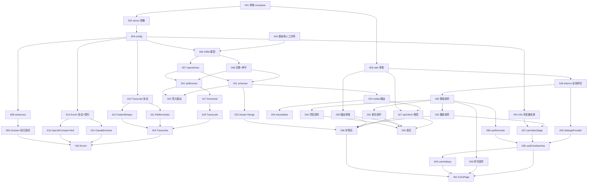

# DE_Nachhall 开发任务计划

## 元信息
- **PRD**: docs/PRD.md
- **UI-SPEC**: docs/UI-SPEC.md
- **Spec**: docs/SPEC.md
- **生成时间**: 2026-08-23 04:30
- **任务总数**: 43

## 模块划分

| 模块 | 任务 | 说明 |
|---|---|---|
| M0 基础设施 | 001–003 | compose · Dockerfile · 前端骨架 |
| M1 数据层 | 004–006 | config · ORM · 迁移与种子 |
| M2 仓储层 | 007 | repositories |
| M3 切分 | 008–009 | 纯规则，算法已用真实数据验证 |
| M4 转写 Provider | 010–012 | 字幕优先 · Whisper 兜底 |
| M5 Enrich Provider | 013–015 | Claude · OpenAI 兼容 · Null 降级 |
| M6 ingest worker | 016–020 | 六阶段管线 |
| M7 API | 021–025 | media · import · stream |
| M8 前端基础 | 026–029 | tokens · apiClient · 路由 · settings |
| M9 组件库 | 030–034 | UI-SPEC 的 16 个组件 |
| M10 页面 | 035–036 | 首页 · 详情页 |
| M11 回声闭环 | 037–041 | 五步状态机（前端最复杂模块） |
| M12 验证 | 042 | Sprint 0 收尾 |

## 两个规划判断

**V2b 浏览器实测排在 TASK-042 之前的很早位置（作为 TASK-004 的并行项）。** 它可能推翻 `useVideoStage` 的实现方式——若 `requestVideoFrameCallback` 达不到 200 ms，UI-SPEC 的指标要改，回声闭环的实现也要改。放到后面做等于把风险堆到最贵的地方。

**只有 chunker 带回归测试（TASK-009）。** 它是唯一有真实标准答案的模块（logo! 2026-08-21 的官方 VTT），且是纯函数、零依赖，测试成本极低而回报明确。其余测试留给 `test-planner`。

## 任务依赖图

### 依赖列表
- TASK-001: 无依赖
- TASK-002: [TASK-001]
- TASK-003: [TASK-001]
- TASK-004: [TASK-002]
- TASK-005: [TASK-004, TASK-043]
- TASK-006: [TASK-005]
- TASK-007: [TASK-005]
- TASK-008: [TASK-004]
- TASK-009: [TASK-008]
- TASK-010: [TASK-004]
- TASK-011: [TASK-010]
- TASK-012: [TASK-010]
- TASK-013: [TASK-004]
- TASK-014: [TASK-013]
- TASK-015: [TASK-013]
- TASK-016: [TASK-006, TASK-007]
- TASK-017: [TASK-016]
- TASK-018: [TASK-017]
- TASK-019: [TASK-018, TASK-011, TASK-012]
- TASK-020: [TASK-019, TASK-014, TASK-015, TASK-009]
- TASK-021: [TASK-006, TASK-007]
- TASK-022: [TASK-021]
- TASK-023: [TASK-021, TASK-016]
- TASK-024: [TASK-022]
- TASK-025: [TASK-021]
- TASK-026: [TASK-003]
- TASK-027: [TASK-003, TASK-022]
- TASK-028: [TASK-003]
- TASK-029: [TASK-026]
- TASK-030: [TASK-026]
- TASK-031: [TASK-030]
- TASK-032: [TASK-030]
- TASK-033: [TASK-030]
- TASK-034: [TASK-030]
- TASK-035: [TASK-027, TASK-028, TASK-031, TASK-034]
- TASK-036: [TASK-027, TASK-028, TASK-032, TASK-025]
- TASK-037: [TASK-032, TASK-042]
- TASK-038: [TASK-030]
- TASK-039: [TASK-029, TASK-037, TASK-038]
- TASK-040: [TASK-039]
- TASK-041: [TASK-039, TASK-033, TASK-040, TASK-036]
- TASK-042: [TASK-004]
- TASK-043: 无依赖
- TASK-044: [TASK-041, TASK-034]
- TASK-045: [TASK-024]
- TASK-046: [TASK-019]

## 任务列表

### TASK-001: 项目骨架与 docker-compose
- **状态**: completed
- **执行者**: session-20260823-051641-ja2
- **认领时间**: 2026-08-23 05:16:41
- **优先级**: P0
- **依赖**: 无
- **模块**: M0 基础设施
- **描述**: 建立 server/ 与 web/ 目录骨架、docker-compose.yml（db/api/worker/web 四服务）、.env.example、.gitignore。worker 必须用 network_mode host 并注入 HTTP_PROXY/HTTPS_PROXY（SPEC B1），db 用 postgres:16 并挂 pgdata 卷，媒体目录挂 ./media:/data/media。
- **验收标准**: docker compose config 无报错；docker compose up db 能起来并可连接；.env.example 覆盖 SPEC §8.1 全部变量
- **相关文件**: docker-compose.yml, .env.example, .gitignore, server/, web/

### TASK-002: server 多阶段 Dockerfile
- **状态**: completed
- **执行者**: session-20260823-051847-oo6
- **认领时间**: 2026-08-23 05:18:47
- **优先级**: P0
- **依赖**: [TASK-001]
- **模块**: M0 基础设施
- **描述**: 多阶段构建：base 装 Python 3.12 + ffmpeg + yt-dlp；api 目标跑 uvicorn；worker 目标基于 nvidia/cuda:12.4.1-cudnn-runtime 并装 faster-whisper（注意需显式装 requests 与 huggingface_hub，Sprint 0 已踩过）。pyproject.toml 依赖按 SPEC §7.1。
- **验收标准**: 两个目标都能 build；worker 容器内 nvidia-smi 可见 GPU；容器内 yt-dlp --version 与 ffmpeg -version 正常
- **相关文件**: server/Dockerfile, server/pyproject.toml

### TASK-003: web 骨架与 Vite 配置
- **状态**: completed
- **执行者**: session-20260823-051847-s6p
- **认领时间**: 2026-08-23 05:18:47
- **优先级**: P0
- **依赖**: [TASK-001]
- **模块**: M0 基础设施
- **描述**: React 18 + TS 5 + Vite 5 骨架，依赖只装 SPEC §7.2 列出的三个运行时包。配置 eslint/prettier（行宽 100、单引号、有分号、2 空格）与 tsconfig（禁 any）。web/Dockerfile 挂卷支持热重载。
- **验收标准**: npm run dev 起得来；npm run lint 与 tsc --noEmit 通过；未引入 redux/zustand/tailwind
- **相关文件**: web/package.json, web/vite.config.ts, web/tsconfig.json, web/Dockerfile, web/.eslintrc.cjs

### TASK-004: 后端配置层
- **状态**: completed
- **执行者**: session-20260823-084059-30o
- **认领时间**: 2026-08-23 08:40:59
- **优先级**: P0
- **依赖**: [TASK-002]
- **模块**: M1 数据层
- **描述**: pydantic-settings 读取 SPEC §8.1 全部环境变量。LLM_PROVIDER 为 claude 时校验 ANTHROPIC_API_KEY 存在，为 openai_compat 时校验 LLM_API_KEY 与 LLM_BASE_URL。WHISPER_DEVICE=cpu 时自动把 compute_type 降为 int8。默认值：WHISPER_COMPUTE_TYPE=int8_float16（不是 float16，Sprint 0 实测 OOM）、CHUNK_TARGET_WORDS=22。
- **验收标准**: 缺必需变量时启动即报错并指明缺哪个；cpu 降级规则有单测覆盖
- **相关文件**: server/src/de_nachhall/config.py

### TASK-005: SQLAlchemy ORM 模型
- **状态**: completed
- **执行者**: session-20260823-084619-tzi
- **认领时间**: 2026-08-23 08:46:19
- **优先级**: P0
- **依赖**: [TASK-004, TASK-043]
- **模块**: M1 数据层
- **描述**: 按 SPEC §3.3 定义 10 张表的 SQLAlchemy 2.0 typed ORM：users, sources, subscriptions, media, user_media, ingest_jobs, fragments, sentences, chapters, chunks。所有表带 user_id 预留；media.source_url 唯一索引；枚举用 CHECK 约束。
- **验收标准**: 模型与 SPEC §3.3 的 DDL 逐字段一致；mypy strict 通过
- **相关文件**: server/src/de_nachhall/db/models.py, server/src/de_nachhall/db/session.py

### TASK-006: Alembic 初始迁移与种子数据
- **状态**: completed
- **执行者**: session-20260823-090327-wxt
- **认领时间**: 2026-08-23 09:03:27
- **优先级**: P0
- **依赖**: [TASK-005]
- **模块**: M1 数据层
- **描述**: Alembic 初始化并生成首个迁移，含 SPEC §3.3 的全部索引。种子数据：users(id=1)、sources 预置 logo! 官方源（kind=official，channel_url 指向 logo.de）、subscriptions(1,1)。
- **验收标准**: alembic upgrade head 在空库上成功；种子数据存在；alembic downgrade base 可回滚
- **相关文件**: server/alembic/env.py, server/alembic/versions/, server/src/de_nachhall/db/seed.py

### TASK-007: 仓储层
- **状态**: completed
- **执行者**: session-20260823-090327-p93
- **认领时间**: 2026-08-23 09:03:27
- **优先级**: P0
- **依赖**: [TASK-005]
- **模块**: M2 仓储层
- **描述**: media/chunks/jobs 三个 repository。media 列表查询按 published_on DESC NULLS LAST, id DESC 排序并 join chapters；jobs 实现 SPEC §3.4 的 FOR UPDATE SKIP LOCKED 出队与 locked_at 超时回收。
- **验收标准**: 出队在并发两个连接下不会取到同一行；超时回收有测试覆盖
- **相关文件**: server/src/de_nachhall/repositories/media.py, server/src/de_nachhall/repositories/chunks.py, server/src/de_nachhall/repositories/jobs.py

### TASK-008: fragment 到 sentence 的标点合并
- **状态**: completed
- **执行者**: session-20260823-084619-hec
- **认领时间**: 2026-08-23 08:46:19
- **优先级**: P0
- **依赖**: [TASK-004]
- **模块**: M3 切分
- **描述**: 纯函数：把 fragment 按句末标点合并成完整句。句末判定正则须处理德语引号与括号收尾。输出带 start_ms/end_ms/word_count。
- **验收标准**: 用 Sprint 0 的真实 VTT（175 cue）跑出 118 句；纯函数无 IO 无依赖
- **相关文件**: server/src/de_nachhall/chunking/sentences.py, server/tests/test_sentences.py

### TASK-009: bestfit chunker 与真实数据回归测试
- **状态**: completed
- **执行者**: session-20260823-090327-u2b
- **认领时间**: 2026-08-23 09:03:27
- **优先级**: P0
- **依赖**: [TASK-008]
- **模块**: M3 切分
- **描述**: 实现 SPEC §4.4 的 bestfit 就近取优算法，参数 CHUNK_TARGET_WORDS，不设硬上限，chapter 边界为硬边界不可跨越。附带回归测试：把 Sprint 0 的真实 VTT 作为 fixture 提交进仓库。
- **验收标准**: target=22 时输出 53 块、平均 22.4 词、零个超过 35 词的块；不得实现为 greedy 先塞后查
- **相关文件**: server/src/de_nachhall/chunking/chunker.py, server/tests/test_chunker.py, server/tests/fixtures/logo_20260821.vtt

### TASK-010: TranscriptProvider 协议与 MediaRef
- **状态**: completed
- **执行者**: session-20260823-090327-ipo
- **认领时间**: 2026-08-23 09:03:27
- **优先级**: P0
- **依赖**: [TASK-004]
- **模块**: M4 转写 Provider
- **描述**: 定义 typing.Protocol 与 MediaRef 数据类。MediaRef 必须同时携带 wav 路径与原始 URL/probe 信息——只给 wav 会把字幕类实现堵死。定义 FragmentOut。
- **验收标准**: 协议不使用继承；MediaRef 含 probe 字典字段
- **相关文件**: server/src/de_nachhall/providers/transcript/base.py

### TASK-011: PlatformSubsProvider
- **状态**: completed
- **执行者**: session-20260823-102749-6x2
- **认领时间**: 2026-08-23 10:27:49
- **优先级**: P0
- **依赖**: [TASK-010]
- **模块**: M4 转写 Provider
- **描述**: 从 probe.subtitles 判断是否有 de 且非 automatic_captions；有则用 yt-dlp 拉 VTT 并解析成 FragmentOut。VTT 解析要去掉行内标签、合并多行 cue 文本。
- **验收标准**: 对 Sprint 0 的 ZDF 样例能解析出 175 个 fragment；无 de 字幕时返回 None 而不是抛错
- **相关文件**: server/src/de_nachhall/providers/transcript/platform_subs.py, server/src/de_nachhall/providers/transcript/vtt.py

### TASK-012: FasterWhisperProvider
- **状态**: completed
- **执行者**: session-20260823-102749-t1c
- **认领时间**: 2026-08-23 10:27:49
- **优先级**: P0
- **依赖**: [TASK-010]
- **模块**: M4 转写 Provider
- **描述**: faster-whisper 封装。device/compute_type 从 config 读，默认 cuda/int8_float16。language 固定 de，vad_filter=True，word_timestamps=False。模型常驻不卸载。OOM 时抛出可识别异常供上层降级到 cpu。
- **验收标准**: 对 Sprint 0 的 491 秒样例转写耗时在 90 秒内；OOM 异常带明确提示改 WHISPER_DEVICE=cpu
- **相关文件**: server/src/de_nachhall/providers/transcript/faster_whisper.py

### TASK-013: EnrichProvider 协议与共享契约
- **状态**: completed
- **执行者**: session-20260823-084619-mfa
- **认领时间**: 2026-08-23 08:46:19
- **优先级**: P0
- **依赖**: [TASK-004]
- **模块**: M5 Enrich Provider
- **描述**: 定义 Protocol、SentenceIn/ChapterOut/EnrichResult 数据类，以及 contract.py——prompt 与 JSON Schema 只有一份，所有供应商共享。输出契约见 SPEC §4.1。
- **验收标准**: prompt 与 schema 只在 contract.py 出现一次；EnrichResult 带 degraded 标志
- **相关文件**: server/src/de_nachhall/providers/enrich/base.py, server/src/de_nachhall/providers/enrich/contract.py

### TASK-014: ClaudeEnricher
- **状态**: completed
- **执行者**: session-20260823-102749-wxk
- **认领时间**: 2026-08-23 10:27:49
- **优先级**: P0
- **依赖**: [TASK-013]
- **模块**: M5 Enrich Provider
- **描述**: Anthropic Messages API，用 tool-use 强制结构化输出。一次调用同时产出章节边界、标题、逐句中文翻译。必须幂等——同样的 sentences 重试应得到可用结果。
- **验收标准**: 输出通过 contract.py 的 schema 校验；失败时抛出可识别异常供上层回落 NullEnricher
- **相关文件**: server/src/de_nachhall/providers/enrich/claude.py

### TASK-015: OpenAICompatEnricher 与 NullEnricher
- **状态**: completed
- **执行者**: session-20260823-103640-jqu
- **认领时间**: 2026-08-23 10:36:40
- **优先级**: P1
- **依赖**: [TASK-013]
- **模块**: M5 Enrich Provider
- **描述**: OpenAICompatEnricher 用 OpenAI Chat Completions + response_format json_schema，一个实现覆盖 GPT、千问 DashScope 兼容模式、DeepSeek、Ollama，仅靠 LLM_BASE_URL 与 LLM_MODEL 区分。NullEnricher 不调用任何 API：单章节、title 为 None、无翻译、degraded=True。
- **验收标准**: 两者与 ClaudeEnricher 共用同一份 contract；NullEnricher 零网络调用
- **相关文件**: server/src/de_nachhall/providers/enrich/openai_compat.py, server/src/de_nachhall/providers/enrich/null.py

### TASK-016: JobRunner 轮询与阶段调度
- **状态**: completed
- **执行者**: session-20260823-102750-xvf
- **认领时间**: 2026-08-23 10:27:50
- **优先级**: P0
- **依赖**: [TASK-006, TASK-007]
- **模块**: M6 ingest worker
- **描述**: worker 入口与主循环。按 WORKER_POLL_INTERVAL_S 轮询，用 FOR UPDATE SKIP LOCKED 出队，逐阶段执行并落 stage/percent。失败一律停在该阶段写 error_code/error_detail，不做自动重试。transcribing 完成即把 media.status 置为 ready_partial。
- **验收标准**: 进程被 kill 后 locked_at 超时能被重新捡起；阶段状态每次变更都落库
- **相关文件**: server/src/de_nachhall/worker.py, server/src/de_nachhall/ingest/runner.py

### TASK-017: DownloadStage 与 probe
- **状态**: completed
- **执行者**: session-20260823-103640-fhx
- **认领时间**: 2026-08-23 10:36:40
- **优先级**: P0
- **依赖**: [TASK-016]
- **模块**: M6 ingest worker
- **描述**: 封装 yt-dlp。probe 用 extract_info(download=False) 拿标题、时长、是否纯音频、缩略图、platform（extractor_key）。下载视频与缩略图到 MEDIA_ROOT。纯音频返回 AUDIO_NOT_SUPPORTED。按 yt-dlp 报错分流 UNSUPPORTED_SITE / PROBE_FAILED，且 PROBE_FAILED 要区分下架、地域限制、需登录三种。
- **验收标准**: 对 logo.de 的真实 URL 能 probe 出正确标题与时长；三种失败原因文案不同
- **相关文件**: server/src/de_nachhall/ingest/stages/download.py, server/src/de_nachhall/ingest/ytdlp.py

### TASK-018: TranscodeStage
- **状态**: completed
- **执行者**: session-20260823-104813-llj
- **认领时间**: 2026-08-23 10:48:13
- **优先级**: P0
- **依赖**: [TASK-017]
- **模块**: M6 ingest worker
- **描述**: ffmpeg 抽 16k 单声道 pcm_s16le wav 供转写。视频本身按需处理：源 GOP 已规整时不重编码，仅在需要统一容器或加 +faststart 时转码（SPEC §9.1，不为 seek 精度转码）。用 -progress 上报真实百分比。
- **验收标准**: wav 参数为 16000Hz 单声道；不产生无谓的重编码；进度百分比真实非伪造
- **相关文件**: server/src/de_nachhall/ingest/stages/transcode.py, server/src/de_nachhall/ingest/ffmpeg.py

### TASK-019: TranscribeStage 与 Provider 选路
- **状态**: completed
- **执行者**: session-20260823-104813-0am
- **认领时间**: 2026-08-23 10:48:13
- **优先级**: P0
- **依赖**: [TASK-018, TASK-011, TASK-012]
- **模块**: M6 ingest worker
- **描述**: 实现字幕优先策略：先试 PlatformSubsProvider，返回 None 才回落 FasterWhisperProvider。写入 fragments 表并调用 sentences 合并写入 sentences 表。完成后把 media.status 置为 ready_partial，跟读此时已可用。
- **验收标准**: 有 de 字幕的素材不触发 Whisper；ready_partial 后前端能取到 chunks
- **相关文件**: server/src/de_nachhall/ingest/stages/transcribe.py

### TASK-020: EnrichStage 与降级
- **状态**: completed
- **执行者**: session-20260823-104813-3c4
- **认领时间**: 2026-08-23 10:48:13
- **优先级**: P0
- **依赖**: [TASK-019, TASK-014, TASK-015, TASK-009]
- **模块**: M6 ingest worker
- **描述**: 按 LLM_PROVIDER 选实现，调用 enrich 拿章节边界与逐句翻译，写 chapters 与 sentences.translation_zh，再调 chunker 按章内 bestfit 生成 chunks。任何供应商失败一律回落 NullEnricher，不跨供应商重试。完成后 status 置 ready。
- **验收标准**: LLM 失败时仍产出可跟读的 chunks 且 status 为 ready；chunks.idx 全期连续
- **相关文件**: server/src/de_nachhall/ingest/stages/enrich.py

### TASK-021: Pydantic schemas 与 OpenAPI
- **状态**: completed
- **执行者**: session-20260823-105935-17a
- **认领时间**: 2026-08-23 10:59:35
- **优先级**: P0
- **依赖**: [TASK-006, TASK-007]
- **模块**: M7 API
- **描述**: 定义全部请求与响应模型。错误响应统一形状 error.code 与 error.message，message 面向用户且必须说明怎么修。首页列表响应不含 chunk_count（PRD 定的首页只谈时长）。
- **验收标准**: /openapi.json 可生成；错误模型在所有路由复用
- **相关文件**: server/src/de_nachhall/schemas/media.py, server/src/de_nachhall/schemas/errors.py, server/src/de_nachhall/main.py

### TASK-022: media 查询路由
- **状态**: completed
- **执行者**: session-20260823-110445-06k
- **认领时间**: 2026-08-23 11:04:45
- **优先级**: P0
- **依赖**: [TASK-021]
- **模块**: M7 API
- **描述**: GET /api/media 时间线（支持 status 筛选，含处理中项的 job.stage 与 percent）、GET /api/media/{id} 详情（章节+chunk+翻译）、GET /api/media/{id}/chunks、GET /api/sources。
- **验收标准**: 时间线排序为 published_on DESC NULLS LAST, id DESC；ready_partial 的素材 chunks 可取但 chapters 为空
- **相关文件**: server/src/de_nachhall/routers/media.py, server/src/de_nachhall/routers/sources.py

### TASK-023: 导入路由（probe-first）
- **状态**: completed
- **执行者**: session-20260823-110445-0m9
- **认领时间**: 2026-08-23 11:04:45
- **优先级**: P0
- **依赖**: [TASK-021, TASK-016]
- **模块**: M7 API
- **描述**: POST /api/media。同步执行 probe（1–3 秒）后再入队，一次拿到能否抓、标题、时长、是否纯音频、平台。不维护站点白名单。source_url 已存在时返回 200 与 already_exists=true 并跳转，不重复转写。
- **验收标准**: 四种错误码分别可触发且文案不同；重复 URL 不产生第二条 media
- **相关文件**: server/src/de_nachhall/routers/media.py, server/src/de_nachhall/services/ingest_service.py

### TASK-024: 重试与删除路由
- **状态**: completed
- **执行者**: session-20260823-110445-jr1
- **认领时间**: 2026-08-23 11:04:45
- **优先级**: P1
- **依赖**: [TASK-022]
- **模块**: M7 API
- **描述**: POST /api/media/{id}/retry 从记录的失败阶段续跑并复用已完成阶段产物（mp4 已下载不重下、wav 已抽不重抽）。DELETE /api/media/{id} 仅允许 origin=user，删除 user_media 关联并按引用计数回收文件。
- **验收标准**: 重试不重新下载已有文件；订阅源素材删除返回 403
- **相关文件**: server/src/de_nachhall/routers/media.py, server/src/de_nachhall/services/ingest_service.py

### TASK-025: 媒体流路由与 Range 支持
- **状态**: completed
- **执行者**: session-20260823-110445-har
- **认领时间**: 2026-08-23 11:04:45
- **优先级**: P0
- **依赖**: [TASK-021]
- **模块**: M7 API
- **描述**: GET /api/media/{id}/stream 必须支持 HTTP Range，否则逐 chunk seek 会退化为整片下载。无 Range 返回 200 加 Accept-Ranges，有 Range 返回 206 加 Content-Range，越界返回 416。GET /api/media/{id}/thumb 返回缩略图。
- **验收标准**: curl -H "Range: bytes=100-200" 返回 206 且 Content-Range 正确；越界返回 416
- **相关文件**: server/src/de_nachhall/routers/stream.py

### TASK-026: 设计 token 与全局样式
- **状态**: completed
- **执行者**: session-20260823-114706-nev
- **认领时间**: 2026-08-23 11:47:06
- **优先级**: P0
- **依赖**: [TASK-003]
- **模块**: M8 前端基础
- **描述**: 把 docs/ui/tokens.css 同步到 web/src/styles/tokens.css，接入 Google Fonts（Archivo、Public Sans、JetBrains Mono）。全局样式只用 token 变量，不写字面值。
- **验收标准**: grep 'color:\s*var(--acc)' 结果为空（--acc 只用于图形元素）；固定高度只用 var(--h-*)
- **相关文件**: web/src/styles/tokens.css, web/src/styles/global.css, web/index.html

### TASK-027: apiClient 与类型生成
- **状态**: completed
- **执行者**: session-20260823-114706-iit
- **认领时间**: 2026-08-23 11:47:06
- **优先级**: P0
- **依赖**: [TASK-003, TASK-022]
- **模块**: M8 前端基础
- **描述**: fetch 封装，统一处理 error.code/message 形状。用 openapi-typescript 从后端 /openapi.json 生成 api.types.ts，加 npm script 一键重新生成。禁止手写 API 类型。
- **验收标准**: tsc 无 any；接口类型全部来自生成文件
- **相关文件**: web/src/lib/api.ts, web/src/lib/api.types.ts, web/package.json

### TASK-028: 前端路由骨架
- **状态**: completed
- **执行者**: session-20260823-114706-cy1
- **认领时间**: 2026-08-23 11:47:06
- **优先级**: P0
- **依赖**: [TASK-003]
- **模块**: M8 前端基础
- **描述**: react-router-dom 三条路由：/ 首页、/episode/:id 详情、/episode/:id/echo 回声（支持 ?chunk= 直达）。只有三个页面级视图，听写与设置都不是页面。
- **验收标准**: 三条路由可访问；?chunk= 参数能被回声页读到
- **相关文件**: web/src/main.tsx, web/src/App.tsx, web/src/routes/

### TASK-029: SettingsProvider
- **状态**: completed
- **执行者**: session-20260823-114919-h1z
- **认领时间**: 2026-08-23 11:49:19
- **优先级**: P0
- **依赖**: [TASK-026]
- **模块**: M8 前端基础
- **描述**: 实现 SettingsProvider 接口与 LocalStorageSettings。五项布尔：continuousPlay 默认 false（连播模式，① 播完进下一段）、dictation 默认 false、record 默认 true（同时驱动二次播放、录音、回放三步）、subtitles 默认 true、segmentBar 默认 true（显示偏好，不影响步骤）。所有读写必须走这一层。读取失败一律回落默认预设不抛错。
- **验收标准**: 隐私模式或清缓存时回落默认值；调用点不直接触碰 localStorage
- **相关文件**: web/src/settings/SettingsProvider.tsx, web/src/settings/localStorage.ts, web/src/settings/types.ts

### TASK-030: 基础组件
- **状态**: completed
- **执行者**: session-20260823-114919-r8m
- **认领时间**: 2026-08-23 11:49:19
- **优先级**: P0
- **依赖**: [TASK-026]
- **模块**: M9 组件库
- **描述**: Button（四变体两尺寸，支持 kbd 徽章）、StatusChip（六变体，rec 不做脉动）、ProgressBar（确定态与不确定态）、SourceBadge（方框 12px 单一规格）、Toast。键名一律写文字不写符号。
- **验收标准**: grep '<kbd>[⏎␣]' 为空；rec 变体无 animation
- **相关文件**: web/src/components/Button.tsx, web/src/components/StatusChip.tsx, web/src/components/ProgressBar.tsx, web/src/components/SourceBadge.tsx, web/src/components/Toast.tsx

### TASK-031: 首页组件
- **状态**: completed
- **执行者**: session-20260823-115050-3bg
- **认领时间**: 2026-08-23 11:50:50
- **优先级**: P0
- **依赖**: [TASK-030]
- **模块**: M9 组件库
- **描述**: HeroCard（日期与标题须在字族、字号、颜色三通道分离；不显示段数；章节可直达）、EpisodeRow（日期起首）、IngestStrip（处理中与失败两态，失败态提供从该步重试与仍然进入）。
- **验收标准**: HeroCard 与 EpisodeRow 均不渲染段数；章节点击回调带 chunk 起始索引
- **相关文件**: web/src/components/HeroCard.tsx, web/src/components/EpisodeRow.tsx, web/src/components/IngestStrip.tsx

### TASK-032: 播放相关组件
- **状态**: completed
- **执行者**: session-20260823-115050-5er
- **认领时间**: 2026-08-23 11:50:50
- **优先级**: P0
- **依赖**: [TASK-030]
- **模块**: M9 组件库
- **描述**: VideoStage（固定 16/9，最大宽 960，任何状态下不变形不移位）、RecFrame（双层描边，内层 accent 外层 ov-rim，无动画，正向计时徽章）、Transport（按步骤变化，容器高度固定 68px）、ChunkList（侧栏与详情页两种语境）、Disclosure（翻译折叠，听写写作期不渲染）。
- **验收标准**: RecFrame 无 animation 属性；Transport 按钮增减不改变容器高度
- **相关文件**: web/src/components/VideoStage.tsx, web/src/components/RecFrame.tsx, web/src/components/Transport.tsx, web/src/components/ChunkList.tsx, web/src/components/Disclosure.tsx

### TASK-033: 听写组件
- **状态**: completed
- **执行者**: session-20260823-115050-pzl
- **认领时间**: 2026-08-23 11:50:50
- **优先级**: P0
- **依赖**: [TASK-030]
- **模块**: M9 组件库
- **描述**: DictationPanel（写作期原文与翻译均不可见，本步骤不提供 S 字幕，Enter 提交即自动展示对照）、ComparePanel（上下叠，两块必须同宽同字号同行高同内边距）。
- **验收标准**: ComparePanel 不 import 任何 diff 库，无高亮无颜色差异无分数；两块宽度由同一变量控制
- **相关文件**: web/src/components/DictationPanel.tsx, web/src/components/ComparePanel.tsx

### TASK-034: 浮层与外壳组件
- **状态**: completed
- **执行者**: session-20260823-115050-zdd
- **认领时间**: 2026-08-23 11:50:50
- **优先级**: P0
- **依赖**: [TASK-030]
- **模块**: M9 组件库
- **描述**: TopBar（52px，不得出现第二排，头像位预留 40px 但不渲染）、ImportSheet（十种反馈态含探测中，四种失败分开说）、SettingsPanel（三项平铺无嵌套，无假开关无派生只读项）、Dialog、EmptyState。
- **验收标准**: SettingsPanel 中 ① 为静态标签无可点控件、⑤ 回放不单列一行；ImportSheet 失败文案区分下架、地域限制、需登录、站点不支持
- **相关文件**: web/src/components/TopBar.tsx, web/src/components/ImportSheet.tsx, web/src/components/SettingsPanel.tsx, web/src/components/Dialog.tsx, web/src/components/EmptyState.tsx

### TASK-035: 首页
- **状态**: completed
- **执行者**: session-20260823-115802-d8r
- **认领时间**: 2026-08-23 11:58:02
- **优先级**: P0
- **依赖**: [TASK-027, TASK-028, TASK-031, TASK-034]
- **模块**: M10 页面
- **描述**: 统一时间线，订阅源与自导入混排不分 Tab。最新一期展开为 HeroCard，其余为紧凑行。处理中素材每 2 秒轮询刷新。导入走 TopBar 的加号浮层。MVP 无发现入口。
- **验收标准**: 处理中项进度自动刷新无需手动 F5；章节点击直接进入回声闭环跳过详情页
- **相关文件**: web/src/routes/HomePage.tsx, web/src/hooks/useIngestPolling.ts

### TASK-036: 详情页
- **状态**: completed
- **执行者**: session-20260823-115802-q3b
- **认领时间**: 2026-08-23 11:58:02
- **优先级**: P1
- **依赖**: [TASK-027, TASK-028, TASK-032, TASK-025]
- **模块**: M10 页面
- **描述**: 播放器加章节段落列表。详情页是唯一显示段数的列表页。字幕开关为关时段落文本仍显示。ready_partial 时章节头显示生成中，chunk 平铺不分组，跟读入口照常可用。
- **验收标准**: ready_partial 状态下跟读可点；德语原文行宽不超过 58ch
- **相关文件**: web/src/routes/DetailPage.tsx

### TASK-037: useVideoStage
- **状态**: completed
- **执行者**: session-20260823-115556-8zw
- **认领时间**: 2026-08-23 11:55:56
- **优先级**: P0
- **依赖**: [TASK-032, TASK-042]
- **模块**: M11 回声闭环
- **描述**: 精确 seek 到 chunk.start 并在 chunk.end 自动暂停，画面停在该帧不黑屏不跳回。暂停判定必须用 requestVideoFrameCallback 或 rAF 轮询，绝不能只靠 timeupdate（其粒度约 250ms，必然超出 200ms 指标）。按 TASK-042 的实测结论定最终实现。
- **验收标准**: 自动暂停误差小于 200ms；暂停后画面保持最后一帧
- **相关文件**: web/src/echo/useVideoStage.ts

### TASK-038: useRecorder
- **状态**: completed
- **执行者**: session-20260823-115556-abj
- **认领时间**: 2026-08-23 11:55:56
- **优先级**: P0
- **依赖**: [TASK-030]
- **模块**: M11 回声闭环
- **描述**: MediaRecorder 封装。正向计时无固定窗口，Enter 或按钮终止，180 秒无操作自动终止并 Toast。录音不落盘不上传，切换 chunk 时立即 revokeObjectURL 释放。麦克风被拒时给出可操作的恢复提示。
- **验收标准**: 切段后录音 blob 不可再访问；180 秒兜底生效；仅显示已录时长不显示任何参照值
- **相关文件**: web/src/echo/useRecorder.ts

### TASK-039: useEchoMachine 五步状态机
- **状态**: completed
- **执行者**: session-20260823-115704-beh
- **认领时间**: 2026-08-23 11:57:04
- **优先级**: P0
- **依赖**: [TASK-029, TASK-037, TASK-038]
- **模块**: M11 回声闭环
- **描述**: 前端最复杂模块。用 useReducer 把四个 settings 布尔翻译成最多五个运行时步骤的序列（record 一个开关同时驱动步骤四与步骤五，是唯一的非一一对应）。关闭的步骤完全跳过不产生界面闪现。全部关闭时退化为播放原声加等待确认。步骤间 180ms 过渡，视频位置与尺寸始终不变。
- **验收标准**: 四种 settings 组合下步骤序列正确；record 关闭时回放一并跳过；等待态不自动推进
- **相关文件**: web/src/echo/useEchoMachine.ts, web/src/echo/types.ts

### TASK-040: useHotkeys
- **状态**: completed
- **执行者**: session-20260823-115727-dm8
- **认领时间**: 2026-08-23 11:57:27
- **优先级**: P0
- **依赖**: [TASK-039]
- **模块**: M11 回声闭环
- **描述**: Space 重复当前这一步（五个步骤含义各不相同）、Enter 结束录音或提交听写或继续、方向键切段、S 字幕、T 翻译、Tab 侧栏、Esc 返回。Space 须 preventDefault 拦截浏览器翻页。听写 textarea 聚焦时仅 Enter 与 Esc 生效，Esc 必须能可靠退出焦点。
- **验收标准**: textarea 聚焦时字母键正常输入字符；Space 在回声页不触发页面翻页
- **相关文件**: web/src/echo/useHotkeys.ts

### TASK-041: EchoPage 组装
- **状态**: completed
- **执行者**: session-20260823-115853-id4
- **认领时间**: 2026-08-23 11:58:53
- **优先级**: P0
- **依赖**: [TASK-039, TASK-033, TASK-040, TASK-036]
- **模块**: M11 回声闭环
- **描述**: 全屏沉浸布局加可拉出侧栏。按步骤渲染字幕区、状态行、控制条。S 的语义随步骤反转（① 显示、③④⑤ 隐藏、② 不提供）。听写与对照溢出时页面滚动，视频不缩小。顶栏加号位置放设置浮层入口。
- **验收标准**: 字幕区 88px、状态行 48px、控制条 68px 高度在所有步骤中恒定；② 步骤无 S 字幕按钮
- **相关文件**: web/src/routes/EchoPage.tsx

### TASK-042: V2b 浏览器实测暂停精度
- **状态**: completed
- **执行者**: session-20260823-084619-4ib
- **认领时间**: 2026-08-23 08:46:19
- **优先级**: P0
- **依赖**: [TASK-004]
- **模块**: M12 验证
- **描述**: Sprint 0 收尾项。在目标 Chrome 上实测 requestVideoFrameCallback 的暂停抖动与 seek 后首帧呈现延迟，用 Sprint 0 下载的真实 ZDF 视频。产出一页测量报告并据此确认或修订 UI-SPEC 的 200ms 指标。
- **验收标准**: 给出实测抖动数值；若达不到 200ms 则同步修订 UI-SPEC 与 SPEC 的性能指标
- **相关文件**: docs/sprint0-v2b-report.md, tools/seek-bench.html

### TASK-043: 数据库表结构人工评审（闸门）
- **状态**: completed
- **执行者**: session-20260823-045838-wwm
- **认领时间**: 2026-08-23 04:58:38
- **优先级**: P0
- **依赖**: 无
- **模块**: M1 数据层
- **描述**: 人工闸门任务，非编码任务。由用户逐表审阅 SPEC §3.3 的 10 张表结构：字段、类型、约束、索引、外键级联策略。重点确认四处工程判断：四层文本是否都要落库、chunks 是否需要冗余 text 字段、ingest_jobs 与 media 是否该合并、user_media 与 subscriptions 的职责边界。评审结论若有修改，先改 SPEC §3.3 再放行 TASK-005。
- **验收标准**: 用户明确签字确认或给出修改意见并已同步进 SPEC §3.3；未确认前 TASK-005 不得开工
- **相关文件**: docs/SPEC.md

### TASK-044: 全文视图（settings 开关 + 滚动跟随）
- **状态**: pending
- **执行者**: -
- **认领时间**: -
- **优先级**: P2
- **依赖**: [TASK-041, TASK-034]
- **模块**: M11 回声闭环
- **描述**: SettingsPanel 里加「全文」开关（第 5 项）。打开后回声页出现一个滚动的全文视图：整期的德语原文连续排布，**当前段正常显示，其余段淡化**，随播放进度自动滚动跟随。与右侧段落侧栏的区别是：侧栏是**导航**（单行省略、点了跳转），全文视图是**阅读**（连续成篇、跟着读）。两者可同时开，也可只开一个。
- **验收标准**: 当前段与其余段的区分不只靠透明度（需第二通道）；自动滚动不与用户手动滚动打架（手动滚动后暂停跟随，回到当前段后恢复）；关掉时组件不渲染
- **相关文件**: web/src/components/FullText.tsx, web/src/components/SettingsPanel.tsx, web/src/routes/EchoPage.tsx
- **备注**: 用户 2026-08-23 提出，明确说「稍后」，等基础流程跑通再做。原话：「我稍后想在 settings 里面设置一个 全文 的按钮，点开这个按钮就会有个滚动的组件，显示目前读到哪一段了，其他段就淡化」

### TASK-045: 存储清理
- **状态**: pending
- **执行者**: -
- **认领时间**: -
- **优先级**: P1
- **依赖**: [TASK-024]
- **模块**: M6 素材管线
- **描述**: 按规则回收 `MEDIA_ROOT` 下的文件，别让磁盘被素材吃满。实测一期 8 分 11 秒的 logo! 占 **160 MB**（video.mp4 148.8 + audio.wav 15.7 + thumb.jpg 1.2），每天一期约 **1.1 GB/周、58 GB/年**。至少要有：①「保留最近 N 期」的自动回收；② 手动一键清理；③ `audio.wav` 转写完成后即可单独回收（占 10%，且只有重转写才需要它）；④ 缩略图 1.2 MB 偏大，入库时压一次。回收必须**同时更新数据库**——直接删文件会留下指向不存在文件的记录，界面上点开只会提示「文件不见了」。
- **验收标准**: 回收后 `media` 行的 `video_path` / `thumb_path` 与磁盘一致，不出现坏记录；订阅源素材与自导入素材的回收策略可分别配置；清理前给出将释放多少空间；`scripts/disk.sh` 的输出能验证结果
- **相关文件**: server/src/de_nachhall/services/cleanup_service.py, server/src/de_nachhall/routers/media.py, scripts/disk.sh
- **备注**: 用户 2026-08-23 提出，明确说本期不实现。原话：「我们后面要加数据库清理功能，以免导入文件占用太多空间，这个本期不实现」

### TASK-046: 平台字幕的时间戳对齐
- **状态**: pending
- **执行者**: -
- **认领时间**: -
- **优先级**: P1
- **依赖**: [TASK-019]
- **模块**: M5 转写
- **描述**: 平台字幕（ZDF 官方 VTT）的 cue 时间是按**阅读节奏**排的，不是按语音起止排的 —— 通常提前于说话开始、延后于说话结束，段与段之间还留着空。实测四期素材的段间空隙：

  | 素材 | 来源 | 段数 | 空隙合计 | 最大 |
  |---|---|---|---|---|
  | media 1 | VTT | 53 | **14.6 s** | 3.5 s |
  | media 2 | Whisper | 10 | 0 s | — |
  | media 3 | Whisper | 10 | 7.1 s | 1.3 s |
  | media 4 | VTT | 72 | **12.4 s** | 1.7 s |

  Whisper 那条路已经在 2026-08-24 用词级时间戳收紧了（`word_timestamps=True` + `_speech_span()`）；**VTT 这条路还没有对应手段**。可选做法：用 wav 跑一次 VAD 或强制对齐，把 cue 边界吸附到最近的语音起止；或对同一段音频跑一次 Whisper 只取时间戳、文本仍用官方字幕（拼写正确 + 时间准确，两边的长处都要）。

  另有一处：`merge_fragments_to_sentences` 在句号出现在 cue **中间**时，仍然取整个 cue 的 end，句子边界因此偏晚。有了词级时间戳就能切在词上。
- **验收标准**: VTT 素材的段间空隙合计降到当前的 1/3 以内；段首不含超过 200 ms 的前置静音（抽样测量，与 Sprint 0 的 V2b 同样方式）；官方字幕的**文本一字不改** —— 拼写正确是选它而不选 Whisper 的全部理由
- **相关文件**: server/src/de_nachhall/providers/transcript/vtt.py, server/src/de_nachhall/chunking/sentences.py
- **备注**: 用户 2026-08-24 提出「时间戳尽量精准、全文播放连贯、段落分得准确」。三件事里前端的「连贯」与 Whisper 的精度当天已做，这一条是剩下的。
