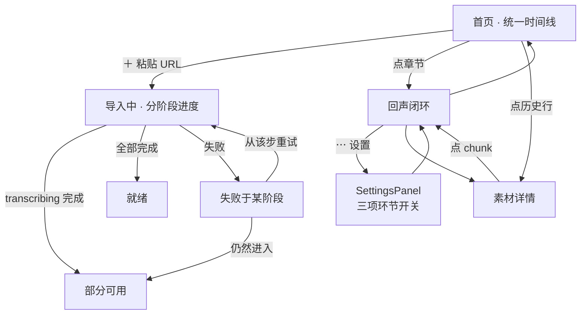
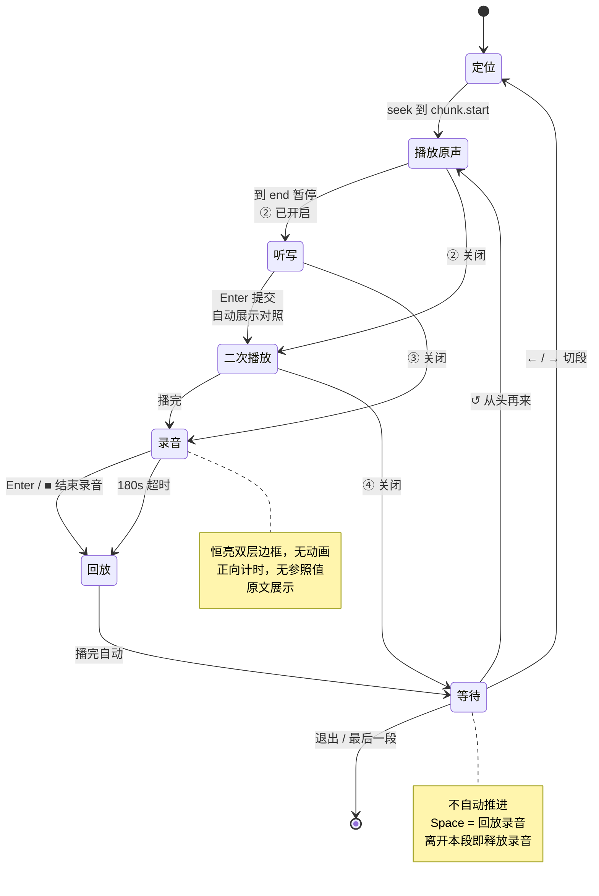

# DE_Nachhall UI 设计规范

> 版本 1.0 · 2026-08-22
> 上游：`docs/PRD.md`
> 下游：`spec-designer`（前端技术选型）· `task-planner`（组件与页面拆解）
> 可视化决策记录：<https://claude.ai/code/artifact/a58a12dc-6af4-442b-b875-f0f27316c18a>

---

## 1. 设计原则

### 1.1 设计理念

**画面是主角，界面是画框。** 用户 90% 的时间在盯一段德语新闻视频并开口复述。界面的任务不是被看见，而是在正确的时刻用最小的动静告诉用户"现在轮到你说了"。

### 1.2 五条原则

| # | 原则 | 具体含义 |
|---|---|---|
| 1 | **余光可读** | 跟读时视线锁在画面上。状态变化必须在视野边缘可感知，不能逼用户移开视线去读一行小字 |
| 2 | **零判罚** | 界面不出现分数、对错标记、红叉。PRD 明确排除判对错，视觉语言必须一致 |
| 3 | **视频不动** | 字幕显隐、翻译展开、录音计时出现、步骤切换，都不得引起视频位移或缩放。字幕区 / 状态行 / 控制条预留固定高度。**内容溢出靠页面滚动，不靠缩小视频**——听写与对照必然超出视口，那是滚动的正当场景 |
| 4 | **键盘优先** | 整个回声闭环手不离键盘。鼠标是备选路径，不是主路径 |
| 5 | **德语文本优先级最高** | 德语原文是唯一需要精读的内容，字号、行高、字重都为它服务，其余一律退让 |

### 1.3 已定决策（来自 PRD 与用户选择）

| 项 | 值 |
|---|---|
| 主题 | **仅浅色**，不做深色模式 |
| 主色 | **青绿 Teal** `#0D9488` / 文字变体 `#0F766E` |
| 回声布局 | **全屏沉浸 + 可拉出侧栏** |
| 回声闭环 | **五步**：① 播原声 ② 听写 ③ 二次播放+原文 ④ 录音 ⑤ 回放；默认 `①③④⑤` |
| 录音表达 | **边框恒亮、无动画** + 正向计时（不与原声时长比较，零暗示） |
| 录音终止 | `Enter` 或按钮，180s 兜底 |
| 主快捷键 | **`Space` = 重复当前这一步** |
| 听写对照 | **上下叠、同宽同字号同行高**，零标记 |
| 设置 | 顶栏 `⋯` 浮层 · **三项平铺无嵌套** · localStorage 全局唯一 |
| 页面滚动 | **允许**；视频任何情况下不缩小 |
| 首页量度 | **只谈时长，不谈段数** |

---

## 2. 色彩规范

### 2.1 中性色（青绿偏色）

不用纯灰。整条色阶带极轻微的青绿倾向，与主色同源，界面读起来是一套而不是"灰底 + 贴上去的绿"。

| Token | 值 | 用途 |
|---|---|---|
| `--n-0` | `#FFFFFF` | 卡片、输入框、播放器底板 |
| `--n-50` | `#F8FAFA` | **页面背景** |
| `--n-100` | `#F1F4F4` | 次级背景、hover 底 |
| `--n-200` | `#E3E8E8` | **分割线、边框** |
| `--n-300` | `#CCD4D4` | 禁用边框、进度条槽 |
| `--n-400` | `#9BA5A5` | 占位符、禁用文字 |
| `--n-500` | `#6F7A7A` | **三级文字**（元信息、时长） |
| `--n-600` | `#525C5C` | **二级文字**（说明、标签） |
| `--n-700` | `#3C4444` | 强调的二级文字 |
| `--n-800` | `#272D2D` | 小标题 |
| `--n-900` | `#171B1B` | **主文字**（德语原文） |

### 2.2 主色

| Token | 值 | 白底对比度 | 用途 |
|---|---|---|---|
| `--acc` | `#0D9488` | 3.7 : 1 | 录音边框、主按钮底、进度填充、当前段指示条 |
| `--acc-text` | `#0F766E` | 5.5 : 1 | **承载文字的一切**：当前段文字、链接、图标标签 |
| `--acc-soft` | `#E6F4F2` | — | 当前段行背景、次级按钮底 |
| `--acc-line` | `#9FD3CD` | — | 次级按钮描边、软分隔 |
| `--acc-glow` | `rgba(13,148,136,.55)` | — | 录音边框外发光 |

> **硬规则**：`--acc`（3.7:1）只用于图形元素，达标线是 3:1。任何文字必须用 `--acc-text`（5.5:1，达标线 4.5:1）。这条在 code review 里当作可检查项。

### 2.3 语义色

判罚色刻意压制。这个产品不判对错，`--err` 只用于**系统错误**（导入失败、麦克风被拒），不用于用户表现。

| Token | 值 | 用途 |
|---|---|---|
| `--ok` | `#15803D` | 素材就绪、导入完成 |
| `--warn` | `#B45309` | 部分可用（转写完成但翻译未生成） |
| `--err` | `#B91C1C` | **仅系统错误**：导入失败、麦克风拒绝、文件缺失 |
| `--err-soft` | `#FEF0F0` | 错误行背景 |

### 2.4 视频叠层专用

叠在亮画面上的元素不能用页面色板，必须自带对比保障。

| Token | 值 | 用途 |
|---|---|---|
| `--ov-bg` | `rgba(0,0,0,.55)` | 计时徽章、时码底板 |
| `--ov-text` | `rgba(255,255,255,.92)` | 叠层文字 |
| `--ov-rim` | `rgba(0,0,0,.38)` | **录音边框的外层描边**（见 §5.7） |

---

## 3. 字体规范

### 3.1 字体家族

```css
--f-display: "Archivo", "Helvetica Neue", Arial, sans-serif;      /* 标题、标签 */
--f-ui:      "Public Sans", -apple-system, "Segoe UI", Roboto,
             "PingFang SC", "Noto Sans SC", sans-serif;            /* 正文、德语原文 */
--f-num:     "JetBrains Mono", ui-monospace, "SF Mono", Menlo, monospace; /* 时码、计时、进度 */
```

**为什么不用 Inter**：Inter 是当下所有 AI 生成界面的默认脸，且它的 `ä ö ü` 变音符号在小字号下与字身粘连。Public Sans 的变音符号间距更开，德语文本可读性更好。

**中文回退**：中文翻译走同一个 `--f-ui` 栈，靠 `PingFang SC` / `Noto Sans SC` 回退。翻译是次要内容，不为它单独引字体。

### 3.2 语义化字号角色

不按 `xs/sm/md` 命名，按**用途**命名——这样组件里写 `font: var(--t-german)` 一眼知道意图。

| 角色 | 字号 / 行高 | 字重 | 用途 |
|---|---|---|---|
| `--t-german` | **20px / 1.62** | 400 | **德语原文**，全站最大正文 |
| `--t-german-lg` | **24px / 1.55** | 400 | 回声模式展示原文的步骤（③④⑤） |
| `--t-card-title` | **20px / 1.34** | 600 | HeroCard 标题，`letter-spacing: -.01em` |
| `--t-zh` | 15px / 1.7 | 400 | 中文翻译 |
| `--t-body` | 15px / 1.6 | 400 | 一般正文、说明 |
| `--t-ui` | 13.5px / 1.5 | 500 | 按钮、控件标签 |
| `--t-meta` | 12.5px / 1.45 | 400 | 元信息、状态说明 |
| `--t-label` | 11px / 1.4 | 600 | 全大写小标签，`letter-spacing: .09em` |
| `--t-h1` | 30px / 1.15 | 700 | 页面标题，`--f-display` |
| `--t-h2` | 19px / 1.3 | 600 | 区块标题，`--f-display` |
| `--t-num` | 13px / 1 | 500 | 时码、计时，`--f-num` + `tabular-nums` |
| `--t-kbd` | 10px / 1 | 500 | 按钮内快捷键徽章，`--f-num` |

#### 首页两个容器的实际字号阶梯

层级是**相对**的——同一个元素在不同容器里维持相对权重，不是绝对字号。

| | HeroCard | EpisodeRow | IngestStrip |
|---|---|---|---|
| 标题 | **20px / 600** | 14px / 400 | 13.5px / 500 |
| 日期 | 14px 等宽 `--n-600` | 12.5px 等宽 `--n-600` | — |
| 来源徽章 | 12px 方框 | 12px 方框 | 12px 方框 |
| 时长 | 10.5px 叠在缩略图 | 11.5px 等宽 | — |
| 状态 | — | — | 12px |

**日期不得与标题争视线**：两者须在**字族、字号、颜色**三通道同时区分——日期等宽 + 次级色 + 小一档，标题无衬线 + 主文字色 + 大一档。只靠字号拉不开。

### 3.3 排版规则

- 德语原文行宽上限 **`58ch`**——德语复合词长，超过这个宽度回行时眼睛会丢行
- 所有数字列（时长、计时、进度）加 `font-variant-numeric: tabular-nums`
- 标题加 `text-wrap: balance`
- 全大写标签必须加 `letter-spacing`，否则德语大写字母串挤成一团

---

## 4. 间距与形状

### 4.1 间距

基础单位 **4px**。

| Token | 值 | 用途 |
|---|---|---|
| `--s-1` | 4px | 图标与文字间 |
| `--s-2` | 8px | 控件内部、chip 内边距 |
| `--s-3` | 12px | 按钮内边距、列表行间 |
| `--s-4` | 16px | 卡片内边距、组件间 |
| `--s-5` | 20px | — |
| `--s-6` | 24px | 区块间、页面左右边距 |
| `--s-8` | 32px | 大区块间 |
| `--s-10` | 40px | 页面顶部留白 |
| `--s-12` | 48px | 回声模式视频上下留白 |

### 4.2 圆角与阴影

```css
--r-sm: 5px;    /* chip、小按钮、进度条 */
--r-md: 8px;    /* 按钮、输入框、视频画面 */
--r-lg: 12px;   /* 卡片、面板 */
--r-full: 999px;

--sh-sm: 0 1px 2px rgba(23,27,27,.06);
--sh-md: 0 4px 12px rgba(23,27,27,.08);
--sh-pop: 0 10px 32px rgba(23,27,27,.12);   /* 侧栏、对话框 */
```

浅色界面上阴影要克制。卡片默认只有 `1px solid var(--n-200)`，不带阴影；只有浮起的东西（侧栏、对话框、Toast）才用阴影。

### 4.3 布局尺度

| 项 | 值 |
|---|---|
| 内容最大宽度（素材库、详情页） | `1160px` |
| 回声模式视频最大宽度 | `960px`（再大反而要转头） |
| 侧栏宽度 | `264px` |
| 顶栏高度 | `52px` |
| 桌面断点 | `≥ 1024px` 为设计基准；`< 900px` 侧栏改为覆盖式浮层 |

> 移动端不在范围内（PRD Out of Scope）。窄屏只保证不破版，不做体验优化。

---

## 5. 组件规范

### 5.1 Button

```
主按钮 Primary                次按钮 Secondary         强调幽灵 GhostAccent
┌────────────────────────┐   ┌──────────────────┐   ┌──────────────────────────┐
│  ■ 结束录音  Enter     │   │    ← 上一段      │   │  ↺ 再听原声  Space       │
└────────────────────────┘   └──────────────────┘   └──────────────────────────┘
bg   --acc                   bg   --n-0             bg     --acc-soft
text #FFFFFF                 text --n-600           text   --acc-text
                             border --n-200         border --acc-line
```

| 属性 | 值 |
|---|---|
| 尺寸 `md` | `h 36px` · `padding 0 14px` · `--t-ui` · `--r-md` |
| 尺寸 `sm` | `h 28px` · `padding 0 10px` · `--t-meta` · `--r-sm` |
| 变体 | `primary` · `secondary` · `ghost-accent` · `danger`（仅删除） |
| Hover | `filter: brightness(1.06)`（primary）/ `border-color: --n-300`（其余） |
| Active | `transform: translateY(1px)` |
| Disabled | `opacity: .45`，`cursor: not-allowed` |
| Focus | `outline: 2px solid var(--acc)` · `outline-offset: 2px` |

**快捷键徽章**：按钮内可挂 `<kbd>`，`--f-num` · 10px · 500 · `opacity .72` · `padding 1px 4px` · `1px solid currentColor` · `--r-sm` · `letter-spacing .02em`。这是键盘优先原则的可见化。

**硬规则 · 键名写文字，不写符号**：`Enter` 不是 `⏎`，`Space` 不是 `␣`。符号在 10px 下辨识不出，且不同平台字形差异大。唯一例外是方向键 `→` `←`——它们没有更短的文字写法，写 `ArrowRight` 反而更糟。

**硬规则 · 按钮文案随步骤走**：同一个 `Space` 在六个步骤里做六件事，文案必须说清是哪一件（见 §5.8）。统一叫「再来一遍」看似整齐，但第 ⑤ 步会读不出「再放我的」的意思。

### 5.2 StepBar（阶段条）

状态行不只报状态，它同时是**导航**：阶段并列排布，当前格高亮，其余可点，**点哪一格跳哪一格**。

```
┌──────────────────────────────────────────────────────────────────┐
│      ● 播放原声   ○ 听写   ○ 二次播放   ○ 录音 + 回放             │
│                      到段尾自动暂停                               │
└──────────────────────────────────────────────────────────────────┘
   两行，高 48px（--h-status-row），永不换行
```

**显示的是设置面板里那四个阶段，不是六个运行时步骤。**

| 阶段格 | 对应运行时步骤 |
|---|---|
| 播放原声 | ① |
| 听写 | ② |
| 二次播放 | ③ |
| 录音 + 回放 | ④ ⑤（一个开关驱动两步，拆开是假选择） |
| —— | ⑥ 等待确认**不占格子**：它是终点不是阶段，到那里时四格全部标记为走完 |

**不写数字序号。** 六格加 ①–⑥ 试过，一行里塞六个带编号的胶囊，读的成本高过它给的信息。阶段名本身就够认。关掉的阶段连格子都不出现——这比跳号更直接。

**说明单独一行，不与格子并排。** 并排时说明会跟着当前步长短变化挤压格子的位置。

| 状态 | 底 / 边 / 字 | 圆点 |
|---|---|---|
| 当前 | `--acc-soft` / `--acc-line` / `--acc-text` · 600 | **实心** `--acc` |
| 其余 | `--n-50` / `--n-200` / `--n-500` | **空心**描边 |

**只有两态。** 试过再分一档「走过的」（实心点＋深一档的字），但实心点与「当前」撞了；把它改成空心之后，它和「没走到」就只剩字色一点差别——**纯颜色的区分**，正是下面那条硬规则禁止的。所以整个态去掉了。

单格：`h 24px` · `padding 0 10px` · `--r-full` · `--t-meta`。

**允许往回跳，也允许跳过没做的阶段。** 这是训练工具不是流程审批，顺序是建议不是约束。跳到「录音 + 回放」而这一段还没录过时，回放没有内容可放——不禁用按钮，因为「为什么这个键是灰的」比「按了没反应」更难猜。

**状态永不只靠颜色传达**：底色、圆点虚实、字重三者同时变化。

**录音格不做脉动动画**，与 `RecFrame` 同理——录音是持续状态不是事件。

**`--h-status-row` 从 26px 改为 48px。** 硬规则要的是**高度恒定**（阶段从 2 格变 4 格、说明长短不一都不能顶动视频），不是 26px 这个具体数值。

**段落序号前缀用 `#` 而不是 `¶`。** 段落记号在 JetBrains Mono 里字腔厚重，跟旁边的数字挤成一团；`#` 轻、宽度稳定、含义无歧义。

> **替换记录**：本节原先是只读的 `StatusChip`（六变体的状态标签）。它只做「报当前在哪一步」一件事，而同一行的空间足够同时承载导航。`StatusChip` 组件已从代码中**删除**，唯一调用方 `EchoPage` 改用 `StepBar`——留着一个没有调用方的组件只会让下一个人以为它还在用。

### 5.3 ProgressBar

两种形态，**导入用确定态，LLM 阶段用不确定态**——PRD 约束 C4 明确不伪造百分比。

```
确定态（下载 / 转码 / 转写）           不确定态（enriching）
┌────────────────────────────┐        ┌────────────────────────────┐
│████████████░░░░░░░░░░░░░░░░│  58%   │░░░░████░░░░░░░░░░░░░░░░░░░░│  ◌
└────────────────────────────┘        └────────────────────────────┘
槽 --n-300 · 填充 --acc · h 6px        一段 --acc 往复滑动 1.4s
```

### 5.4 HeroCard（首页最新一期）

```
┌──────────────────────────────────────────────────────────────────┐
│ ┌──────────┐   2026-07-14   logo!                                │
│ │          │   Fünf Jahre nach der Flut: So geht es den          │
│ │  缩略图  │   Menschen im Ahrtal                                │
│ │    09:38 │                                                     │
│ └──────────┘                                                     │
├──────────────────────────────────────────────────────────────────┤
│  01  Waldbrände in Südeuropa                         2:08   ▶    │
│  02  Fünf Jahre nach der Flut                        2:51   ▶    │
│  03  Wiederaufbau im Ahrtal                          2:30   ▶    │
│  04  Sport: Handball-EM                              2:09   ▶    │
├──────────────────────────────────────────────────────────────────┤
│                                          [▶ 从头开始跟读]         │
└──────────────────────────────────────────────────────────────────┘
   缩略图 168×95 · --r-md · 时长叠在右下（--ov-bg 底 · --ov-text）
```

| 元素 | 规格 |
|---|---|
| 日期 | `--f-num` · **14px** · 500 · `--n-600` · `tabular-nums` |
| 来源徽章 | `SourceBadge` 方框 12px，见 §5.14 |
| 标题 | **20px · 600 · `--n-900`** · `letter-spacing: -.01em` · 两行截断 |
| 章节行 | 序号 `--f-num` 11px `--n-400` · 名称 14px `--n-900` 单行省略 · 时长 `--f-num` 11.5px `--n-500` |
| 章节 hover | 底 `--acc-soft` · 名称与序号转 `--acc-text` · 右端 `▶` 淡入 |
| 卡片 | `--r-lg` + `1px solid --n-200`，无阴影 |

**硬规则 · 日期不得与标题争视线**：两者必须在**字族、字号、颜色**三个通道上同时区分——日期用等宽 + 次级色 + 14px，标题用无衬线 + 主文字色 + 20px。只靠字号拉不开。

**硬规则 · 首页只谈时长**：卡片与章节行均**不显示段数**。决定「今天练哪条」靠的是「要花几分钟」；段数是内部结构，只在回声模式作为进度指示（`#11 / 27`）出现。

**章节可直接进入回声闭环**，跳过详情页。这是首页最核心的交互——一期 10 分钟未必想一次练完。

`enriching` 未完成时，章节区替换为：

```
├──────────────────────────────────────────────────────────────────┤
│  ◌ 章节生成中 · 跟读现在就能用                                     │
├──────────────────────────────────────────────────────────────────┤
```

### 5.4b EpisodeRow（首页历史时间线行）

```
┌──────────────────────────────────────────────────────────────────┐
│ 07-12   logo!    Waldbrände, Schulstreik und mehr | logo!  09:12 │
│ 07-11   我导入   Hitzewelle in Europa – was jetzt hilft   07:48  │
│ 07-10   logo!    Neue Regeln für Handys in der Schule     08:31  │
└──────────────────────────────────────────────────────────────────┘
  日期 --f-num 12.5px 500 --n-600 · flex 0 0 46px
  标题 14px --n-900 单行省略 · 时长 --f-num 11.5px --n-500
  行高 auto · padding 11px 16px · 行间 1px --n-100
```

官方源与自导入**混排在同一条时间线**，只用 `SourceBadge` 区分。不分 Tab——订阅已经决定了什么进流，分类是重复劳动。

### 5.4c IngestStrip（处理中 / 失败）

插在 HeroCard 与历史时间线之间。

```
处理中：
┌──────────────────────────────────────────────────────────────────┐
│ ◌   Warum Bienen so wichtig sind | logo!                         │
│     logo!  转写中（Whisper）                                      │
│     ████████████░░░░░░░░░░░░░░                            58%    │
└──────────────────────────────────────────────────────────────────┘

失败：
┌──────────────────────────────────────────────────────────────────┐
│ ⚠   Klimagipfel in Brüssel | logo!                               │
│     失败于「生成翻译」· LLM 请求超时                               │
│                              [从该步重试]  [仍然进入]             │
└──────────────────────────────────────────────────────────────────┘
   失败态：边框 #F3C9C9 · 底 --err-soft · 图标与状态文字 --err
```

「仍然进入」是 PRD F3.1.2 那条验收标准的界面出口——`enriching` 失败不阻塞跟读。

### 5.5 ChunkList（段落侧栏 / 详情页列表）

```
┌──────────────────────────────────┐
│ ② FÜNF JAHRE NACH DER FLUT       │  ← --t-label · --n-500
│                                  │
│  #10  Vor fünf Jahren kam die …  │
│ ▎#11  Extrem starker Regen ha…   │  ← 当前段：--acc-soft 底
│  #12  Viele Menschen konnten …   │     左侧 3px --acc 指示条
│  #13  Inzwischen sind viele …    │     文字 --acc-text · 500
│                                  │
│ ③ WIEDERAUFBAU                   │
│  #14  Die Brücke ist neu geb…    │
└──────────────────────────────────┘
   行高 auto · padding 6px 8px · --r-sm
   序号 --f-num/--n-400/flex 0 0 32px
   文本单行省略（侧栏）/ 两行省略（详情页）
   章节头右侧：详情页显示「N 段 · M:SS」，侧栏只显示标题
```

| 语境 | 显示 |
|---|---|
| 回声页侧栏 | 章节标题 + chunk 单行省略；**不显示段数与时长**（正在训练，不需要盘点） |
| 详情页 | 章节标题 + **段数 · 时长** + chunk 两行省略 + 每行悬停显示 `▶` |

> **详情页是唯一显示段数的列表页**。首页只谈时长（挑今天练什么），详情页才谈段数（看内部结构）。

**侧栏默认展开，布局用「预留位」，且左右各留一列。** 只在右边留的话视频会被挤得偏左；镜像之后视频落在**页面正中**，且开合侧栏时宽度与位置一动不动，满足设计原则 3。代价是可用宽度少两列（1440px 窗口下视频约 912px，比 960 的上限窄一点）。左右各留一列白是自觉的代价，跟顶栏右端那个 40px 头像位是同一种处理：位置先占住。

比较过的另外两种做法，都不选：

| 做法 | 视频位移 | 视频居中 | 遮画面 | 结论 |
|---|---|---|---|---|
| 挤压式（主区让宽） | **会动** | 是（但会动） | 不遮 | 撞设计原则 3，弃 |
| 覆盖式抽屉 | 不动 | 是 | **遮右侧约 27%** | 遮挡是动态的，每次镜头右侧有内容都烦一次，弃 |
| 单侧预留位 | 不动 | **偏左** | 不遮 | 视频不在正中，弃 |
| **双侧预留位** | 不动 | 是 | 不遮 | **采用**。留白是静态的，看两次就不看了 |

窄屏（`max-width: 1100px`）放不下常驻列，退回覆盖式抽屉。

**折叠控件是三角，不是文字标签。** 右侧抽屉是横向的，所以三角也横向：收起时朝左（拉出来），展开后朝右（推回去）。三处——右边缘把手（22×54，只有三角）、侧栏抬头右端的收起键、顶栏「段落」按钮后面随状态翻转的那个。三角用 CSS 边框画，不用 `◂ ▸` 字符：那两个字形回落到 Noto Sans SC 时大小和基线都会跳。

**当前段原文完整展开**，**用主文字色加粗，不用 accent**——展开成三四行之后整段青绿读起来发飘，而「当前」这件事底色、左指示条、`#` 号已经说清楚了（`#` 号仍用 `--acc-text`）。其余段单行省略。非当前段是拿来扫的不是拿来读的，53 段全展开会长到滚不动，反而找不到自己在哪。行内边距 `9px 12px`、行间 `3px`、章节间 `--s-6`。

**听写写作期侧栏文本照常显示，不打码。** 侧栏里的德语原文本身就是字幕，写作期把它摊在旁边等于答案在手边——这是**有意保留的「偷看」通道**，不是遗漏。

> 做过打码版本（写作期文本换成 `· · · ·`），实际看过之后决定不要。理由是听写本来就不判对错、不算分（PRD Out of Scope 第二条），既然产品不打算抓作弊，就没有把答案锁起来的立场；想不看的人把侧栏收起来就是了，那是他自己的选择。系统替用户执行自律，是这个产品明确不做的事。
>
> 实现上打码机制已从代码里**整个移除**，不是留个开关传 false——没有调用方的分支只会让下一个读代码的人以为它还在用。

### 5.5b FullText（全文视图）—— 未做，见 TASK-044

settings 里的第 5 项开关。打开后回声页出现一个滚动的全文视图：整期德语原文连续排布，**当前段正常显示、其余段淡化**，随播放进度自动滚动跟随。

**与右侧段落侧栏的分工**：侧栏是**导航**（单行省略、点了跳转、按章分组），全文是**阅读**（连续成篇、跟着读）。两者可同时开，也可只开一个。

三条要求写在 TASK-044 的验收标准里：当前段的区分不能只靠透明度（需第二通道）；自动滚动不与手动滚动打架；关掉时组件不渲染。

### 5.6 VideoStage

```
┌────────────────────────────────────┐
│                                    │
│          视频画面 16:9             │
│                              04:12 │  ← 时码叠层，右下
└────────────────────────────────────┘
   --r-md · overflow hidden
   底色 --n-900（视频加载前不露白）
```

固定 `aspect-ratio: 16/9`，最大宽 960px，居中。

**硬规则 · 暂停判定必须用 `requestVideoFrameCallback`。** 实测（`docs/sprint0-v2b-report.md`）：

```
                Chrome 131        Firefox 136      预算
rVFC        P95  39.5 ms ✅   P95  78.7 ms ✅   200 ms
timeupdate  P95 251.0 ms ❌   P95 277.5 ms ❌   200 ms
            中位 170.1 ms      中位 205.6 ms ❌
```

**两个浏览器结论一致**。单靠 `timeupdate`：Chrome 上每五段有一段超标，
Firefox 上**中位数就超标**——一半以上的段落会在超标点暂停。

**硬规则 · 任何步骤、任何状态下尺寸与位置都不变**（原则 3）。听写输入框与上下叠对照必然超出视口——那时**页面滚动**，视频**不缩小**。这是有意的取舍：视频一旦在步骤间忽大忽小，跟读的节奏就断了。

~~**seek 精度依赖转码时的 GOP**~~ —— **实测推翻，见 SPEC §9.1**。浏览器的 `currentTime = X` 走的是精确 seek，会在关键帧之后继续解码到目标帧，落点误差实测 **0.0 ms**，与 GOP 无关。所以**不为 seek 精度重编码**。

真正必须做的是**重封装**（SPEC §9.1a）：`yt-dlp` 把 HLS 结果存成 `.mp4`，容器实际是 MPEG-TS，没有 moov 索引，浏览器**根本 seek 不了**——`seeked` 事件永远不来。修法是 `-c copy -movflags +faststart` 换容器，8 分钟视频实测 0.46 s。V2b 卡住三层查出来的就是这件事。

**音频素材形态推 v2**。音频没有画面，这块 16:9 区域放什么需要单独设计——`RecFrame` 围绕什么、「余光可读」的余光落在哪，都没有答案。MVP 在导入时即拒绝纯音频。

### 5.6b SegmentBar（段落进度条）

视频正下方，整期按段切成一格一格。

```
┌────────────────────────────────────────────────────────────┐
│                     视频画面 16:9              0:41 / 8:11 │
└────────────────────────────────────────────────────────────┘
  ▪▪ ▪▪ ▪▪▪ ▪▪ ▪▪▪▪ ▬▬▬▮▮ ▫▫ ▫▫▫ ▫▫ ▫▫▫▫ ▫▫ ▫▫▫ …
     练过的深一档      当前段(accent+内部填充)   还没到的浅一档
```

**不是可拖动的播放进度条，是段落导航。** 回声闭环的每一步都要精确到段，自由拖动必然停在段中间，接下来「再听一遍」该从哪儿开始就说不清了。切成格子之后，点击**必然**落在某一段的开头——与点侧栏段落是同一个动作。

| 规则 | 值 |
|---|---|
| 每格宽度 | `flex-grow: 该段时长`，所以段落长短不均一眼可见 |
| 最小宽 | `3px`（4 秒的短段也点得到） |
| 高度 | 点击区 `14px`，可视轨道 `6px` 居中。**hover 不改高度** |
| 当前段 | 轨道 `--acc-line`，内部 `--acc` 填充按播放进度推进 |
| 练过 / 未到 | `--n-300` / `--n-200` |
| 键盘 | **不进 tab 序**——53 个 tab 停靠点是灾难。同样的事由 `←` `→` 与段落侧栏承担，两条路都键盘可达 |

> 这里的深浅是**量**不是**态**，与 §5.2 那条「状态不能只靠颜色」不冲突：进度条本来就是靠位置读的，而「当前段」另有 accent 与内部填充两个通道。

时码叠层同时显示 `当前 / 总长`。

**可在设置里关掉**（「显示 · 段落进度条」，默认开）。关掉时**整个不渲染、不留占位**，下面的内容上移 14px。这不违反 §5.6 那条「任何状态下尺寸与位置都不变」——那条约束的是**步骤切换**，而这里是用户自己拨了开关，位置变化正是他要的结果。

> 样式定稿前比过四种：分格胶囊（选中）、连续细线加刻度、无间隙直角、极简发丝线。选了分格胶囊，段落边界最清楚。

### 5.7 RecFrame（录音边框）— 核心组件

已定方案：**恒亮 + 双层描边，无动画**。

```
录音中：
   ╔════════════════════════════════════╗   ← 外层：--ov-rim 半透明深色 2px
   ║ ┌────────────────────────────────┐ ║      内层：--acc 3px + 外发光
   ║ │                                │ ║
   ║ │        视频画面（暂停）        │ ║
   ║ │                        ● 3.4s  │ ║   ← 计时徽章，正向
   ║ └────────────────────────────────┘ ║
   ╚════════════════════════════════════╝
```

**为什么必须双层。** 青绿边框单独放在天空、水面、浅色墙这类画面上会被吃掉——这期讲洪水，正是最坏情况。做法是在 Teal 描边**外侧**再叠一圈 `--ov-rim`（半透明黑），让边框在任何亮度的帧上都有对比参照。

```css
.rec-frame {
  box-shadow:
    0 0 0 3px var(--acc),                    /* 内层：主色 */
    0 0 0 5px var(--ov-rim),                 /* 外层：深色保底 */
    0 0 18px 2px var(--acc-glow);            /* 外发光 */
}
```

> **不做呼吸 / 闪烁动画。** 用户明确选的是「恒亮」——录音是一个持续状态，不是需要吸引注意的事件。动起来只会在余光里制造噪音，与设计原则 1「余光可读」相悖。

**计时徽章**：`--f-num` · 13px · `tabular-nums` · `--ov-bg` 底 · `--acc` 圆点。
显示规则：`< 60s` 显示 `3.4s`；`≥ 60s` 显示 `1:04.2`。**只显示已录时长，不显示任何参照值**——这是用户明确选的零暗示方案。

叠层在亮画面上的可读性由 `--ov-bg`（`rgba(0,0,0,.55)`）保证，不依赖画面本身。

### 5.8 Transport（回声控制条）

控制条随**步骤**变化，不是随状态微调。每一步的主按钮都绑 `Space`，含义永远是「重复当前这一步」。

| 步骤 | 按钮序列 |
|---|---|
| ① 播放原声 | `↺ 再听原声 Space` · `[←] 上一段` · `下一段 [→]` · `S 字幕` · `T 翻译` |
| ② 听写（写作） | `▶ 再听一遍 Space` · `提交 Enter` · `[←] 上一段` · `下一段 [→]` |
| ② 听写（对照） | `✎ 重写` · `▶ 再听一遍 Space` · `继续 → Enter` · `T 翻译` |
| ③ 二次播放 | `↺ 再听原声 Space` · `[←] 上一段` · `下一段 [→]` · `S 隐藏字幕` · `T 翻译` |
| ④ 录音 | **`■ 结束录音 Enter`** · `↺ 重录 Space` · `[←] 上一段` · `下一段 [→]` · `S 字幕` |
| ⑤ 回放 | `↺ 回放录音 Space` · `▶ 原声` · `[←] 上一段` · `下一段 [→]` · `S 字幕` |
| 等待确认 | `↺ 从头再来 Space` · `▶ 原声` · `▶ 我的` · `[←] 上一段` · `下一段 [→]` |

**硬规则 · 上一段与下一段镜像对称。** 箭头徽章各自指向外侧（`[←] 上一段` / `下一段 [→]`），**位置本身就在说方向**，所以标签里不再重复画一个装饰箭头。徽章**每一步都在**——曾经有三步把「下一段」的徽章去掉过，同一个键时有时无，人只会以为这一步按 `→` 没用。

> `Button` 因此有了 `kbdSide`（`start` / `end`，默认 `end`）。这是目前唯一用到 `start` 的地方。

```
④ 录音态：
┌────────────────────────────────────────────────────────────────┐
│ [■ 结束录音 Enter] [↺ 重录 Space] [← 上一段] [下一段 →] [S 字幕] │
└────────────────────────────────────────────────────────────────┘
   primary            ghost-accent   secondary   secondary  secondary
```

**硬规则 · 容器高度恒定 68px**，按钮增减不引起布局位移（设计原则 3）。

**硬规则 · 「播完」不等于「这一步做完」。** 只有 ① 播放原声与 ③ 二次播放的
内容就是这段播放，播完才自动进下一步。其余步骤里播放是**辅助动作**：
② 听写点「再听一遍」是为了写得更准，⑤ 回放点「▶ 原声」是为了跟自己的录音比 ——
两者播完都必须**留在原地**。② 由「提交 → 对照 → 回车」结束，⑤ 由回车结束。

**硬规则 · 进 ⑤ 回放一秒后自动播放。** 结束录音是一次明确的动作，接下来必然要听 —— 让人再点一次没有意义。

停顿一秒而不是立刻：刚说完话立刻听到自己会像被打断，留一拍让人从「说」切到「听」。也不更长——等待本身不产生价值，超过一两秒就开始像是卡住了。

> 最初定的是两秒，2026-08-24 实际用下来改成一秒。

三处实现上必须做对的：

| | 为什么 |
|---|---|
| 等 `recorder.url` 就绪再起表 | 录音 blob 是 `MediaRecorder.onstop` 之后才生成的，进这一步的瞬间 url 往往还是 `null` |
| 切段 / 跳步骤 / 离开页面时取消定时器 | 不取消的话声音会在人已经走开之后突然响起来 |
| 手动回放时取消待触发的自动回放 | 否则手动播完一秒后又响一遍 |

`play()` 被自动播放策略拦下时给 Toast 并提示按 `Space`——干等一秒没声音又不知道为什么，比没有自动回放更糟。

**硬规则 · 回放步骤不给单独的「▶ 我的」按钮**——那就是 `Space` 本身，两个入口做同一件事只会让人怀疑它们不同。等待确认态才同时给「▶ 原声」「▶ 我的」，因为那时 `Space` 的语义已经是「回放录音」。

**按钮文案随步骤走，不用统一措辞。** 每一步都叫「再来一遍」看似整齐，但第 ⑤ 步会读不出「再放我的」的意思——正是这个含糊让人觉得还需要一个额外按钮。

### 5.9 Disclosure（翻译折叠）

```
折叠（默认）：
  ▸ 中文翻译                              T
展开：
  ▾ 中文翻译                              T
  ┌──────────────────────────────────────────┐
  │ 极强的降雨导致阿尔河这样的小河突然暴涨， │  --t-zh · --n-600
  │ 淹没了整座整座的村庄和城镇。             │  左侧 2px --acc-line 竖线
  └──────────────────────────────────────────┘

enriching 未完成：
  ▸ 中文翻译  ◌ 生成中                    --n-400，不可点击
```

| 规则 | 值 |
|---|---|
| 默认状态 | **折叠**（B2–C1 不该先看翻译） |
| 快捷键 | `T`，标注在标题行右端 |
| 展开动效 | 200ms `ease-in-out`，高度过渡 |
| 生成中 | 整行 `--n-400`，`cursor: default`，`aria-disabled` |
| 听写写作期 | **整个组件不渲染**——翻译也是答案的一部分 |

### 5.10 ComparePanel（听写对照）

**不做 diff、不判对错**（PRD F3.4.3）。**上下叠**，靠同宽对齐让差异自己浮现。

```
我写的                                    ← --t-label · --n-500
┌────────────────────────────────────────────────────────────┐
│ Viele Menschen konnten nicht rechtzeitig gewarnt werden    │  底 --n-100
│ und starben. Und sehr viel wurde zerstört. Und heute?      │
└────────────────────────────────────────────────────────────┘
原文
┌────────────────────────────────────────────────────────────┐
│ Viele Menschen konnten nicht rechtzeitig gewarnt werden    │  ← 逐字对齐
│ und starben. Und sehr viel wurde zerstört. Und heute? Wie  │  ← 从这里分叉
│ sieht es dort mittlerweile aus?                            │  底 --n-0
└────────────────────────────────────────────────────────────┘
                        ▸ 中文翻译
```

| 规则 | 值 |
|---|---|
| 两块**必须同宽、同 `--t-german`、同行高、同内边距** | 这是全部机制所在 |
| 我写的 | 底 `--n-100`，字色 `--n-900` |
| 原文 | 底 `--n-0`，字色 `--n-900`（**与上方完全相同**） |
| 差异标记 | **无** |

**为什么上下叠而不是左右并排。** 内容区 960px 一分为二每栏只剩 ~450px，22 词的德语段落要折 3–4 行，而且**两边行数不同**（写的短、原文长），左右根本对不齐。上下叠因为同宽同字号，**相同的词自动垂直对齐，写错或漏掉的地方从那里开始错位**——错位本身就是信号，但它是排版的自然结果，不是标记。

> **明令禁止**：不得加入任何形式的差异标记——高亮、删除线、颜色、相似度分数。这是 PRD Out of Scope 的第二条，也是产品的核心价值主张之一。实现时看到两块文本并排，加个 diff 高亮只是三行代码且看起来像改进，正因如此这条必须写死。

### 5.11 TopBar

```
首页：
┌──────────────────────────────────────────────────────────────────┐
│ DE_Nachhall                                       ＋      (40)  │
└──────────────────────────────────────────────────────────────────┘
  产品名 --f-display 16px 700              导入   头像位（本期不渲染）

回声 / 详情页：
┌──────────────────────────────────────────────────────────────────┐
│ ←   ② Fünf Jahre nach der Flut              #11 / 27        ⋯   │
└──────────────────────────────────────────────────────────────────┘
```

| 规则 | 值 |
|---|---|
| 高度 | `52px`，**任何页面都不得出现第二排控件** |
| `＋` | `32×30` · `--r-md` · hover 转 `--acc-soft` / `--acc-text` |
| 头像位 | 右端预留 **40px**（32px + 8px 间距），**本期不渲染任何元素** |
| `⋯` | 回声页设置入口，见 §5.13 |

**为什么用 `⋯` 而不是齿轮**：齿轮把这个位置钉死成设置入口，以后要加「删除本期」「导出字幕」就得再占一个图标位——而顶栏不许多东西。三点是「更多操作」，语义能装下设置以外的内容。

### 5.12 ImportSheet（导入浮层）

`＋` 打开的浮层，锚在顶栏右下。

```
┌────────────────────────────────────────────────┐
│ 导入素材                                        │
│ ┌────────────────────────────────┐ ┌────────┐ │
│ │ 粘贴 YouTube 链接…              │ │  导入  │ │
│ └────────────────────────────────┘ └────────┘ │
│ 支持 youtube.com/watch?v=… 或 youtu.be/…       │
└────────────────────────────────────────────────┘
   宽 392px · --r-lg · --sh-pop
```

四种反馈，**每一种都说明怎么修，不只是说错了**：

| 情形 | 文案 | 色 |
|---|---|---|
| 空 / 首次 | `粘贴视频链接。YouTube、ZDF、ARD 等站点都支持。` | `--n-500` |
| 探测中 | `◌ 正在读取视频信息…` | `--n-500` |
| 合法 | `logo! vom 14. Juli 2026 · 09:38 —— 点「导入」开始处理。` | `--ok` |
| 形态不合法 | `这不像一个网址，检查是否漏了 https://` | `--err` |
| 站点不支持 | `这个站点抓不了。支持 YouTube、ZDF、ARD 等常见视频站。` | `--err` |
| 已下架 | `这个视频已经不在了。` | `--err` |
| 地域限制 | `这个视频在当前网络下看不到，可能有地域限制。` | `--err` |
| 需要登录 | `这个视频需要登录才能看，暂时抓不了。` | `--err` |
| 库中已存在 | `这一期已经在库里了 —— 直接打开，不会重复转写。` | `--ok` |
| 纯音频 | `这是纯音频素材，暂不支持。音频没有画面，回声闭环的「画面跟随」无从谈起，需要单独设计。` | `--err` |

**提交是同步 probe，1–3 秒。** 期间输入框禁用、按钮转圈、显示「正在读取视频信息…」。**合法态直接回显标题与时长**——这是 probe 顺带拿到的，比一句「链接可用」有信息量得多，也让用户在导入前就确认自己贴对了。

**四种失败必须分开说。** `yt-dlp` 的报错能区分下架、地域限制、需登录、站点不支持，这四种用户的下一步动作完全不同（换个视频 / 挂代理 / 放弃 / 换站点）。笼统说「抓取失败」等于没说。

### 5.13 SettingsPanel（回声环节设置）

顶栏 `⋯` 打开。**两组，全平铺，无嵌套。**

| 组 | 项 | 性质 |
|---|---|---|
| 回声环节 | **00 全文播放** · 01 播放原声 · 02 听写 · 03 录音与回放 | 决定运行时怎么走 |
| 显示 | 段落进度条 | 只管画面上摆什么，**不影响任何步骤** |

**00 全文播放**（默认关）：开启后 ① 播完**不进下一步，而是进下一段继续播 ①**，一路连到全文结束。这是「听一遍整期」的模式，不是跟读模式。

> 为什么默认关：这个产品的地基是回声闭环，连播是另一种用法。默认开等于一进来就把跟读跳过了。
>
> 为什么不在开启时把 01–03 变灰：那会变成**派生只读项**，正是下面第 2 条禁止的。它们仍然可用——按 `Enter` 就从连播里跳出来进入这一段的听写／录音，这是有意保留的出口。状态行会写「连播中 · 播完自动进下一段」，位置在哪一目了然。

**分组不是嵌套**：两组在同一层，没有折叠、没有子选项。混在一起才是问题——「段落进度条」和「听写」摆同一串里，会让人以为关掉它也会少一个环节。

```
┌────────────────────────────────────────────────┐
│ 回声环节                                        │
├────────────────────────────────────────────────┤
│ 01  播放原声                            始终    │
│     到段尾自动暂停                              │
├────────────────────────────────────────────────┤
│ 02  听写                              ○━━      │
│     写完提交，就地展示答案                       │
├────────────────────────────────────────────────┤
│ 03  录音与回放                          ━━●     │
│     录音前自动重听一遍并展示原文；录完立即回放对比   │
├────────────────────────────────────────────────┤
│ 全局设置，改一次以后每期都是这样。存在浏览器本地。   │
│ 听写提交后自动展示答案，不需要再点一次。            │
│ 回放跟着录音走，不单列一项。                      │
└────────────────────────────────────────────────┘
   宽 288px · --r-lg · --sh-pop · 序号列 --f-num 12px --n-400
   开关 36×20 · 轨 --n-300 / 开启 --acc · 钮 16px 白 + --sh-sm
```

**三条硬规则：**

1. **不出现假开关。** ① 显示静态标签「始终」，没有可点击控件。它是闭环的地基——一段没听过就没什么可跟读的——关不掉；既然关不掉就别给开关，给一个能点但点了没意义的控件比不给更糟。

   > 2026-08-23 一度改成真开关（连带允许三个环节全关、状态行给空状态提示），当天撤回。① 恢复为「始终」。
2. **不出现派生只读项。** 二次播放与回放**都不单列**——它们跟着录音走，并进「③ 录音与回放」。二次播放是录音前的准备动作，回放是录音后的对比动作，**两者都没有独立存在的理由**：关掉录音还单独留着「重听一遍然后什么也不做」是假选择。所以**设置里是 3 项，运行时最多 6 步**，这是有意的非一一对应。

   > 2026-08-23 合并。原先「③ 二次播放 + 展示原文」是独立开关，与「④ 录音 + 回放」并列。合并后录音前**自动**重听一遍，不再需要用户决定。
3. **不做嵌套子选项。** 「提交后自动展示答案」写死为自动，不给开关——关掉它意味着每次听写完还要多点一次，那本身就是坏设计。

### 5.14 SourceBadge

**单一规格，各处一致的方框标签。**

| 变体 | 样式 | 语义 |
|---|---|---|
| `official` | 底 `--acc-soft` · 字 `--acc-text` · 边 `--acc-line` | 订阅源，**不可删除**（应取消订阅） |
| `user` | 底 `--n-50` · 字 `--n-600` · 边 `--n-200` | 自行导入，可删除 |

`12px` · 500 · `padding 2px 7px` · `--r-sm` · `letter-spacing .01em`。

**12px 与 `IngestStrip` 的状态文字同字号。** 同一行里出现 11.5 / 12 这种半像素级的差，读起来就是「没对齐」——列表语境内的所有次级文字统一到 12px。

**在 HeroCard 与列表里用同一套规格**，不按容器分化。方框本身就把徽章从周围文字里区隔出来，不需要再为不同容器调权重；同一个东西在三个地方长得一样，扫视时才形成稳定的「来源列」。

**颜色编码行为差异**——青绿的删不掉（应取消订阅），灰色的能删。这不是装饰，是提前预告。

### 5.15 DictationPanel（听写输入）

```
写作态：
┌────────────────────────────────────────────────────────────┐
│ Viele Menschen konnten nicht rechtzeitig gewarnt werden    │
│ und starben. Und heute?▊                                   │
│                                                            │
└────────────────────────────────────────────────────────────┘
   --t-german · min-height 140px · --r-md
   focus: border --acc + 3px --acc-soft 光晕
```

| 规则 | 值 |
|---|---|
| 写作过程中 | 德语原文与中文翻译**均不可见** |
| `S 字幕` | **本步骤不提供**——看到原文等于直接看答案 |
| 提交 | `Enter`，**提交即自动展示对照**，不需要再点一次 |
| 重写 | 回到输入态，已输入内容保留 |
| 溢出 | 对照超出视口时靠**页面滚动**查看，**视频不缩小** |

### 5.16 其它

| 组件 | 要点 |
|---|---|
| `Toast` | 右下角，`--r-md` + `--sh-pop`。成功停 3s，错误停 6s 且带关闭按钮 |
| `Dialog` | 仅用于删除确认。列出将被删除的内容 |
| `EmptyState` | 首页为空时：一句话 + 指向 `＋` 的提示，不放插画 |

## 6. 页面设计

**只有三个页面级视图。** 听写不是独立页面（它是回声闭环的步骤 ②），设置不是页面（它是回声页上的浮层）。

### 6.1 P1 首页 `/`

```
┌────────────────────────────────────────────────────────────────────┐
│  DE_Nachhall                                      ＋       (40)   │ 52px
├────────────────────────────────────────────────────────────────────┤
│  ┌──────────────────────────────────────────────────────────────┐  │
│  │ ┌────────┐  2026-07-14   logo!                               │  │
│  │ │ 缩略图 │  Fünf Jahre nach der Flut: So geht es den         │  │
│  │ │  09:38 │  Menschen im Ahrtal                               │  │
│  │ └────────┘                                                    │  │
│  ├──────────────────────────────────────────────────────────────┤  │
│  │  01  Waldbrände in Südeuropa                    2:08   ▶     │  │
│  │  02  Fünf Jahre nach der Flut                   2:51   ▶     │  │
│  │  03  Wiederaufbau im Ahrtal                     2:30   ▶     │  │
│  │  04  Sport: Handball-EM                         2:09   ▶     │  │
│  ├──────────────────────────────────────────────────────────────┤  │
│  │                                     [▶ 从头开始跟读]          │  │
│  └──────────────────────────────────────────────────────────────┘  │
│                                                                    │
│  ┌──────────────────────────────────────────────────────────────┐  │
│  │ ◌  Warum Bienen so wichtig sind | logo!                      │  │
│  │    logo!  转写中（Whisper）                                   │  │
│  │    ████████████░░░░░░░░░░░░░░                      58%       │  │
│  └──────────────────────────────────────────────────────────────┘  │
│                                                                    │
│  更早                                                               │
│  ┌──────────────────────────────────────────────────────────────┐  │
│  │ 07-12   logo!    Waldbrände, Schulstreik und mehr     09:12  │  │
│  │ 07-11   我导入   Hitzewelle in Europa                 07:48  │  │
│  │ 07-10   logo!    Neue Regeln für Handys               08:31  │  │
│  └──────────────────────────────────────────────────────────────┘  │
└────────────────────────────────────────────────────────────────────┘
   内容宽 1080px 居中 · 处理中项每 2s 轮询刷新
```

**三条结构性判断：**

1. **统一时间线，不分「官方 / 我的」Tab。** 订阅已经决定了什么进流；分 Tab 会逼你每天点两次找新内容。
2. **最新一期展开为 HeroCard，历史收成单行。** 九成情况你就是练最新的；历史只是「万一想回去」的通道，不值得占对等空间。
3. **`＋` 在顶栏，不是常驻输入框。** 导入是低频动作，官方源上线后趋近于零。常驻输入框会让每次打开都先撞上一个多数时候不用的控件。

### 6.2 P2 素材详情 `/episode/:id` —— **暂缓，首页不再链向它**

> **2026-08-23 决定**：首页的**所有**入口（HeroCard 缩略图、标题、「开始跟读」、章节行、往期行、失败素材的「仍然进入」）一律**直达回声闭环的 ① 播放原声**，不经过这一页。首页的每一次点击都是「现在开始练」，中间插一页「先看看这期讲什么」是多出来的一步。
>
> 回声页的 `←` 与 `Esc` 因此直接回首页。
>
> **页面代码与路由都保留**，直接敲 `/episode/1` 仍然可访问 —— 它不是被删掉，是暂时不摆在动线上。什么时候需要一个「这期有什么」的总览，它就在那儿。
>
> 它原本承担的「看看内部结构」由两处替代：首页 HeroCard 的章节行（挑章节）、回声页右侧的段落侧栏（挑段落）。

### 6.2 P2 素材详情 `/episode/:id`

```
┌────────────────────────────────────────────────────────────────────┐
│  ←  Fünf Jahre nach der Flut …          2026-07-14 · 09:38    ⋯   │
├────────────────────────────────────────────────────────────────────┤
│           ┌────────────────────────────────────────────┐           │
│           │             视频画面 16:9            04:12  │           │
│           └────────────────────────────────────────────┘           │
│           ├──────●───────────────────────────────────┤ 04:12/09:38 │
│                                                                    │
│           [▶ 从头跟读]              字幕 [关] · 翻译 [折叠]         │
│                                                                    │
│  ┌──────────────────────────────────────────────────────────────┐  │
│  │ ① WALDBRÄNDE IN SÜDEUROPA                          6 段·2:08 │  │
│  │   #01  In Südeuropa brennen seit Tagen große Wälder…    ▶    │  │
│  │   #02  Besonders betroffen ist Griechenland, wo…        ▶    │  │
│  │        ▸ 中文翻译                                             │  │
│  ├──────────────────────────────────────────────────────────────┤  │
│  │ ② FÜNF JAHRE NACH DER FLUT                         8 段·2:51 │  │
│  │   #10  Vor fünf Jahren kam die Flut ins Ahrtal…         ▶    │  │
│  └──────────────────────────────────────────────────────────────┘  │
└────────────────────────────────────────────────────────────────────┘
   德语原文 --t-german · 行宽 58ch · 悬停显示 ▶
```

详情页是**唯一显示段数的列表页**——这里你在看结构，不是在挑今天练什么。字幕开关为「关」时段落文本仍然显示：这是详情页，不是训练场。

`enriching` 未完成时：章节头显示 `◌ 章节标题生成中`，chunk 按顺序平铺不分组，翻译行显示「生成中」；**跟读照常可用**。

### 6.3 P3 回声闭环 `/episode/:id/echo?chunk=11` — 核心页

```
默认（侧栏收起）：
┌────────────────────────────────────────────────────────────────────┐
│  ←   ② Fünf Jahre nach der Flut                  #11 / 27     ⋯   │ 52px
├────────────────────────────────────────────────────────────────────┤
│                                                                    │ --s-12
│                ┌────────────────────────────────────┐              │
│                │          视频画面 16:9      04:12  │              │
│                └────────────────────────────────────┘              │
│                                                                    │ --s-4
│                字幕已隐藏 · 按 S 临时显示                           │ 固定 88px
│                                                                    │
│                ● 播放原声   到段尾自动暂停                          │ 固定 26px
│                                                                    │
│                [↺ 再听原声 Space] [← 上一段] [下一段 → →] [S] [T]  │ 固定 68px
└────────────────────────────────────────────────────────────────────┘

侧栏拉出（⋯ 旁的 Tab 键 / ☰）：
┌─────────────────────────────────────────┬──────────────────────────┐
│          ┌──────────────────────┐       │ ② FÜNF JAHRE NACH DER…   │
│          │     视频 16:9        │       │  #10 Vor fünf Jahren …   │
│          └──────────────────────┘       │ ▎#11 Extrem starker …    │
│          字幕已隐藏 · 按 S               │  #12 Viele Menschen …    │
│          ● 播放原声                      │ ③ WIEDERAUFBAU           │
│          [↺][←][→][S][T]                 │  #14 Die Brücke ist …    │
└─────────────────────────────────────────┴──────────────────────────┘
                                             264px · 从右滑入 280ms
```

#### 五步的界面差异

**视频位置与尺寸在所有步骤中恒定。** 变化只发生在字幕区、状态行、控制条。

| 步骤 | 视频边框 | 字幕区 | 状态行 | `S` 语义 |
|---|---|---|---|---|
| ① 播放原声 | 无 | `字幕已隐藏 · 按 S 临时显示` | `● 播放原声 / 到段尾自动暂停` | **显示** |
| ② 听写 | 无 | 输入框 / 上下叠对照 | `● 听写 / 原文与翻译均不可见` | **不提供** |
| ③ 二次播放 | 无 | **德语原文（`--t-german-lg`）** | `● 二次播放 / 重听原声，同时看到原文` | **隐藏** |
| ④ 录音 | **RecFrame 恒亮** + `● 3.4s` | **德语原文** | `● 录音中 / 按 Enter 结束 · 180s 自动结束` | **隐藏** |
| ⑤ 回放 | 无 | **德语原文** | `● 回放我的 / 原声、我的 可反复切换` | **隐藏** |
| 等待确认 | 无 | 德语原文 | `○ 等待确认 / 不自动推进 · 录音已释放` | **隐藏** |

**`S` 的语义随步骤反转**：① 原文隐藏时 `S` = 显示；③④⑤ 原文已展示时 `S` = 隐藏。对用户是一致的——它永远是「切换字幕」。**唯独 ② 听写不给 `S`**，那一步看到原文等于直接看答案。

**④ 录音展示原文是本步骤自身的属性**，不依赖 ③ 是否开启。关掉 ③ 时录音步骤照样展示原文。

#### ② 听写步骤的布局

听写和对照会超出视口——**页面允许上下滚动，视频不缩小**。

```
写作态：
┌────────────────────────────────────────────────────────────────────┐
│                ┌────────────────────────────────────┐              │
│                │          视频画面 16:9             │              │
│                └────────────────────────────────────┘              │
│                ● 听写   原文与翻译均不可见                          │
│                                                                    │
│  ┌──────────────────────────────────────────────────────────────┐  │
│  │ Viele Menschen konnten nicht rechtzeitig gewarnt werden      │  │
│  │ und starben. Und heute?▊                                     │  │
│  └──────────────────────────────────────────────────────────────┘  │
│  [▶ 再听一遍 Space]  [提交 Enter]  [← 上一段]  [下一段 →]          │
└────────────────────────────────────────────────────────────────────┘

对照态（提交后自动进入）：
│  我写的                                                             │
│  ┌──────────────────────────────────────────────────────────────┐  │
│  │ Viele Menschen konnten nicht rechtzeitig gewarnt werden      │  │
│  │ und starben. Und sehr viel wurde zerstört. Und heute?        │  │
│  └──────────────────────────────────────────────────────────────┘  │
│  原文                                                               │
│  ┌──────────────────────────────────────────────────────────────┐  │
│  │ Viele Menschen konnten nicht rechtzeitig gewarnt werden      │  │
│  │ und starben. Und sehr viel wurde zerstört. Und heute? Wie    │  │
│  │ sieht es dort mittlerweile aus?                              │  │
│  └──────────────────────────────────────────────────────────────┘  │
│                        ▸ 中文翻译                                   │
│  [✎ 重写]  [▶ 再听一遍 Space]  [继续 → Enter]                      │
```

### 6.4 用户流程图



### 6.5 回声闭环状态与界面映射



## 7. 交互规范

### 7.1 键盘快捷键

**键盘是主路径。** 完整一轮回声：`Space` → 说 → `Enter` → 听 → `→`。

| 键 | 回声闭环 | 详情页 | 首页 |
|---|---|---|---|
| `Space` | **重复当前这一步** | 播放 / 暂停 | — |
| `Enter` | 结束录音（④）/ 提交听写（②）/ 继续（②对照） | — | 提交导入 |
| `→` `←` | 下一段 / 上一段 | — | — |
| `S` | 切换字幕（②不提供） | 切换字幕 | — |
| `T` | 展开 / 收起翻译 | 全部展开 / 收起 | — |
| `Tab` | 切换侧栏 | — | — |
| `Esc` | 返回详情页 | 返回首页 | 关闭导入浮层 |

**`Space` = 重复当前这一步**，这是唯一需要记的规则：

| 步骤 | `Space` 的含义 | 按钮文案 |
|---|---|---|
| ① 播放原声 | 再播一遍原声 | `↺ 再听原声` |
| ② 听写 | 再听一遍 | `▶ 再听一遍` |
| ③ 二次播放 | 再播一遍原声 | `↺ 再听原声` |
| ④ 录音 | 重录 | `↺ 重录` |
| ⑤ 回放 | 再放一遍我的 | `↺ 回放录音` |
| 等待确认 | 回放录音（**延续 ⑤**） | `↺ 回放录音` |

> 「从头整段再来」**只走按钮**，不绑键。同一个键在相邻两态做不同的事、中间没有视觉边界，是实打实的困惑源。

#### 三条已知冲突与处理

| 冲突 | 处理 |
|---|---|
| `Space` 是浏览器翻页键 | 回声页 `preventDefault` 拦截；页面滚动靠鼠标滚轮或 `PgDn` |
| ② 听写时 textarea 聚焦，字母键与空格都输入字符 | 该步骤**仅 `Enter` 与 `Esc` 生效**，播放控制只能点按钮；或先按 `Esc` 退出输入焦点 |
| `S` 在不同步骤语义相反 | 有意为之——它永远是「切换字幕」，只是当前状态不同 |

### 7.2 动效

| 场景 | 时长 | 缓动 |
|---|---|---|
| 按钮 hover / active | 120ms | `ease-out` |
| 状态 chip 切换 | 160ms | `ease-in-out` |
| **步骤切换** | 180ms | `ease-in-out` |
| 侧栏滑入 / 滑出 | 280ms | `cubic-bezier(.22,.61,.36,1)` |
| 浮层（导入 / 设置）出现 | 160ms 淡入 + 2px 上移 | `ease-out` |
| 翻译展开 / 收起 | 200ms | `ease-in-out` |
| 字幕显 / 隐 | 140ms（仅 opacity，**不动布局**） | `ease-out` |
| 进度条不确定态 | 1400ms 往复 | `ease-in-out` |
| Toast 进入 | 240ms 上滑 + 淡入 | `ease-out` |

**录音边框无动画。** 录音是持续状态不是事件，动起来只在余光里制造噪音。

`prefers-reduced-motion: reduce` 时：侧栏与浮层改为瞬时，进度条不确定态改为静态条纹，其余过渡归零。

### 7.3 反馈规范

| 场景 | 反馈 |
|---|---|
| 导入提交成功 | 浮层关闭，时间线顶部立刻插入占位行（乐观更新），Toast「已加入队列」3s |
| URL 已在库中 | 浮层关闭，Toast「这一期已在库中，已为你打开」3s，直接跳转 |
| 纯音频 URL | 浮层**不关闭**，就地显示错误并说明原因 |
| 导入某阶段完成 | 行内进度条与阶段名原地更新，无 Toast |
| 导入全部完成 | Toast「Fünf Jahre nach der Flut 已就绪」3s |
| 导入失败 | 行转失败态 + Toast 错误摘要，6s 可关闭 |
| 麦克风权限被拒 | 回声页内联提示：「浏览器拒绝了麦克风。点地址栏左侧的图标 → 允许麦克风 → 刷新」 |
| 录音 180s 自动终止 | Toast「录音已达 180 秒上限，自动结束」3s |
| 设置切换 | 即时生效，**无保存按钮、无 Toast** |
| 删除素材 | Dialog 确认 → Toast「已删除」+ 5s 内可撤销 |

### 7.4 可访问性

| 项 | 做法 |
|---|---|
| 焦点可见 | 所有交互元素 `:focus-visible` 描边 `2px solid var(--acc)` · `offset 2px` |
| **步骤播报** | 步骤切换时 `aria-live="polite"` 播报当前步骤名 + 说明（「录音中，按 Enter 结束」） |
| **不依赖单一通道** | 录音边框不是唯一状态指示——状态行的 chip 文字与之同步；chip 的圆点实虚 + 文案 + 说明三者共同编码状态 |
| 对比度 | `--acc` 3.7:1 仅用于图形；文字一律 `--acc-text` 5.5:1。叠层文字靠 `--ov-bg` 保证，不依赖画面 |
| 字幕轨 | 视频提供 `<track>`（用 chunk 数据生成），即使默认关闭 |
| **减少动效** | `prefers-reduced-motion: reduce` 时侧栏与浮层瞬时、进度条不确定态转静态条纹；`RecFrame` 本就无动画，不受影响 |
| **`Space` 被拦截的代价** | 回声页 `preventDefault` 拦掉浏览器翻页，屏幕阅读器用户的滚动需依赖 `PgDn` / 方向键。必须在页面上明示这一点 |
| **听写焦点陷阱** | textarea 聚焦时仅 `Enter` / `Esc` 生效。`Esc` 必须能可靠退出焦点，否则键盘用户被困在输入框里 |
| 触发区 | 章节行、时间线行整行可点，最小高度 40px |

## 8. Design Tokens

完整 CSS 变量见 **`docs/ui/tokens.css`**，可直接 `@import`。以下是实现时最容易写错的几组：

### 8.1 固定高度（原则 3 的落点）

```css
--h-topbar:        52px;   /* 任何页面都不得出现第二排 */
--h-subtitle-area: 88px;   /* 字幕区，显隐不改高 */
--h-status-row:    48px;   /* 状态行：阶段格子 + 说明两行 */
--h-transport:     68px;   /* 控制条，按钮增减不改高 */
--w-avatar-slot:   40px;   /* 头像位，本期不渲染 */
```

### 8.2 两个主色的分工

```css
--acc:      #0D9488;  /* 白底 3.7:1 —— 只用于图形元素 */
--acc-text: #0F766E;  /* 白底 5.5:1 —— 承载文字的一切 */
```

> code review 可检查项：任何 `color:` 后面出现 `var(--acc)` 都是错的。

### 8.3 录音边框（不可简化为单层）

```css
.rec-frame {
  box-shadow:
    0 0 0 3px var(--acc),
    0 0 0 5px var(--ov-rim),          /* 外层深色保底，缺了会被亮画面吃掉 */
    0 0 18px 2px var(--acc-glow);
}
```

无 `animation`。

---

## META（供其他 Skill 解析）

```yaml
design_system:
  name: DE_Nachhall
  version: "2.0"
  theme: light_only

  colors:
    accent:      "#0D9488"   # 图形元素专用，白底 3.7:1
    accent_text: "#0F766E"   # 承载文字专用，白底 5.5:1
    accent_soft: "#E6F4F2"
    accent_line: "#9FD3CD"
    accent_glow: "rgba(13,148,136,.55)"
    neutral:
      0: "#FFFFFF"
      50: "#F8FAFA"
      100: "#F1F4F4"
      200: "#E3E8E8"
      300: "#CCD4D4"
      400: "#9BA5A5"
      500: "#6F7A7A"
      600: "#525C5C"
      700: "#3C4444"
      800: "#272D2D"
      900: "#171B1B"
    semantic:
      ok:   "#15803D"
      warn: "#B45309"
      err:  "#B91C1C"        # 仅系统错误，绝不用于用户表现
    overlay:
      bg:   "rgba(0,0,0,.55)"
      text: "rgba(255,255,255,.92)"
      rim:  "rgba(0,0,0,.38)"

  typography:
    font_display: "Archivo, 'Helvetica Neue', Arial, sans-serif"
    font_ui: "'Public Sans', -apple-system, 'Segoe UI', Roboto, 'PingFang SC', 'Noto Sans SC', sans-serif"
    font_num: "'JetBrains Mono', ui-monospace, 'SF Mono', Menlo, monospace"
    roles:
      german:     { size: "20px",   line_height: "1.62", weight: 400 }
      german_lg:  { size: "24px",   line_height: "1.55", weight: 400 }
      zh:         { size: "15px",   line_height: "1.7",  weight: 400 }
      body:       { size: "15px",   line_height: "1.6",  weight: 400 }
      ui:         { size: "13.5px", line_height: "1.5",  weight: 500 }
      meta:       { size: "12.5px", line_height: "1.45", weight: 400 }
      label:      { size: "11px",   line_height: "1.4",  weight: 600, letter_spacing: ".09em" }
      h1:         { size: "30px",   line_height: "1.15", weight: 700 }
      h2:         { size: "19px",   line_height: "1.3",  weight: 600 }
      card_title: { size: "20px",   line_height: "1.34", weight: 600, letter_spacing: "-.01em" }
      num:        { size: "13px",   line_height: "1",    weight: 500 }
    measure_german: "58ch"

  spacing: { base: 4, scale: [4, 8, 12, 16, 20, 24, 32, 40, 48] }
  borders: { radius: { sm: "5px", md: "8px", lg: "12px", full: "999px" } }
  shadows:
    sm:  "0 1px 2px rgba(23,27,27,.06)"
    md:  "0 4px 12px rgba(23,27,27,.08)"
    pop: "0 10px 32px rgba(23,27,27,.12)"

  layout:
    home_content_max: "1080px"
    content_max: "1160px"
    video_max: "960px"
    sidebar_width: "264px"
    topbar_height: "52px"
    avatar_slot_reserved: "40px"
    fixed_heights:
      subtitle_area: "88px"
      status_row: "48px"
      transport: "68px"
    design_baseline: "1024px"

  motion:
    fast: { duration: "120ms", easing: "ease-out" }
    base: { duration: "180ms", easing: "ease-in-out" }
    step: { duration: "180ms", easing: "ease-in-out" }
    sidebar: { duration: "280ms", easing: "cubic-bezier(.22,.61,.36,1)" }
    rec_frame_animation: none

  components:
    - name: Button
      variants: [primary, secondary, ghost-accent, danger]
      sizes: [sm, md]
      slots: [kbd]
    - name: StatusChip
      variants: [neutral, on, rec, ok, warn, err]
    - name: ProgressBar
      variants: [determinate, indeterminate]
    - name: HeroCard
      note: 首页最新一期；日期与标题必须在字族/字号/颜色三通道分离；不显示段数；章节可直达回声闭环
    - name: EpisodeRow
      note: 首页历史时间线行；官方与自导入混排，仅用 SourceBadge 区分
    - name: IngestStrip
      states: [processing, failed]
      note: 失败态提供「从该步重试」与「仍然进入」
    - name: ChunkList
      variants: [sidebar, detail]
    - name: VideoStage
      note: 固定 16/9，所有步骤中位置与尺寸不变
    - name: RecFrame
      note: 双层描边（内层 accent + 外层 overlay.rim）+ 正向计时徽章；无动画
    - name: Transport
      note: 按步骤变化；容器高度固定 68px；回放步骤不给单独的「我的」按钮
    - name: Disclosure
      states: [collapsed, expanded, generating]
    - name: ComparePanel
      note: 上下叠、同宽同字号同行高；严禁任何 diff / 高亮 / 评分标记
    - name: TopBar
      note: 52px；不得出现第二排控件；头像位预留 40px 不渲染
    - name: ImportSheet
      note: 四种反馈文案均须说明如何修正
    - name: SettingsPanel
      note: 三项平铺无嵌套；无假开关；无派生只读项；无嵌套子选项
    - name: SourceBadge
      variants: [official, user]
      spec: 方框 12px / 500 / padding 2px 7px / r-sm，各处一致，不按容器分化
      note: 颜色差异编码删除权限差异（青绿不可删，灰色可删）
    - name: DictationPanel
      note: 写作期原文与翻译不可见；本步骤不提供 S 字幕；提交即自动展示对照
    - name: Toast
    - name: Dialog
    - name: EmptyState

  pages:
    - name: home
      path: "/"
      priority: P0
      components: [TopBar, ImportSheet, HeroCard, EpisodeRow, IngestStrip, EmptyState, Toast, Dialog]
    - name: episode_detail
      path: "/episode/:id"
      priority: P0
      components: [TopBar, VideoStage, ChunkList, Disclosure, Button, StatusChip]
    - name: echo
      path: "/episode/:id/echo"
      priority: P0
      components: [TopBar, SettingsPanel, VideoStage, RecFrame, Transport, StatusChip, ChunkList, Disclosure, DictationPanel, ComparePanel]

  echo_steps:
    - { id: play_original,     label: "播放原声",          toggleable: false, german_text: hidden,  space: "再播原声" }
    - { id: dictation,         label: "听写",              toggleable: true,  german_text: hidden,  space: "再听一遍", default: false }
    - { id: replay_with_text,  label: "二次播放 + 展示原文", toggleable: false, german_text: shown,   space: "再播原声", note: "跟随 record 开关，录音前自动执行" }
    - { id: record,            label: "录音",              toggleable: true,  german_text: shown,   space: "重录",     default: true }
    - { id: playback,          label: "回放",              toggleable: follows_record, german_text: shown, space: "回放录音", default: true }
  settings_items: 4
  runtime_steps: 5
  settings_to_steps_note: "record 开关同时驱动 ④ 录音与 ⑤ 回放，是唯一的非一一对应"

  keyboard:
    primary_rule: "Space = repeat current step"
    echo:
      Space: 重复当前这一步
      Enter: 结束录音 / 提交听写 / 继续
      ArrowRight: 下一段
      ArrowLeft: 上一段
      S: 切换字幕（听写步骤不提供）
      T: 展开收起翻译
      Tab: 切换侧栏
      Escape: 返回详情页
    conflicts:
      - "Space 需 preventDefault 拦截浏览器翻页；滚动靠滚轮或 PgDn"
      - "听写 textarea 聚焦时仅 Enter 与 Escape 生效"

  hard_rules:
    - accent 3.7:1 仅用于图形元素；任何文字必须用 accent_text 5.5:1
    - ComparePanel 不得出现 diff、高亮、颜色差异或相似度分数
    - err 色仅用于系统错误，不用于用户表现
    - VideoStage 在所有步骤中位置与尺寸恒定；溢出靠页面滚动
    - 字幕区 88px / 状态行 48px / 控制条 68px 高度恒定
    - RecFrame 必须双层描边且无动画
    - 计时只显示已录时长，不显示原声参照值
    - 首页不显示段数，只显示时长
    - HeroCard 日期与标题须在字族/字号/颜色三通道同时区分
    - SourceBadge 各处使用同一套规格，不按容器分化
    - TopBar 不得出现第二排控件
    - SettingsPanel 不得出现假开关、派生只读项或嵌套子选项
    - 听写步骤不提供 S 字幕开关
    - 回放步骤不提供单独的「我的」按钮
```
